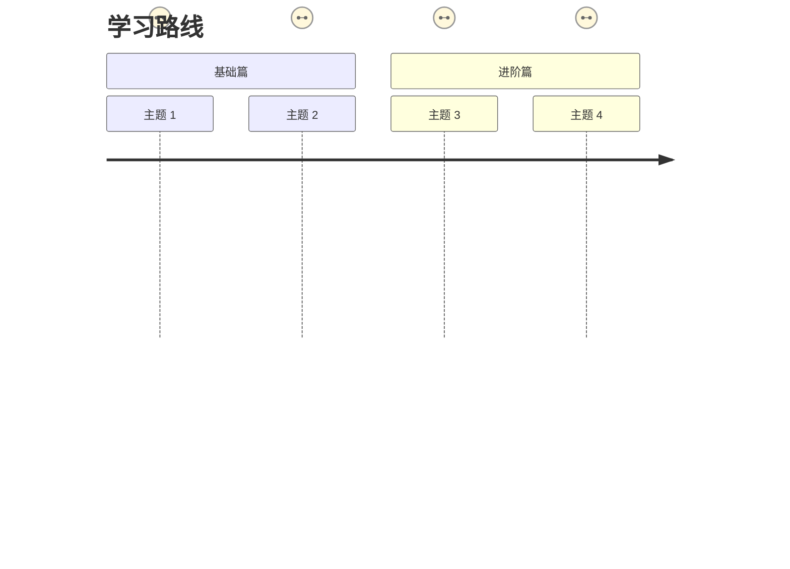
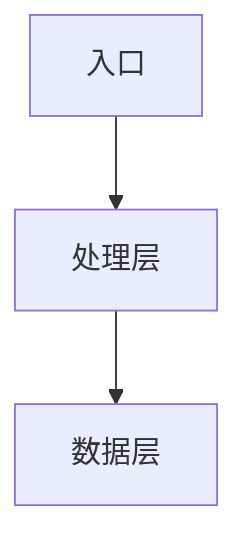
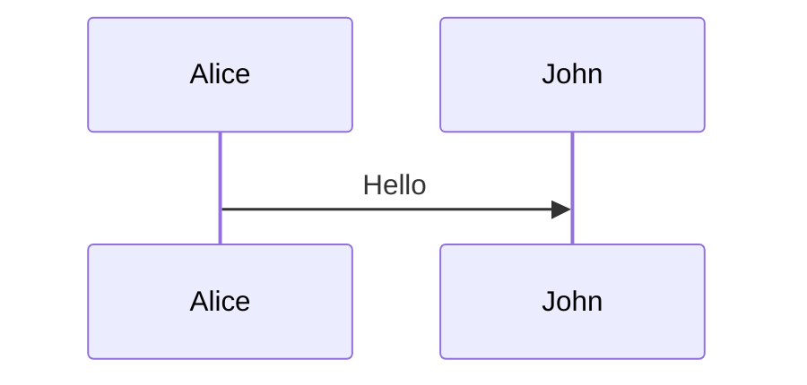
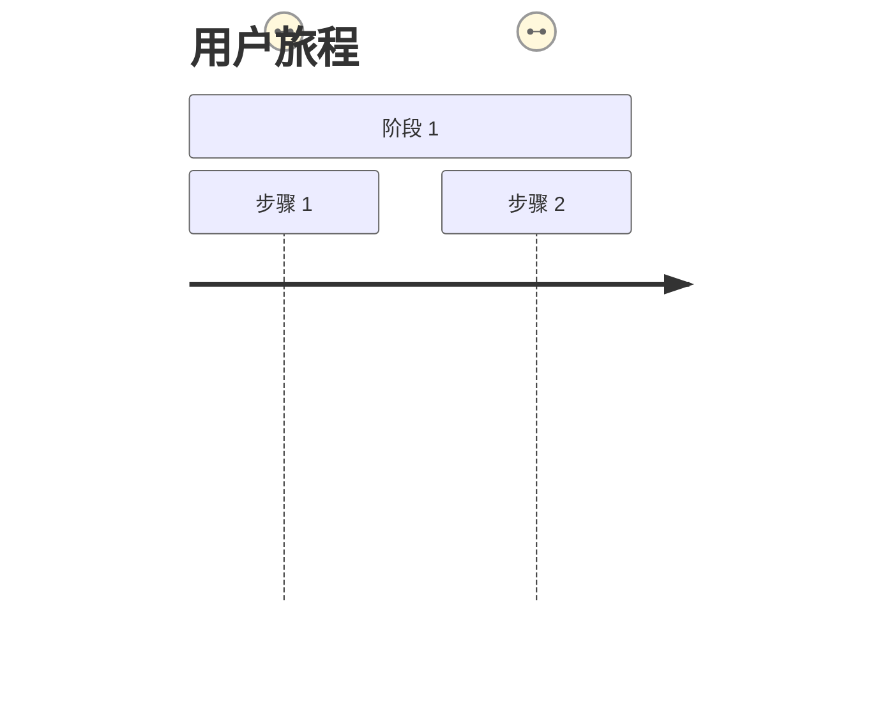

# VitePress 文档项目配置指南

一套可复用的 VitePress 文档项目配置方案，包含 Mermaid 图表、文档宽度优化、专注模式等功能。

## 📁 文件结构

```
docs/
├── .vitepress/
│   ├── config.ts              # VitePress 主配置
│   └── theme/
│       ├── index.ts           # 自定义主题入口
│       └── style.css          # 自定义样式
└── index.md                   # 首页
```

---

## 1. Mermaid 图表支持

### 安装依赖

```bash
npm install -D mermaid
```

### 配置文件 `docs/.vitepress/config.ts`

```typescript
import { defineConfig } from 'vitepress'

export default defineConfig({
  markdown: {
    config: (md) => {
      md.use((await import('markdown-it')).default)
    },
  },
  vite: {
    optimizeDeps: {
      include: ['mermaid'],
    },
  },
})
```

### 主题入口 `docs/.vitepress/theme/index.ts`

```typescript
// .vitepress/theme/index.ts
import DefaultTheme from 'vitepress/theme'
import type { EnhanceAppContext } from 'vitepress'
import type { Theme } from 'vitepress'
import { onMounted, watch, nextTick } from 'vue'
import { useRoute } from 'vitepress'
import type { default as mermaid } from 'mermaid'
import './style.css'

let mermaidInstance: typeof mermaid | null = null

// 初始化 Mermaid
const initMermaid = async () => {
  if (typeof window === 'undefined') return

  if (!mermaidInstance) {
    const { default: m } = await import('mermaid')
    mermaidInstance = m
    mermaidInstance.initialize({
      startOnLoad: false,
      theme: 'default',
      securityLevel: 'loose',
      flowchart: {
        curve: 'basis',
        padding: 20,
      },
      sequence: {
        diagramMarginX: 50,
        diagramMarginY: 10,
        boxMargin: 10,
        showSequenceNumbers: true,
      },
    })
  }

  return mermaidInstance
}

// 为 SVG 添加缩放和拖拽功能
const initZoomPan = (svg: SVGElement, wrapper: HTMLElement) => {
  let scale = 1
  let panning = false
  let panStart = { x: 0, y: 0 }
  let translate = { x: 0, y: 0 }

  svg.style.transformOrigin = '0 0'
  svg.style.transform = 'translate(0px, 0px) scale(1)'
  svg.style.cursor = 'grab'

  wrapper.addEventListener('wheel', (e) => {
    e.preventDefault()
    const delta = e.deltaY > 0 ? 0.9 : 1.1
    const newScale = Math.max(0.1, Math.min(5, scale * delta))
    scale = newScale
    svg.style.transform = `translate(${translate.x}px, ${translate.y}px) scale(${scale})`
  }, { passive: false })

  svg.addEventListener('mousedown', (e) => {
    panning = true
    panStart = { x: e.clientX - translate.x, y: e.clientY - translate.y }
    svg.style.cursor = 'grabbing'
  })

  window.addEventListener('mousemove', (e) => {
    if (!panning) return
    e.preventDefault()
    translate = { x: e.clientX - panStart.x, y: e.clientY - panStart.y }
    svg.style.transform = `translate(${translate.x}px, ${translate.y}px) scale(${scale})`
  })

  window.addEventListener('mouseup', () => {
    panning = false
    svg.style.cursor = 'grab'
  })

  svg.addEventListener('dblclick', () => {
    scale = 1
    translate = { x: 0, y: 0 }
    svg.style.transform = 'translate(0px, 0px) scale(1)'
  })
}

// 渲染 Mermaid 图表
const renderMermaid = async () => {
  const mermaid = await initMermaid()
  if (!mermaid) return

  const elements = document.querySelectorAll<HTMLPreElement>('.language-mermaid pre')

  for (const pre of elements) {
    if (pre.parentElement?.classList.contains('mermaid-rendered')) continue

    const codeElement = pre.querySelector('code')
    if (!codeElement) continue

    const graphDefinition = codeElement.textContent || ''
    if (!graphDefinition.trim()) continue

    try {
      const container = document.createElement('div')
      container.className = 'mermaid'
      container.textContent = graphDefinition

      pre.style.display = 'none'
      pre.parentElement?.classList.add('mermaid-rendered')
      pre.parentElement?.insertBefore(container, pre.nextSibling)
    } catch (e) {
      console.warn('Mermaid render error:', e)
    }
  }

  try {
    await mermaid.run({
      querySelector: '.mermaid:not([data-processed])',
      suppressErrors: true,
    })

    await new Promise(resolve => setTimeout(resolve, 100))

    const svgs = document.querySelectorAll('.mermaid svg')
    for (let i = 0; i < svgs.length; i++) {
      const svg = svgs[i] as SVGElement
      const viewBox = svg.getAttribute('viewBox')
      if (!viewBox) continue

      const [, , , height] = viewBox.split(' ').map(Number)

      const parent = svg.parentElement
      if (!parent) continue

      const wrapper = document.createElement('div')
      wrapper.className = 'mermaid-zoom-pan-wrapper'
      wrapper.style.cssText = `
        width: 100%;
        height: ${Math.min(height, 800)}px;
        overflow: auto;
        border: 1px solid #e5e5e5;
        border-radius: 8px;
        background: #fff;
      `

      svg.style.transformOrigin = 'top left'
      svg.style.minWidth = '100%'

      parent.insertBefore(wrapper, svg)
      wrapper.appendChild(svg)

      initZoomPan(svg, wrapper)
    }
  } catch (e) {
    console.warn('Mermaid run error:', e)
  }
}

export default {
  extends: DefaultTheme,
  setup() {
    const route = useRoute()

    watch(
      () => route.path,
      () => {
        nextTick(() => {
          renderMermaid()
        })
      }
    )

    onMounted(() => {
      setTimeout(() => {
        renderMermaid()
      }, 100)

      initFocusMode()
    })
  },
  enhanceApp({ app }: EnhanceAppContext) {},
} satisfies Theme

// 专注模式功能
const FOCUS_MODE_STORAGE_KEY = 'focus-mode'

const initFocusMode = () => {
  if (typeof document === 'undefined') return
  if (document.querySelector('.focus-mode-toggle')) return

  const toggleButton = document.createElement('button')
  toggleButton.className = 'focus-mode-toggle'
  toggleButton.setAttribute('aria-label', '专注模式')
  toggleButton.setAttribute('title', '专注模式 (快捷键：F)')
  toggleButton.innerHTML = `
    <svg id="focus-icon" viewBox="0 0 24 24" fill="none" xmlns="http://www.w3.org/2000/svg">
      <path d="M4 9V4H9" stroke="currentColor" stroke-width="2" stroke-linecap="round" stroke-linejoin="round"/>
      <path d="M20 9V4H15" stroke="currentColor" stroke-width="2" stroke-linecap="round" stroke-linejoin="round"/>
      <path d="M4 15V20H9" stroke="currentColor" stroke-width="2" stroke-linecap="round" stroke-linejoin="round"/>
      <path d="M20 15V20H15" stroke="currentColor" stroke-width="2" stroke-linecap="round" stroke-linejoin="round"/>
    </svg>
  `

  const exitHint = document.createElement('div')
  exitHint.className = 'focus-mode-exit-hint'
  exitHint.textContent = '按 F 或点击按钮退出'

  document.body.appendChild(toggleButton)
  document.body.appendChild(exitHint)

  const wasInFocusMode = localStorage.getItem(FOCUS_MODE_STORAGE_KEY) === 'true'
  if (wasInFocusMode) {
    document.body.classList.add('focus-mode')
    updateFocusIcon(true)
  }

  toggleButton.addEventListener('click', toggleFocusMode)

  document.addEventListener('keydown', (e) => {
    if (e.target instanceof HTMLInputElement || e.target instanceof HTMLTextAreaElement) return
    if (e.key === 'f' || e.key === 'F') {
      e.preventDefault()
      toggleFocusMode()
    }
  })

  function toggleFocusMode() {
    document.body.classList.toggle('focus-mode')
    const isInFocusMode = document.body.classList.contains('focus-mode')
    localStorage.setItem(FOCUS_MODE_STORAGE_KEY, isInFocusMode ? 'true' : 'false')
    updateFocusIcon(isInFocusMode)
  }

  function updateFocusIcon(isInFocusMode: boolean) {
    const icon = document.getElementById('focus-icon')
    if (!icon) return

    if (isInFocusMode) {
      icon.innerHTML = `
        <path d="M4 14H9V9" stroke="currentColor" stroke-width="2" stroke-linecap="round" stroke-linejoin="round"/>
        <path d="M20 14H15V9" stroke="currentColor" stroke-width="2" stroke-linecap="round" stroke-linejoin="round"/>
        <path d="M4 10H9V15" stroke="currentColor" stroke-width="2" stroke-linecap="round" stroke-linejoin="round"/>
        <path d="M20 10H15V15" stroke="currentColor" stroke-width="2" stroke-linecap="round" stroke-linejoin="round"/>
      `
    } else {
      icon.innerHTML = `
        <path d="M4 9V4H9" stroke="currentColor" stroke-width="2" stroke-linecap="round" stroke-linejoin="round"/>
        <path d="M20 9V4H15" stroke="currentColor" stroke-width="2" stroke-linecap="round" stroke-linejoin="round"/>
        <path d="M4 15V20H9" stroke="currentColor" stroke-width="2" stroke-linecap="round" stroke-linejoin="round"/>
        <path d="M20 15V20H15" stroke="currentColor" stroke-width="2" stroke-linecap="round" stroke-linejoin="round"/>
      `
    }
  }
}
```

---

## 2. 自定义样式 `docs/.vitepress/theme/style.css`

```css
/* 自定义样式 - VitePress 文档项目 */

/* ============================================
   1. 文档内容宽度优化
   ============================================ */

:root {
  --vp-layout-max-width: 1800px;
  --vp-home-content-width: 1400px;
  --vp-doc-content-width: 1400px;
}

/* 文档内容区域 - 铺满中间区域，两边留 36px 间距 */
.VPDoc.has-aside .content-container {
  max-width: 100% !important;
  padding-left: 36px !important;
  padding-right: 36px !important;
}

/* 无侧边栏时的文档页面 */
.vp-doc {
  max-width: 1400px !important;
  margin-left: auto !important;
  margin-right: auto !important;
  padding-left: 48px !important;
  padding-right: 48px !important;
}

@media (min-width: 960px) {
  .vp-doc {
    padding-left: 36px !important;
    padding-right: 36px !important;
  }
}

/* 代码块宽度优化 */
.vp-doc pre,
.vp-code-group .tabs,
.vp-code-group div[class*='language-'] {
  margin-left: 0;
  margin-right: 0;
  border-radius: 12px;
}

/* 表格宽度优化 */
.vp-doc .table-wrapper {
  overflow-x: auto;
}

.vp-doc table {
  min-width: 100%;
}

/* Mermaid 图表容器 */
.vp-doc .mermaid,
.vp-doc .mermaid-zoom-pan-wrapper {
  width: 100%;
  min-width: 100%;
}

/* 字体大小优化 */
.vp-doc p,
.vp-doc li,
.vp-doc td {
  font-size: 16px;
  line-height: 1.75;
}

.vp-doc h1 { font-size: 2.5rem; }
.vp-doc h2 { font-size: 2rem; }
.vp-doc h3 { font-size: 1.5rem; }
.vp-doc h4 { font-size: 1.25rem; }

/* ============================================
   2. 专注模式样式
   ============================================ */

/* 专注模式 - 覆盖默认 sidebar padding */
@media (min-width: 1440px) {
  body.focus-mode .VPContent.has-sidebar {
    padding-right: calc((100vw - var(--vp-layout-max-width)) / 2) !important;
    padding-left: calc((100vw - var(--vp-layout-max-width)) / 2) !important;
  }
}

/* 专注模式激活状态 */
body.focus-mode .VPNav,
body.focus-mode .VPSidebar,
body.focus-mode .VPDoc .aside,
body.focus-mode .VPDocFooter,
body.focus-mode .doc-footer {
  display: none !important;
}

body.focus-mode .VPContent {
  padding-top: 0 !important;
}

body.focus-mode .VPDoc {
  padding-left: 0 !important;
  padding-right: 0 !important;
  margin-left: auto !important;
  margin-right: auto !important;
  width: 100% !important;
}

/* 专注模式文档内容 - 居中显示，宽度 1100px-1700px */
body.focus-mode .vp-doc {
  max-width: 1700px !important;
  min-width: 1100px !important;
  width: 90% !important;
  margin-left: auto !important;
  margin-right: auto !important;
  padding-left: 40px !important;
  padding-right: 40px !important;
}

/* 专注模式切换按钮 */
.focus-mode-toggle {
  position: fixed;
  top: 80px;
  right: 24px;
  z-index: 100;
  width: 44px;
  height: 44px;
  border-radius: 50%;
  background: var(--vp-c-bg);
  border: 1px solid var(--vp-c-divider);
  cursor: pointer;
  display: flex;
  align-items: center;
  justify-content: center;
  transition: all 0.3s ease;
  box-shadow: 0 4px 12px rgba(0, 0, 0, 0.1);
}

.focus-mode-toggle:hover {
  background: var(--vp-c-brand-soft);
  border-color: var(--vp-c-brand);
  transform: scale(1.05);
}

.focus-mode-toggle svg {
  width: 20px;
  height: 20px;
  fill: var(--vp-c-text-1);
}

body.focus-mode .focus-mode-toggle {
  top: 24px;
}

.focus-mode-exit-hint {
  position: fixed;
  top: 24px;
  right: 80px;
  padding: 8px 16px;
  background: var(--vp-c-bg-soft);
  border: 1px solid var(--vp-c-divider);
  border-radius: 20px;
  font-size: 13px;
  color: var(--vp-c-text-2);
  z-index: 100;
  opacity: 0;
  transform: translateY(-10px);
  transition: all 0.3s ease;
  pointer-events: none;
}

body.focus-mode .focus-mode-exit-hint {
  opacity: 1;
  transform: translateY(0);
}

/* ============================================
   3. 首页优化样式
   ============================================ */

.VPHero {
  padding: 48px 24px;
}

.VPHero .container {
  max-width: var(--vp-home-content-width) !important;
}

.VPHero .main {
  text-align: center;
}

.VPFeatures {
  padding: 64px 24px;
}

.VPFeatures .container {
  max-width: var(--vp-home-content-width) !important;
}

/* ============================================
   4. 响应式优化
   ============================================ */

@media (max-width: 768px) {
  .vp-doc {
    padding-left: 24px !important;
    padding-right: 24px !important;
  }

  .focus-mode-toggle {
    top: 70px;
    right: 16px;
    width: 40px;
    height: 40px;
  }
}

/* ============================================
   5. 深色模式适配
   ============================================ */

.dark .focus-mode-toggle {
  background: var(--vp-c-bg-soft);
}

.dark .focus-mode-toggle:hover {
  background: var(--vp-c-brand-soft);
}
```

---

## 3. 首页模板 `docs/index.md`

```markdown
---
layout: home
title: 项目名称
titleTemplate: 副标题
hero:
  name: 项目名称
  text: 简短描述
  tagline: 详细描述
  image:
    src: /logo.svg
    alt: Logo
  actions:
    - theme: brand
      text: 开始阅读
      link: /guide/introduction
    - theme: alt
      text: 快速开始
      link: /guide/quick-start
features:
  - icon: 🚀
    title: 特性标题
    details: 特性描述
    link: /guide/xxx
    linkText: 了解更多

  - icon: ⚡
    title: 特性标题
    details: 特性描述
    link: /guide/xxx
    linkText: 了解更多
---

<div class="home-content">

## 📚 学习路径



## 🎯 架构图



</div>

<style>
.home-content {
  max-width: 1200px;
  margin: 0 auto;
  padding: 48px 24px;
}

.home-content h2 {
  font-size: 2rem;
  font-weight: 700;
  margin-top: 48px;
  margin-bottom: 24px;
  text-align: center;
}

.home-content .mermaid {
  background: var(--vp-c-bg-soft);
  border-radius: 12px;
  padding: 24px;
  margin: 24px 0;
}
</style>
```

---

## 4. 使用 Mermaid 图表

### 支持的图表类型

```markdown
<!-- 流程图 -->


<!-- 时序图 -->


<!-- 旅程图 -->

```

### 注意事项

1. **journey 图表评分格式**：必须使用 `(数字)` 格式，如 `(5)` 而非 `5`
2. **图表缩放**：大型图表会自动添加缩放拖拽功能
3. **响应式**：图表容器宽度为 100%，高度最大 800px

---

## 5. 功能特性

### ✅ 已实现功能

| 功能 | 说明 | 快捷键 |
|------|------|--------|
| Mermaid 图表 | 支持流程图/时序图/旅程图等 | - |
| 图表缩放拖拽 | 支持滚轮缩放、拖拽、双击重置 | - |
| 专注模式 | 隐藏导航/侧边栏，只显示内容 | `F` |
| 状态持久化 | 专注模式状态保存到 localStorage | - |
| 宽屏优化 | 文档最大宽度 1400px，专注模式 1700px | - |
| 字体优化 | 正文 16px，行高 1.75 | - |

### 🎯 专注模式

- 点击右上角按钮或按 `F` 键切换
- 隐藏：导航栏、左侧边栏、右侧目录、页脚
- 内容宽度：1100px - 1700px 自适应
- 状态持久化到 localStorage

---

## 6. 配置速查

### VitePress 基础配置

```typescript
// config.ts
export default defineConfig({
  title: '文档标题',
  description: '文档描述',
  cleanUrls: true,
  lastUpdated: true,

  themeConfig: {
    logo: '/logo.svg',
    nav: [/* 导航配置 */],
    sidebar: { /* 侧边栏配置 */ },
    search: { provider: 'local' },
  },

  vite: {
    server: { port: 3000 },
    build: { target: 'esnext' },
  },
})
```

### 脚本命令

```json
{
  "scripts": {
    "dev": "vitepress dev docs",
    "build": "vitepress build docs",
    "preview": "vitepress preview docs"
  }
}
```

---

## 7. 自定义扩展

### 添加新的 UI 组件

在 `theme/index.ts` 的 `enhanceApp` 中注册：

```typescript
enhanceApp({ app }: EnhanceAppContext) {
  app.component('MyComponent', MyComponent)
}
```

### 添加自定义样式

在 `style.css` 底部追加：

```css
/* 你的自定义样式 */
.my-custom-class {
  color: var(--vp-c-brand);
}
```

### 修改主题变量

```css
:root {
  --vp-c-brand: #your-color;
  --vp-font-family-base: 'Your-Font', sans-serif;
}
```

---

## 8. 常见问题

### Q: Mermaid 图表不渲染？
A: 确保安装了 `mermaid` 依赖，且代码块语言为 `mermaid`

### Q: 专注模式按钮不显示？
A: 检查浏览器控制台是否有 JavaScript 错误，清除缓存后刷新

### Q: 文档宽度不生效？
A: 确保样式文件已正确引入，检查 CSS 优先级问题

### Q: 如何禁用专注模式？
A: 删除 `theme/index.ts` 中的 `initFocusMode()` 调用

---

## 9. 更新日志

- **v1.0** - 初始版本
  - Mermaid 图表支持（带缩放拖拽）
  - 专注模式（F 键切换）
  - 文档宽度优化（1400px/1700px）
  - 字体大小优化（16px）
  - 响应式适配
