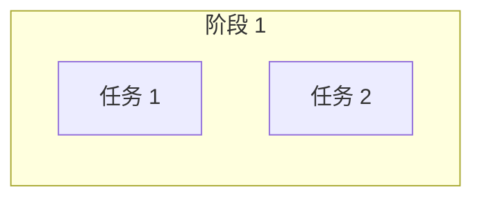
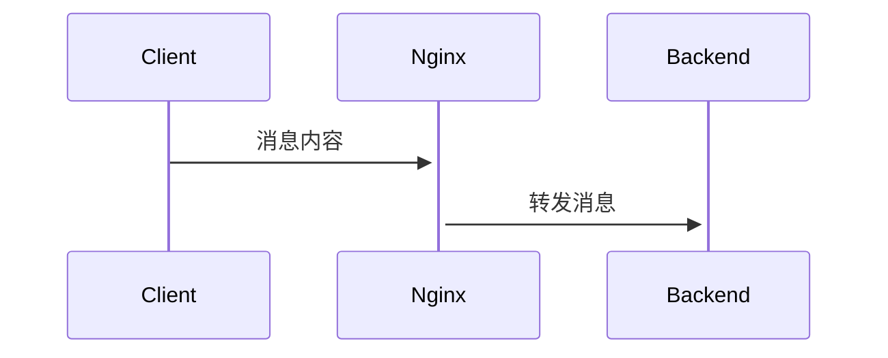
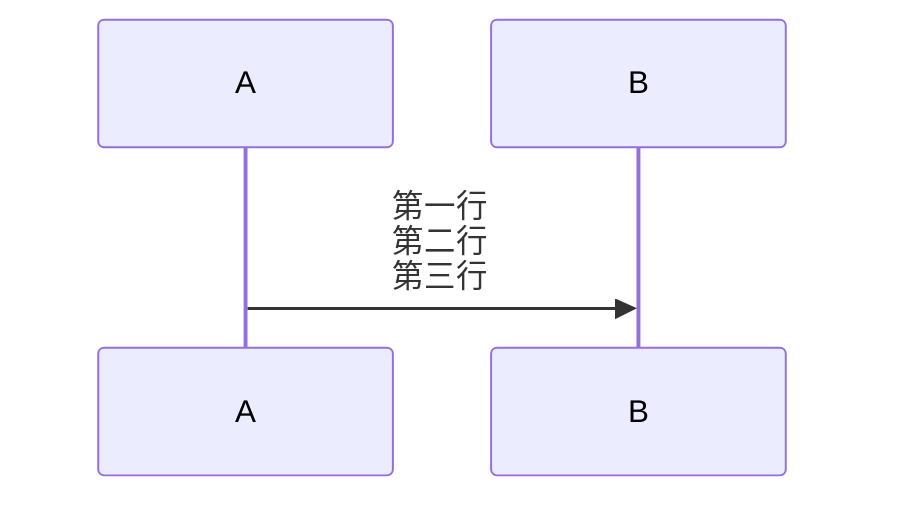
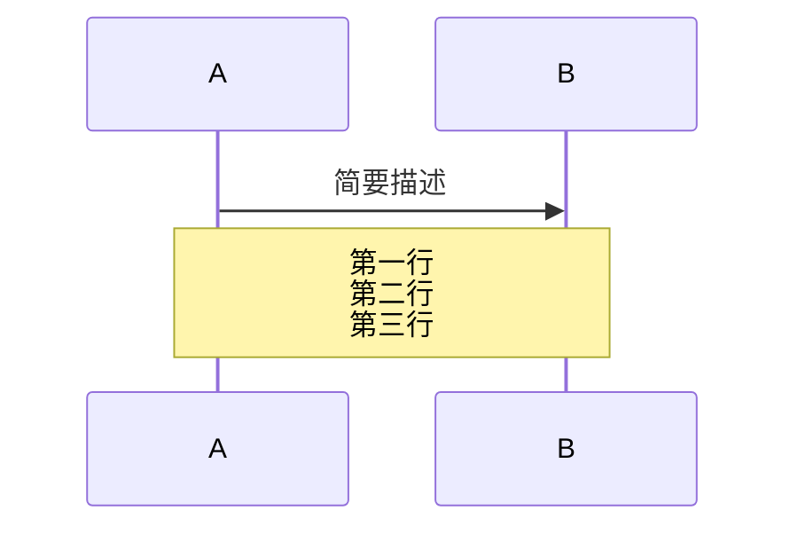
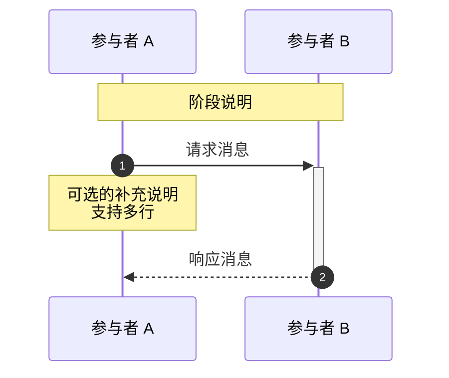
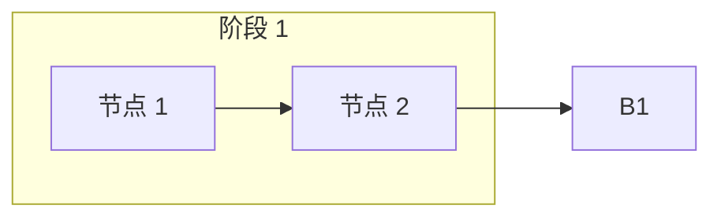
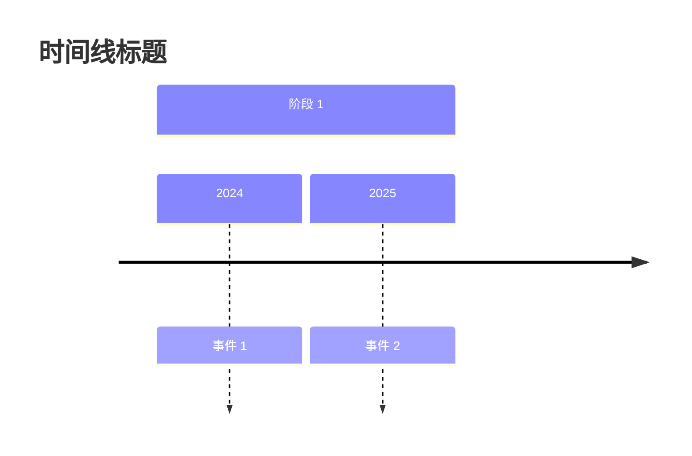

# Mermaid 语法约束规则

本文档定义本项目中 Mermaid 图表的语法约束和规范，避免渲染错误。

---

## 一、已验证支持的图表类型

| 图表类型 | 支持状态 | 备注 |
|---------|---------|------|
| `flowchart` | ✅ 完全支持 | 推荐使用 |
| `graph` | ✅ 完全支持 | 等同于 flowchart |
| `sequenceDiagram` | ✅ 完全支持 | 需遵循消息语法规则 |
| `timeline` | ✅ 完全支持 | - |
| `stateDiagram-v2` | ✅ 完全支持 | 必须使用 `-v2` 后缀 |

---

## 二、禁止使用的语法

### 2.1 journey 图表（已弃用）

**❌ 问题语法：**
```mermaid
journey
    title 学习路线
    section 阶段 1
      任务名：5
```

**问题原因：**
- 任务名中包含冒号（如 `任务名：5`）会被解析为语法错误
- Mermaid 的 journey 图表要求任务名不能包含冒号字符
- 中文冒号 `：` 和英文冒号 `:` 都会导致解析失败

**✅ 替代方案：使用 flowchart**


---

### 2.2 sequenceDiagram 多跳消息语法

**❌ 问题语法：**
```mermaid
sequenceDiagram
    Client->>Nginx->>Backend: 消息内容
```

**问题原因：**
- 多跳语法 `A->>B->>C` 在某些 Mermaid 版本中渲染不稳定
- 可能导致消息箭头显示异常或完全失败

**✅ 正确写法：拆分为独立消息**


---

### 2.3 消息文本中的复杂换行

**❌ 问题语法：**


**问题原因：**
- 消息文本（箭头后的内容）中的 `<br/>` 在某些版本中不渲染
- 过长的多行内容应使用 `Note` 承载

**✅ 正确写法：使用 Note 承载多行内容**


---

## 三、推荐的最佳实践

### 3.1 sequenceDiagram 规范



**规范要点：**
1. 使用 `autonumber` 自动编号
2. 使用 `->>+` 和 `-->>-` 标记生命周期
3. 复杂说明用 `Note` 承载
4. 避免在箭头消息中使用 `<br/>`

### 3.2 flowchart 规范



**规范要点：**
1. 使用 `LR`（从左到右）或 `TB`（从上到下）
2. `subgraph` 标题用双引号包裹
3. 节点标签用双引号包裹

### 3.3 timeline 规范



**规范要点：**
1. `section` 后紧跟阶段名
2. 时间点和事件用 `:` 分隔

---

## 四、常见问题排查清单

| 问题现象 | 可能原因 | 解决方案 |
|---------|---------|---------|
| 图表完全不渲染 | 语法错误 | 检查是否有禁止的语法 |
| 部分节点不显示 | 引号未闭合 | 检查 `subgraph` 和节点标签 |
| 箭头方向错误 | 语法不支持 | 避免多跳消息语法 |
| 换行不生效 | `<br/>`位置错误 | 移到 `Note` 中 |
| journey 图表报错 | 任务名含冒号 | 改用 flowchart |

---

## 五、代码块书写格式

```markdown
```mermaid
<图表类型>
    <配置和节点定义>
```
```

**注意：**
- 开始标记 ```mermaid 后必须换行
- 结束标记 ``` 前必须换行
- 缩进使用 4 个空格或 2 个空格（保持一致）

---

## 六、版本兼容性

本项目使用 Mermaid v11.x，部分语法在不同版本的兼容性：

| 语法 | v9.x | v10.x | v11.x |
|------|------|-------|-------|
| journey | ⚠️ | ⚠️ | ⚠️ |
| 多跳消息 | ❌ |  | ❌ |
| timeline | ✅ | ✅ | ✅ |
| stateDiagram-v2 | ✅ | ✅ | ✅ |

**建议：** 始终使用 flowchart 和 sequenceDiagram，避免使用实验性图表类型。

---

## 七、修改历史

| 日期 | 修改内容 | 修改人 |
|------|---------|-------|
| 2026-03-29 | 初始版本：禁用 journey 和多跳消息语法 | Nginx Handbook Team |

---

## 快速参考卡片

```
✅ 允许使用：
- flowchart / graph
- sequenceDiagram（单跳消息）
- timeline
- stateDiagram-v2

❌ 禁止使用：
- journey（改用 flowchart）
- A->>B->>C 多跳语法（拆分）
- 消息文本中的多个 <br/>（用 Note）
```
