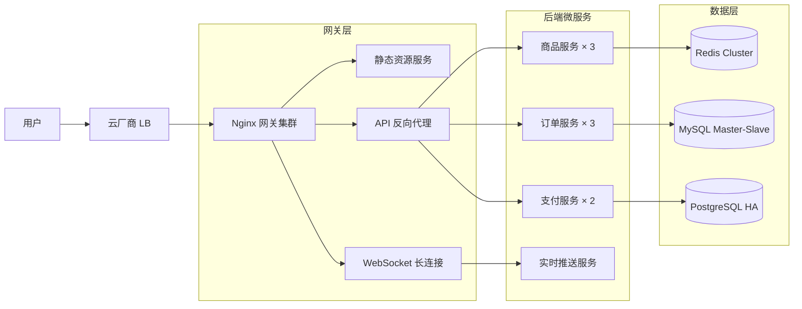
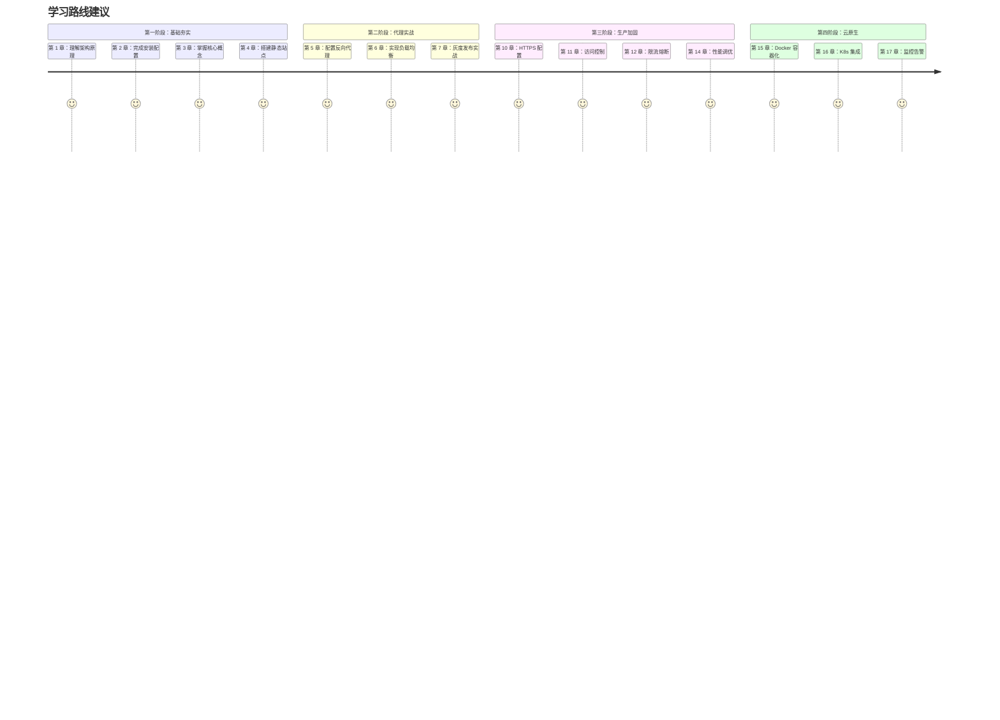

# Nginx 实战手册（2026 版）

<div align="center">


**从单机配置到生产级网关落地的全栈知识体系**

[]()
[](https://nginx.org)
[](https://vitepress.dev)
[]()

</div>

---

## 📖 关于本手册

本手册面向**运维工程师**与**全栈开发者**，聚焦于 Nginx 在生产环境中的真实应用场景。不同于纯理论教材，我们强调：

- ✅ **完整可运行的配置示例**（拒绝片段式代码）
- ✅ **可视化架构图解**（Mermaid 时序图/流程图）
- ✅ **2025-2026 最新特性**（HTTP/3 QUIC、Gateway API、eBPF 监控）
- ✅ **避坑指南与排查清单**（基于真实故障案例）
- ✅ **Docker/Kubernetes 容器化部署**（生产级编排模板）

### 🎯 主线案例

全书贯穿一个通用化**电商系统**案例，覆盖以下场景：



### 📚 内容结构

| 篇章 | 章节 | 核心主题 |
|------|------|----------|
| **第一篇：基础篇** | 第 1-4 章 | 架构原理、安装配置、核心概念、静态资源服务 |
| **第二篇：反向代理篇** | 第 5-9 章 | 反向代理、负载均衡、高级代理、WebSocket/SSE、微服务路由 |
| **第三篇：安全与性能** | 第 10-14 章 | HTTPS/TLS、访问控制、限流熔断、缓存策略、性能调优 |
| **第四篇：云原生** | 第 15-18 章 | Docker 容器化、Kubernetes 集成、可观测性、故障排查 |
| **附录** | A-C | 指令速查表、配置模板库、故障排查清单 |

### 🔥 2026 版更新亮点

#### HTTP/3 QUIC 生产落地
- ✅ Nginx ≥1.25.0 原生支持配置详解
- ✅ OpenSSL 3.5.1+ / BoringSSL 编译指南
- ✅ 0-RTT 优化与重放攻击防护
- ✅ 高丢包环境下性能对比实测

#### Kubernetes Ingress 重大变更
- ⚠️ **ingress-nginx EOL 预警**（2026 年 3 月停止维护）
- 📍 迁移至 **Gateway API** 的完整路径
- 🔀 Traefik v3 / Cilium Ingress 替代方案对比
- 🏢 NGINX Plus 商业版持续支持说明

#### eBPF 内核级监控
- 🔍 Cilium + Hubble 网络可观测性
- 📊 Prometheus Exporter 指标采集
- 📈 Grafana Dashboard 可视化实践
- ⚡ <5% CPU 开销的性能优势

#### WAF 与 DDoS 防护
- 🛡️ ModSecurity + OWASP CRS 集成
- 🚦 多层级限流策略（漏桶/令牌桶）
- 🎯 API 安全防护（OWASP API Top 10）
- 🔄 动态熔断与优雅降级

---

## 🚀 快速开始

### 本地开发环境

```bash
# 1. 克隆仓库
git clone https://github.com/your-org/nginx-handbook.git
cd nginx-handbook

# 2. 安装依赖
npm install

# 3. 启动开发服务器
npm run dev

# 访问 http://localhost:3000
```

### Docker 一键运行

```bash
# 使用提供的 Docker Compose 配置
docker-compose up -d

# 访问 http://localhost:3000
# 查看日志：docker-compose logs -f
```

### 生产构建

```bash
# 生成静态站点
npm run build

# 预览构建结果
npm run preview

# 输出目录：docs/.vitepress/dist/
```

---

## 📋 阅读导航

### 新手入门路径



### 按场景查阅

| 我想... | 推荐章节 |
|---------|----------|
| 快速搭建一个反向代理 | 第 2 章 + 第 5 章 |
| 实现负载均衡与灰度发布 | 第 6 章 + 第 7 章 |
| 配置 HTTPS 自动续签 | 第 10 章 |
| 防护 DDoS 攻击 | 第 11 章 + 第 12 章 |
| 优化静态资源加载速度 | 第 4 章 + 第 13 章 |
| 在 Kubernetes 中部署 Nginx | 第 16 章 |
| 排查 502/504 错误 | 第 18 章 + 附录 C |

---

## 🛠️ 配套资源

### 配置模板库

附录 B 提供以下开箱即用的配置模板：

- 📦 **电商网关模板**：SPA + API + WebSocket 完整示例
- 🔐 **OAuth2 Proxy 模板**：集中式认证网关
- 🚦 **限流熔断模板**：多级限流 + 优雅降级
- 🐳 **Docker Compose 模板**：一键部署微服务栈
- ☸️ **Kubernetes YAML 模板**：Ingress/Gateway API 配置

### 故障排查清单

附录 C 包含：

- ✅ 502/503/504 错误诊断树
- ✅ SSL 证书链验证步骤
- ✅ 容器网络连通性排查流程
- ✅ tcpdump/strace 抓包分析指南

### 在线工具推荐

- [Nginx 配置生成器](https://www.digitalocean.com/community/tools/nginx)
- [SSL Labs 测试](https://www.ssllabs.com/ssltest/)
- [HTTP/3 检测工具](https://http3check.net/)

---

## 🤝 参与贡献

我们欢迎任何形式的贡献：

- 📝 修正错别字或配置错误
- 💡 补充实战案例或避坑指南
- 🎨 优化 Mermaid 图表可视化
- 🔧 更新 Docker/K8s 部署模板

请参阅 [贡献指南](./CONTRIBUTING.md) 了解详细流程。

---

## 📄 许可证

本手册采用 **MIT 许可证** 开源。您可以自由复制、修改和分发内容，但需保留署名。

---

## 📬 联系方式

- 📧 问题反馈：issues@nginx-handbook.dev
- 💬 技术讨论：[Discord 频道](https://discord.gg/nginx)
- 🐦 官方 Twitter：[@NginxHandbook](https://twitter.com/nginxhandbook)

---

<div align="center">

**开始阅读** → [第 1 章：概述与架构设计](/guide/01-overview)

</div>
