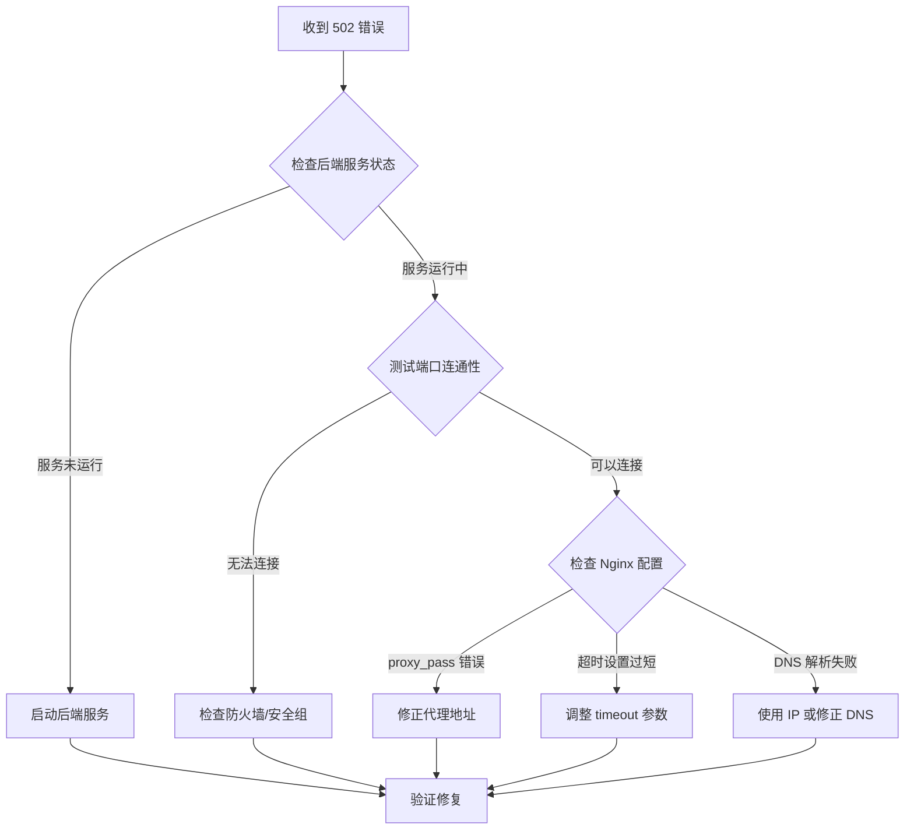
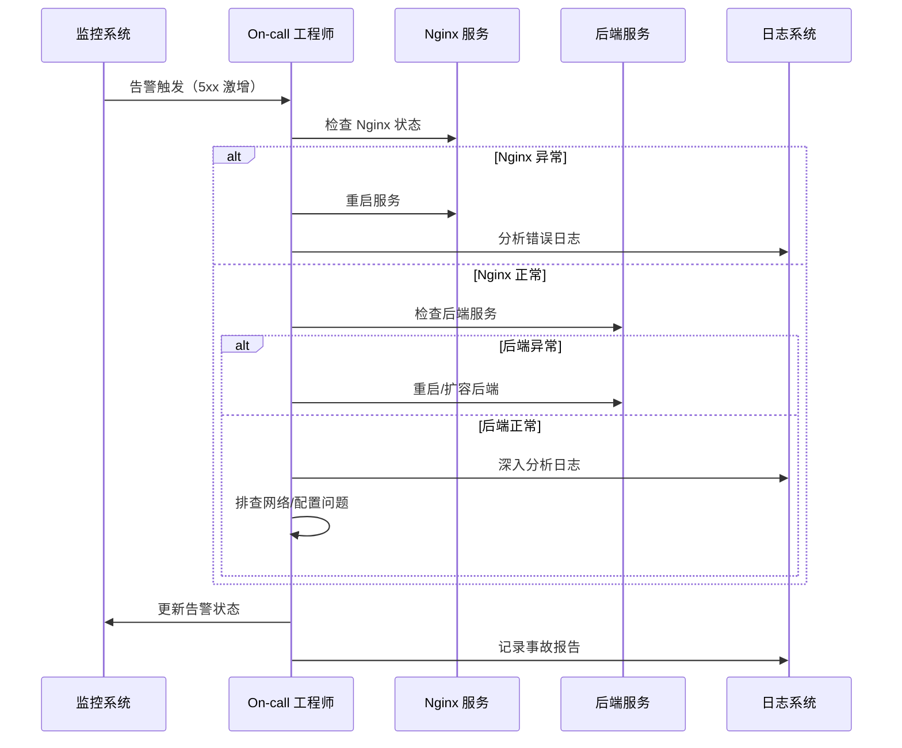

# C. 故障排查清单 {#troubleshooting-checklist}

本附录提供了 Nginx 常见问题的系统化排查流程和解决方案。

## C.1 启动失败排查 {#startup-failures}

### 症状：Nginx 无法启动

```bash
# 1. 检查配置文件语法
nginx -t

# 2. 查看详细错误日志
journalctl -u nginx -n 50 --no-pager
tail -f /var/log/nginx/error.log

# 3. 检查端口占用
ss -tlnp | grep :80
netstat -tlnp | grep :80
lsof -i :80

# 4. 检查权限问题
ls -la /etc/nginx/
ls -la /var/log/nginx/
ls -la /var/run/nginx.pid

# 5. 测试配置修复后重启
systemctl restart nginx
systemctl status nginx
```

### 常见原因与解决方案

| 错误信息 | 可能原因 | 解决方案 |
|---------|---------|---------|
| `bind() to 0.0.0.0:80 failed (98: Address already in use)` | 端口被占用 | 停止占用端口的服务或修改 Nginx 监听端口 |
| `open() "/etc/nginx/mime.types" failed (2: No such file or directory)` | 文件缺失 | 安装完整 Nginx 包或创建 mime.types 文件 |
| `unknown directive "http3"` | 模块未编译 | 确认 Nginx 版本支持 HTTP/3 或重新编译 |
| `SSL_CTX_use_PrivateKey_file() failed` | SSL 密钥错误 | 检查证书路径和权限，确保证书有效 |
| `permission denied` | 权限不足 | 修正文件权限：`chown -R nginx:nginx /var/log/nginx` |

## C.2 502 Bad Gateway 排查 {#502-bad-gateway}

### 症状：返回 502 错误

```bash
# 1. 检查后端服务状态
systemctl status <backend-service>
docker ps | grep backend
kubectl get pods

# 2. 检查后端服务日志
tail -f /var/log/backend/error.log
docker logs <container-name>

# 3. 测试后端服务连通性
curl -v http://localhost:3000/health
telnet localhost 3000
nc -zv localhost 3000

# 4. 检查 Nginx 错误日志
grep "upstream" /var/log/nginx/error.log | tail -50

# 5. 检查防火墙规则
iptables -L -n | grep 3000
firewall-cmd --list-all
ufw status
```

### 排查流程图



### 快速修复方案

```nginx
# 增加超时时间
location /api/ {
    proxy_pass http://backend:3000;
    proxy_connect_timeout 30s;      # 默认 60s
    proxy_send_timeout 90s;         # 默认 60s
    proxy_read_timeout 90s;         # 默认 60s
    
    # 失败重试机制
    proxy_next_upstream error timeout http_502 http_503 http_504;
    proxy_next_upstream_tries 3;
}

# 增加 keepalive 连接
upstream backend {
    server 127.0.0.1:3000;
    keepalive 32;
}

location /api/ {
    proxy_pass http://backend;
    proxy_http_version 1.1;
    proxy_set_header Connection "";
}
```

## C.3 504 Gateway Timeout 排查 {#504-timeout}

### 症状：请求超时

```bash
# 1. 检查慢查询日志
tail -f /var/log/nginx/error.log | grep "timed out"

# 2. 监控后端响应时间
curl -w "@curl-format.txt" -o /dev/null -s https://example.com/api/slow-endpoint

# curl-format.txt 内容:
# time_namelookup:  %{time_namelookup}\n
# time_connect:     %{time_connect}\n
# time_appconnect:  %{time_appconnect}\n
# time_pretransfer: %{time_pretransfer}\n
# time_redirect:    %{time_redirect}\n
# time_starttransfer: %{time_starttransfer}\n
# ----------\n
# time_total:       %{time_total}\n

# 3. 检查系统资源
top -bn1 | head -20
free -h
df -h

# 4. 检查数据库连接
mysql -e "SHOW PROCESSLIST;"
redis-cli slowlog get 10
```

### 优化方案

```nginx
# 针对不同接口设置不同超时
location /api/export/ {
    # 导出接口需要更长时间
    proxy_pass http://backend:3000;
    proxy_connect_timeout 10s;
    proxy_send_timeout 120s;
    proxy_read_timeout 300s;      # 5 分钟超时
    
    # 关闭缓冲（大文件传输）
    proxy_buffering off;
    proxy_request_buffering off;
}

location /api/fast/ {
    # 快速接口保持较短超时
    proxy_read_timeout 30s;
}
```

## C.4 SSL/TLS 问题排查 {#ssl-issues}

### 症状：HTTPS 连接失败

```bash
# 1. 检查证书有效性
openssl x509 -in /etc/letsencrypt/live/example.com/fullchain.pem -text -noout
openssl x509 -in /etc/letsencrypt/live/example.com/fullchain.pem -noout -dates
openssl x509 -in /etc/letsencrypt/live/example.com/fullchain.pem -noout -checkend 0

# 2. 测试 SSL 连接
openssl s_client -connect example.com:443 -servername example.com
curl -vI https://example.com

# 3. 检查证书链完整性
openssl s_client -connect example.com:443 -showcerts

# 4. 验证证书与私钥匹配
openssl x509 -noout -modulus -in fullchain.pem | openssl md5
openssl rsa -noout -modulus -in privkey.pem | openssl md5
# 两个 MD5 值应该相同

# 5. 在线工具检测
# https://www.ssllabs.com/ssltest/
```

### 常见 SSL 错误

| 错误 | 原因 | 解决方案 |
|------|------|---------|
| `SSL_ERROR_RX_RECORD_TOO_LONG` | 在 HTTP 端口启用 SSL | 确保 listen 443 ssl 而非 listen 80 ssl |
| `certificate has expired` | 证书过期 | 更新证书：`certbot renew` |
| `unable to verify the first certificate` | 证书链不完整 | 使用完整的证书链文件 |
| `bad handshake` | 协议/套件不匹配 | 调整 ssl_protocols 和 ssl_ciphers |

## C.5 性能问题排查 {#performance-issues}

### 症状：响应缓慢、吞吐量低

```bash
# 1. 检查 Nginx 状态
curl http://localhost/nginx_status

# 输出示例:
# Active connections: 150 
# server accepts handled requests
#  12345 12345 67890 
# Reading: 10 Writing: 5 Waiting: 135

# 2. 监控系统资源
vmstat 1 10
iostat -x 1 10
iftop -Pn

# 3. 分析访问日志
awk '{print $9}' /var/log/nginx/access.log | sort | uniq -c | sort -rn
awk '{print $7}' /var/log/nginx/access.log | sort | uniq -c | sort -rn | head -20

# 4. 检查慢请求
grep -E "\" [45][0-9][0-9] " /var/log/nginx/access.log | tail -50

# 5. 检查打开的文件数
lsof -p $(cat /var/run/nginx.pid) | wc -l
ulimit -n
```

### 性能优化检查清单

- [ ] `worker_processes` 设置为 `auto` 或 CPU 核心数
- [ ] `worker_connections` 足够大（建议 65535）
- [ ] 启用 `sendfile`、`tcp_nopush`、`tcp_nodelay`
- [ ] 配置适当的 `keepalive_timeout`
- [ ] 启用 Gzip 压缩
- [ ] 配置静态资源缓存
- [ ] 开启 `open_file_cache`
- [ ] 调整 `client_max_body_size`
- [ ] 优化 upstream keepalive 连接
- [ ] 使用 HTTP/2 或 HTTP/3

## C.6 限流触发排查 {#rate-limiting-issues}

### 症状：返回 429 Too Many Requests

```bash
# 1. 检查限流日志
grep "limiting requests" /var/log/nginx/error.log | tail -20

# 2. 查看当前限流配置
nginx -T | grep -E "limit_req|limit_conn"

# 3. 监控限流指标
# 使用 Prometheus + nginx-prometheus-exporter

# 4. 临时放宽限制（调试用）
# 编辑配置文件，增加 burst 值或 rate
```

### 调整限流策略

```nginx
# 原配置（严格）
limit_req_zone $binary_remote_addr zone=strict:10m rate=1r/s;

# 调整后（宽松）
limit_req_zone $binary_remote_addr zone=relaxed:10m rate=10r/s;

location /api/ {
    limit_req zone=relaxed burst=50 nodelay;
    limit_req_status 429;
    
    # 记录限流日志
    limit_req_log_level warn;
}
```

## C.7 Docker 环境排查 {#docker-troubleshooting}

### 容器网络问题

```bash
# 1. 检查容器网络
docker network ls
docker network inspect ecommerce-network

# 2. 测试容器间连通性
docker exec frontend ping product-api
docker exec nginx curl -v http://product-api:3001/health

# 3. 检查 DNS 解析
docker exec nginx nslookup product-api
docker exec nginx cat /etc/resolv.conf

# 4. 查看容器日志
docker logs ecommerce-nginx --tail 100
docker logs ecommerce-product-api --tail 100

# 5. 重启网络栈
docker-compose down
docker network prune
docker-compose up -d
```

### Compose 常见问题

| 问题 | 原因 | 解决方案 |
|------|------|---------|
| 容器无法互相访问 | 不在同一网络 | 确保所有服务在同一 network |
| DNS 解析失败 | 服务名拼写错误 | 使用准确的 service name |
| 端口冲突 | 宿主机端口已占用 | 修改 docker-compose.yml 端口映射 |
| 配置未生效 | 卷挂载错误 | 检查 volumes 路径是否正确 |

## C.8 K8s Ingress 排查 {#kubernetes-troubleshooting}

### Ingress 问题诊断

```bash
# 1. 检查 Ingress 资源
kubectl get ingress -n production
kubectl describe ingress ecommerce-ingress -n production

# 2. 检查 Ingress Controller
kubectl get pods -n ingress-nginx
kubectl logs -n ingress-nginx <controller-pod-name>

# 3. 检查后端 Service
kubectl get svc -n production
kubectl get endpoints -n production

# 4. 测试内部访问
kubectl run test --rm -it --image=curlimages/curl -- /bin/sh
# 在容器内执行:
curl -v http://product-service:3001/health

# 5. 检查 TLS Secret
kubectl get secret ecommerce-tls -n production
kubectl describe secret ecommerce-tls -n production
```

### 常见 Ingress 问题

| 问题 | 可能原因 | 排查命令 |
|------|---------|---------|
| 404 Not Found | 路径不匹配 | `kubectl describe ingress` |
| 503 Service Unavailable | Endpoints 为空 | `kubectl get endpoints` |
| SSL 证书错误 | Secret 配置错误 | `kubectl describe secret` |
| 重定向循环 | annotation 配置冲突 | 检查 rewrite-target 等注解 |

## C.9 日志分析技巧 {#log-analysis}

### 快速定位问题

```bash
# 实时查看错误日志
tail -f /var/log/nginx/error.log

# 按状态码统计
awk '{print $9}' /var/log/nginx/access.log | sort | uniq -c | sort -rn

# 查找最频繁的 IP
awk '{print $1}' /var/log/nginx/access.log | sort | uniq -c | sort -rn | head -10

# 查找最慢的请求
awk '{print $7, $10}' /var/log/nginx/access.log | sort -k2 -rn | head -10

# 搜索特定时间段
sed -n '/29\/Mar\/2026:10:00:00/,/29\/Mar\/2026:11:00:00/p' /var/log/nginx/access.log

# 提取 POST 请求
grep "POST" /var/log/nginx/access.log

# 分析 User-Agent
awk -F'"' '{print $6}' /var/log/nginx/access.log | sort | uniq -c | sort -rn
```

### 自定义日志格式

```nginx
# 包含更多字段的日志格式
log_format detailed '$remote_addr - $remote_user [$time_local] '
                    '"$request" $status $body_bytes_sent '
                    '"$http_referer" "$http_user_agent" '
                    '$request_time $upstream_response_time '
                    '$pipe $connection "$http_x_forwarded_for"';

access_log /var/log/nginx/detailed_access.log detailed;
```

## C.10 应急响应清单 {#emergency-response}

### 生产事故处理流程



### 快速回滚步骤

```bash
# 1. 备份当前配置
cp /etc/nginx/nginx.conf /etc/nginx/nginx.conf.backup.$(date +%Y%m%d_%H%M%S)
cp -r /etc/nginx/conf.d /etc/nginx/conf.d.backup.$(date +%Y%m%d_%H%M%S)

# 2. 恢复上一版本配置
# 从 Git 仓库或备份目录还原

# 3. 测试配置
nginx -t

# 4. 平滑重载
nginx -s reload

# 5. 验证服务
curl -I https://example.com

# 6. 监控指标
watch -n 1 'nginx -T 2>&1 | grep -c "error"'
```

---

::: tip 最佳实践
1. **预防优于治疗**：定期审查配置、更新证书、监控指标
2. **变更管理**：所有配置变更通过 Git 版本控制
3. **灰度发布**：先在测试环境验证，再逐步推送到生产
4. **文档记录**：记录所有故障现象、原因和解决方案
5. **自动化监控**：配置 Prometheus + Grafana 实时监控
:::
