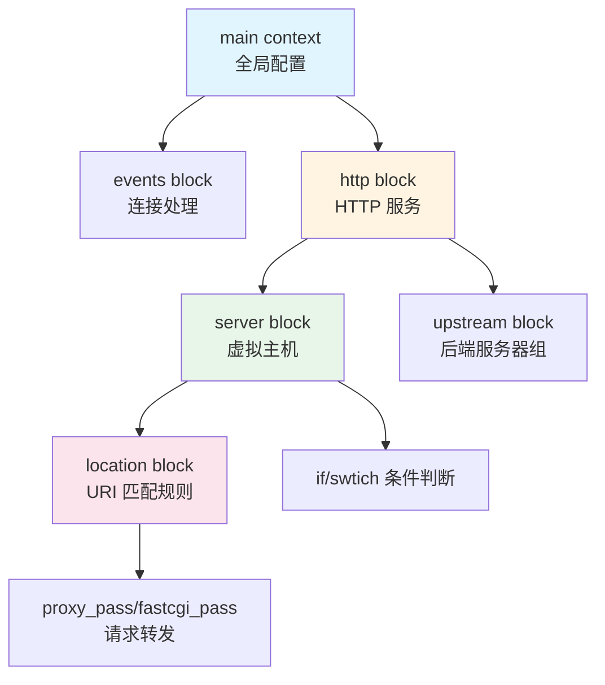
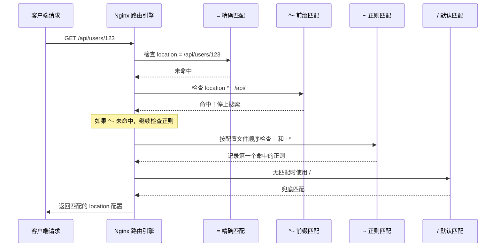
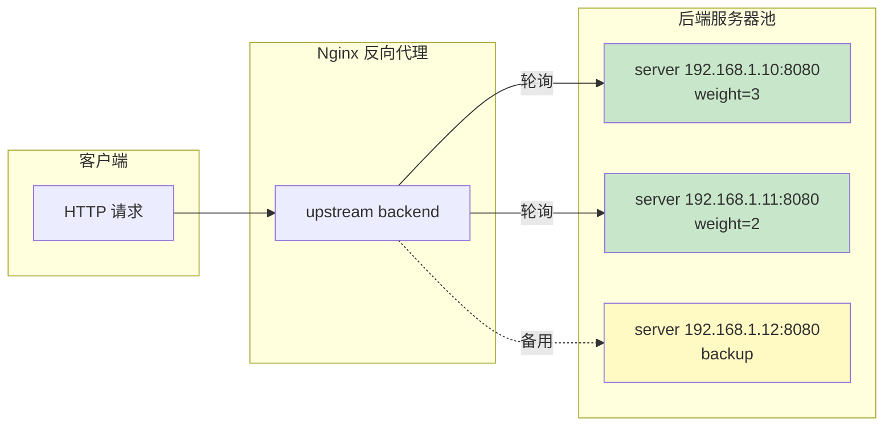

# 第 3 章 核心概念深度解析

## 学习目标
- ✅ 彻底理解 `server`、`location`、`upstream` 三大核心块的语义与关系
- ✅ 掌握 Nginx 配置继承规则与作用域优先级
- ✅ 能够编写模块化的配置文件结构
- ✅ 理解请求处理流程（从 TCP 连接到后端转发）
- ✅ 避免常见的配置陷阱与性能误区

---

## 场景引入

假设你接手了一个混乱的 Nginx 配置：
```nginx
# 前任留下的"祖传代码"
server {
    listen 80;
    server_name example.com;
    
    location / {
        proxy_pass http://backend;
        # 这里为什么有 5 个 proxy_set_header？
        # 为什么 /api/ 的请求没有走鉴权？
        # 为什么静态资源缓存没生效？
    }
}
```

**你是否遇到过这些问题**：
1. 多个 `location` 匹配冲突，不知道哪个优先生效
2. `proxy_pass` 末尾加不加 `/` 导致路径错乱
3. 在 `http` 块设置的变量在 `server` 块找不到
4. 配置改了几十行，reload 后毫无变化（语法错误被忽略）

本章将系统性地解决这些困惑，让你**像编译器一样思考 Nginx 配置**。

---

## 核心原理

### 3.1 Nginx 配置层级模型



**关键规则**：
1. **指令作用域**：每个指令只能在特定层级使用（查官方文档确认）
2. **继承规则**：子块自动继承父块指令，但可覆盖
3. **加载顺序**：从上到下，从外到内

### 3.2 Location 匹配算法（面试高频考点）



**匹配优先级**（从高到低）：
```nginx
# 1. 精确匹配（最高优先级）
location = /api/status { }

# 2. 带 ^~ 的前缀匹配（命中后立即停止正则搜索）
location ^~ /static/ { }

# 3. 正则匹配（按配置文件顺序，先匹配者胜出）
location ~ \.(jpg|jpeg|png)$ { }
location ~* \.(gif|css|js)$ { }  # 不区分大小写

# 4. 普通前缀匹配（不带修饰符）
location /api/ { }

# 5. 通用匹配（最低优先级）
location / { }
```

### 3.3 Upstream 负载均衡机制



**负载分配策略**：
| 算法 | 配置方式 | 适用场景 | 注意事项 |
|------|---------|---------|---------|
| **轮询**（默认） | 无需配置 | 后端性能均匀 | 短连接场景效果好 |
| **权重轮询** | `weight=5` | 后端性能不均 | weight 越大分配越多 |
| **IP Hash** | `ip_hash;` | Session 保持 | 可能导致负载不均 |
| **Least Conn** | `least_conn;` | 长连接场景 | 优先选连接数最少的 |
| **URL Hash** | `hash $request_uri;` | 缓存场景 | 相同 URL 固定到同一台 |

---

## 配置实战

### 3.4 Server 块完整模板（生产级）

```nginx
# /etc/nginx/sites-available/example.com
server {
    # === 基础网络配置 ===
    listen 80;
    listen [::]:80;  # IPv6 支持
    server_name example.com www.example.com;
    
    # 强制跳转 HTTPS（推荐做法）
    return 301 https://$host$request_uri;
}

server {
    # === HTTPS 配置 ===
    listen 443 ssl http2;
    listen [::]:443 ssl http2;
    server_name example.com www.example.com;
    
    # SSL 证书路径
    ssl_certificate /etc/nginx/ssl/example.com.crt;
    ssl_certificate_key /etc/nginx/ssl/example.com.key;
    ssl_trusted_certificate /etc/nginx/ssl/chain.pem;
    
    # SSL 优化配置
    ssl_session_timeout 1d;
    ssl_session_cache shared:SSL:50m;
    ssl_session_tickets off;
    
    # 现代安全套件（TLS 1.3）
    ssl_protocols TLSv1.2 TLSv1.3;
    ssl_ciphers ECDHE-ECDSA-AES128-GCM-SHA256:ECDHE-RSA-AES128-GCM-SHA256;
    ssl_prefer_server_ciphers off;
    
    # OCSP Stapling（提升 HTTPS 握手速度）
    ssl_stapling on;
    ssl_stapling_verify on;
    resolver 8.8.8.8 8.8.4.4 valid=300s;
    
    # === 日志配置 ===
    access_log /var/log/nginx/example.com.access.log main;
    error_log /var/log/nginx/example.com.error.log warn;
    
    # === 根目录与首页 ===
    root /var/www/example.com/html;
    index index.html index.htm;
    
    # === 静态资源处理 ===
    location ~* \.(jpg|jpeg|png|gif|ico|svg|webp)$ {
        expires 30d;
        add_header Cache-Control "public, immutable";
        access_log off;
    }
    
    location ~* \.(css|js|woff2|woff|ttf|eot)$ {
        expires 7d;
        add_header Cache-Control "public";
    }
    
    # === API 反向代理 ===
    location /api/ {
        proxy_pass http://backend_upstream;
        
        # 必要的请求头传递
        proxy_set_header Host $host;
        proxy_set_header X-Real-IP $remote_addr;
        proxy_set_header X-Forwarded-For $proxy_add_x_forwarded_for;
        proxy_set_header X-Forwarded-Proto $scheme;
        
        # 超时设置
        proxy_connect_timeout 60s;
        proxy_send_timeout 60s;
        proxy_read_timeout 60s;
        
        # 缓冲优化
        proxy_buffering on;
        proxy_buffer_size 4k;
        proxy_buffers 8 4k;
    }
    
    # === 健康检查端点 ===
    location = /health {
        access_log off;
        return 200 "healthy\n";
        add_header Content-Type text/plain;
    }
    
    # === 安全加固 ===
    # 隐藏敏感文件
    location ~ /\. {
        deny all;
        access_log off;
        log_not_found off;
    }
    
    # 禁止访问备份文件
    location ~* \.(bak|swp|tmp|old)$ {
        deny all;
    }
}
```

### 3.5 Location 最佳实践示例

```nginx
# 电商网站路由配置示例

server {
    listen 80;
    server_name shop.example.com;
    
    # === 首页 ===
    location = / {
        # 精确匹配首页，避免被其他规则拦截
        try_files /index.html @backend;
    }
    
    # === 静态资源（带版本号缓存粉碎）===
    # 匹配：/assets/v1.2.3/logo.png
    location ~ ^/assets/(v[\d.]+)/(.*)$ {
        alias /var/www/shop/assets/$2;
        expires max;
        add_header Cache-Control "public, immutable";
        add_header X-Version $1;
    }
    
    # === API 网关（分层代理）===
    # 用户相关 API
    location /api/users/ {
        proxy_pass http://user-service:3000/;
        proxy_set_header Host $host;
    }
    
    # 订单相关 API
    location /api/orders/ {
        # 需要鉴权
        auth_request /auth/verify;
        
        proxy_pass http://order-service:3001/;
        proxy_set_header Host $host;
    }
    
    # 支付回调（特殊处理）
    location = /api/payment/callback {
        # 关闭 CSRF 检查
        proxy_pass http://payment-service:3002/callback;
        client_max_body_size 1M;  # 允许较大请求体
    }
    
    # === WebSocket 支持 ===
    location /ws/ {
        proxy_pass http://websocket-server:8080;
        proxy_http_version 1.1;
        proxy_set_header Upgrade $http_upgrade;
        proxy_set_header Connection "upgrade";
        proxy_read_timeout 86400;  # 长连接
    }
    
    # === SSE (Server-Sent Events) ===
    location /sse/notifications {
        proxy_pass http://notification-service:3003;
        proxy_buffering off;      # 关键：关闭缓冲
        proxy_cache off;          # 关键：关闭缓存
        proxy_set_header Connection '';
        proxy_http_version 1.1;
        chunked_transfer_encoding off;
    }
    
    # === 管理后台（限制访问 IP）===
    location /admin/ {
        allow 192.168.1.0/24;     # 内网允许
        allow 10.0.0.0/8;
        deny all;                 # 其他拒绝
        
        proxy_pass http://admin-service:4000/;
    }
    
    # === 图片热链接防护 ===
    location ~* \.(jpg|jpeg|png|gif)$ {
        valid_referers none blocked server_names *.example.com;
        if ($invalid_referer) {
            return 403;
        }
    }
    
    # === 兜底规则 ===
    location / {
        try_files $uri $uri/ @backend;
    }
    
    # === 命名 location（内部重定向）===
    location @backend {
        proxy_pass http://frontend-ssr:3000;
    }
}
```

### 3.6 Upstream 高级配置

```nginx
# 定义后端服务器组（放在 http 块内）

# === 基础轮询 ===
upstream backend_basic {
    server 192.168.1.10:8080;
    server 192.168.1.11:8080;
    server 192.168.1.12:8080;
}

# === 加权轮询（高性能机器权重高）===
upstream backend_weighted {
    server 192.168.1.10:8080 weight=5;  # 处理 5/8 的请求
    server 192.168.1.11:8080 weight=2;  # 处理 2/8 的请求
    server 192.168.1.12:8080 weight=1;  # 处理 1/8 的请求
}

# === 会话保持（IP Hash）===
upstream backend_session {
    ip_hash;  # 同一 IP 始终访问同一台服务器
    server 192.168.1.10:8080;
    server 192.168.1.11:8080;
}

# === 最少连接（适合长连接场景）===
upstream backend_least_conn {
    least_conn;  # 优先选择当前连接数最少的服务器
    server 192.168.1.10:8080;
    server 192.168.1.11:8080;
}

# === 健康检查与故障转移 ===
upstream backend_ha {
    server 192.168.1.10:8080 max_fails=3 fail_timeout=30s;
    server 192.168.1.11:8080 max_fails=3 fail_timeout=30s;
    server 192.168.1.12:8080 backup;  # 仅当其他服务器不可用时启用
}

# === Keepalive 长连接池（性能优化关键）===
upstream backend_keepalive {
    least_conn;
    
    server 192.168.1.10:8080 max_fails=3 fail_timeout=30s;
    server 192.168.1.11:8080 max_fails=3 fail_timeout=30s;
    
    # 每个 worker 进程维护的长连接数
    keepalive 32;
    
    # 长连接空闲超时时间
    keepalive_timeout 60s;
    
    # 长连接请求上限（达到后主动关闭重建）
    keepalive_requests 100;
}

# 使用示例
server {
    location /api/ {
        proxy_pass http://backend_keepalive;
        
        # 必须设置这两个头部才能正确使用 keepalive
        proxy_http_version 1.1;
        proxy_set_header Connection "";
    }
}
```

---

## 完整示例文件

### 3.7 微服务架构完整配置

```nginx
# /etc/nginx/conf.d/microservices.conf
# 电商网站完整 Nginx 配置（生产环境参考）

# === 全局 upstream 定义 ===
upstream user_service {
    least_conn;
    server user-svc-1:3000 max_fails=3 fail_timeout=30s;
    server user-svc-2:3000 max_fails=3 fail_timeout=30s;
    keepalive 16;
}

upstream order_service {
    least_conn;
    server order-svc-1:3001 max_fails=3 fail_timeout=30s;
    server order-svc-2:3001 max_fails=3 fail_timeout=30s;
    keepalive 16;
}

upstream product_service {
    least_conn;
    server product-svc-1:3002 max_fails=3 fail_timeout=30s;
    server product-svc-2:3002 max_fails=3 fail_timeout=30s;
    keepalive 16;
}

upstream payment_service {
    # 支付服务需要强一致性，使用 IP Hash
    ip_hash;
    server payment-svc-1:3003 max_fails=2 fail_timeout=60s;
    server payment-svc-2:3003 backup;
}

# === 主站点配置 ===
server {
    listen 80;
    listen [::]:80;
    server_name shop.example.com;
    
    # 强制 HTTPS
    return 301 https://$server_name$request_uri;
}

server {
    listen 443 ssl http2;
    listen [::]:443 ssl http2;
    server_name shop.example.com;
    
    # SSL 证书
    ssl_certificate /etc/nginx/ssl/shop.example.com/fullchain.pem;
    ssl_certificate_key /etc/nginx/ssl/shop.example.com/privkey.pem;
    
    # 安全优化
    ssl_session_cache shared:SSL:100m;
    ssl_session_timeout 1d;
    ssl_protocols TLSv1.2 TLSv1.3;
    
    # 根目录
    root /var/www/shop;
    index index.html;
    
    # 访问日志
    access_log /var/log/nginx/shop.access.log main;
    error_log /var/log/nginx/shop.error.log warn;
    
    # === 前端静态资源 ===
    location / {
        try_files $uri $uri/ /index.html;
    }
    
    # === 商品图片 CDN 加速 ===
    location /images/products/ {
        alias /data/images/products/;
        expires 30d;
        add_header Cache-Control "public, no-transform";
        
        # 图片防盗链
        valid_referers none blocked server_names *.example.com;
        if ($invalid_referer) {
            return 403;
        }
    }
    
    # === 用户服务 API ===
    location /api/v1/users/ {
        proxy_pass http://user_service/;
        include /etc/nginx/snippets/proxy-params.conf;
        
        # 限流（防止暴力破解）
        limit_req zone=login burst=5 nodelay;
    }
    
    # === 订单服务 API ===
    location /api/v1/orders/ {
        auth_request /auth/verify;
        
        proxy_pass http://order_service/;
        include /etc/nginx/snippets/proxy-params.conf;
        
        # 大文件上传支持
        client_max_body_size 50M;
    }
    
    # === 支付回调（免鉴权）===
    location = /api/v1/payment/callback {
        proxy_pass http://payment_service/api/callback;
        include /etc/nginx/snippets/proxy-params.conf;
        
        # 支付回调可能延迟，放宽超时
        proxy_read_timeout 120s;
    }
    
    # === WebSocket 实时通知 ===
    location /ws/notifications {
        proxy_pass http://notification-service:8080;
        proxy_http_version 1.1;
        proxy_set_header Upgrade $http_upgrade;
        proxy_set_header Connection "upgrade";
        proxy_read_timeout 86400;
    }
    
    # === 统一鉴权子请求 ===
    location = /auth/verify {
        internal;  # 仅内部访问
        proxy_pass http://user_service/auth/verify;
        proxy_set_header X-Original-URI $request_uri;
    }
    
    # === 健康检查 ===
    location = /health {
        access_log off;
        return 200 "OK\n";
        add_header Content-Type text/plain;
    }
}
```

### 3.8 配套代理参数片段

```nginx
# /etc/nginx/snippets/proxy-params.conf
# 可复用的代理参数配置

# 必要头部
proxy_set_header Host $host;
proxy_set_header X-Real-IP $remote_addr;
proxy_set_header X-Forwarded-For $proxy_add_x_forwarded_for;
proxy_set_header X-Forwarded-Proto $scheme;
proxy_set_header X-Forwarded-Host $host;
proxy_set_header X-Forwarded-Port $server_port;

# HTTP/1.1 与长连接
proxy_http_version 1.1;
proxy_set_header Connection "";

# 超时设置
proxy_connect_timeout 60s;
proxy_send_timeout 60s;
proxy_read_timeout 60s;

# 缓冲配置
proxy_buffering on;
proxy_buffer_size 4k;
proxy_buffers 8 4k;
proxy_busy_buffers_size 8k;

# 临时文件
proxy_temp_path /var/nginx/tmp;
proxy_max_temp_file_size 1024m;
```

---

## 常见错误与排查

### 3.9 Location 匹配陷阱

#### 问题 1：`proxy_pass` 末尾斜杠导致的重定向循环

```nginx
# ❌ 错误配置
location /api/ {
    proxy_pass http://backend/api/;  # 双重 /api/ 路径
}

# 请求：GET /api/users
# 实际转发：GET /api/api/users （错误！）

# ✅ 正确配置
location /api/ {
    proxy_pass http://backend/;  # 末尾保留 /
}

# 请求：GET /api/users
# 实际转发：GET /users （替换了 /api/ 部分）
```

#### 问题 2：正则匹配顺序导致的意外行为

```nginx
# ❌ 错误配置（正则顺序不当）
location ~ \.(jpg|jpeg|png)$ {
    # 这个会先匹配到 .png
}

location ~ \.(gif|png|svg)$ {
    # 这个永远不会执行到！
}

# ✅ 正确配置（合并或调整顺序）
location ~ \.(jpg|jpeg|png|gif|svg)$ {
    # 统一处理所有图片
}
```

### 3.10 Upstream 常见错误

#### 问题 1：Keepalive 未生效

```nginx
# ❌ 错误：忘记设置 Connection 头部
upstream backend {
    keepalive 32;
}

location /api/ {
    proxy_pass http://backend;
    # 缺少这两行，keepalive 无效！
    # proxy_http_version 1.1;
    # proxy_set_header Connection "";
}

# ✅ 正确配置
location /api/ {
    proxy_pass http://backend;
    proxy_http_version 1.1;
    proxy_set_header Connection "";
}
```

#### 问题 2：DNS 解析缓存导致的服务发现延迟

```nginx
# ❌ 问题：使用域名但 DNS 缓存过长
upstream backend {
    server k8s-service.default.svc.cluster.local;
    # DNS 解析结果默认缓存很久，服务扩容后不生效
}

# ✅ 解决方案：使用变量绕过缓存
resolver kube-dns.kube-system.svc.cluster.local valid=10s;

set $backend_svc "k8s-service.default.svc.cluster.local";

location /api/ {
    proxy_pass http://$backend_svc;
}
```

### 3.11 调试技巧

```bash
# 1. 测试配置语法（每次 reload 前必做）
nginx -t

# 2. 查看详细配置（包括默认值）
nginx -T 2>&1 | less

# 3. 查看当前生效的 location
# 在配置中添加临时 header
location /api/ {
    add_header X-Location-Matched "$uri";
    proxy_pass ...;
}

# 4. 实时查看匹配日志
tail -f /var/log/nginx/access.log | grep "GET /api/"

# 5. 使用 curl 验证
curl -I http://localhost/api/users
# 检查响应头确认配置生效
```

---

## 性能与安全建议

### 3.12 配置优化清单

**性能优化**：
```nginx
# 1. 启用 sendfile（零拷贝）
sendfile on;
tcp_nopush on;

# 2. 调整 worker 进程
worker_processes auto;  # 自动匹配 CPU 核心数
worker_rlimit_nofile 65535;

events {
    worker_connections 65535;  # 单进程最大连接数
    multi_accept on;
    use epoll;
}

# 3. 开启连接复用
keepalive_timeout 65;
keepalive_requests 100;

# 4. Upstream 长连接池
upstream backend {
    keepalive 32;
    keepalive_timeout 60s;
    keepalive_requests 100;
}
```

**安全加固**：
```nginx
# 1. 隐藏版本信息
server_tokens off;

# 2. 限制请求方法
if ($request_method !~ ^(GET|HEAD|POST|PUT|DELETE)$) {
    return 405;
}

# 3. 限制请求体大小
client_max_body_size 10M;

# 4. 限制请求头大小
large_client_header_buffers 4 16k;

# 5. 隐藏敏感文件
location ~ /\.(htaccess|htpasswd|git|svn|env) {
    deny all;
    return 404;
}
```

---

## 练习题

### 练习 1：Location 匹配实验
创建一个测试 Nginx 实例，验证以下配置的匹配顺序：
```nginx
location = /test { return 200 "Exact match"; }
location ^~ /test/ { return 200 "Prefix match"; }
location ~ /test/\d+ { return 200 "Regex match"; }
location /test/ { return 200 "Generic prefix"; }
```

分别访问：
- `GET /test`
- `GET /test/`
- `GET /test/123`
- `GET /test/abc`

记录每个请求的响应内容，绘制匹配流程图。

### 练习 2：Upstream 故障转移演练
搭建一个包含 3 台后端服务器的实验环境：
1. 配置加权轮询（weight=3,2,1）
2. 手动停止 weight=3 的服务器
3. 观察流量是否自动转移到其他服务器
4. 配置 `max_fails` 和 `fail_timeout`，验证自动恢复机制
5. 添加一台 `backup` 服务器，验证仅在全部宕机时启用

### 练习 3：微服务路由配置
为以下场景编写完整的 Nginx 配置：
- 域名：`api.shop.com`
- 三个微服务：用户服务、商品服务、订单服务
- 要求：
  - `/users/*` → 用户服务（端口 3001）
  - `/products/*` → 商品服务（端口 3002）
  - `/orders/*` → 订单服务（端口 3003，需鉴权）
  - 所有 API 统一添加 CORS 头部
  - 实现基于 URI 的限流（每秒 10 请求）
  - 配置健康检查端点 `/health`

---

## 本章小结

✅ **核心要点回顾**：
1. **Location 匹配优先级**：`=` > `^~` > `~` > 无前缀 > `/`
2. **proxy_pass 斜杠规则**：末尾 `/` 决定是否替换路径前缀
3. **Upstream Keepalive**：必须设置 `proxy_http_version 1.1` 和 `Connection ""`
4. **配置继承**：子块自动继承父块，但可覆盖
5. **模块化思维**：使用 `include` 拆分配置，提高可维护性

🎯 **下一章预告**：
第 4 章将讲解 **静态资源服务**，涵盖 Gzip/Brotli 压缩、浏览器缓存策略、图片优化等实战技能，让你的网站加载速度提升 50% 以上。

📚 **参考资源**：
- [Nginx Location 官方文档](https://nginx.org/en/docs/http/ngx_http_core_module.html#location)
- [Upstream 模块详解](https://nginx.org/en/docs/http/ngx_http_upstream_module.html)
- [反向代理最佳实践](https://www.nginx.com/resources/admin-guide/reverse-proxy/)
