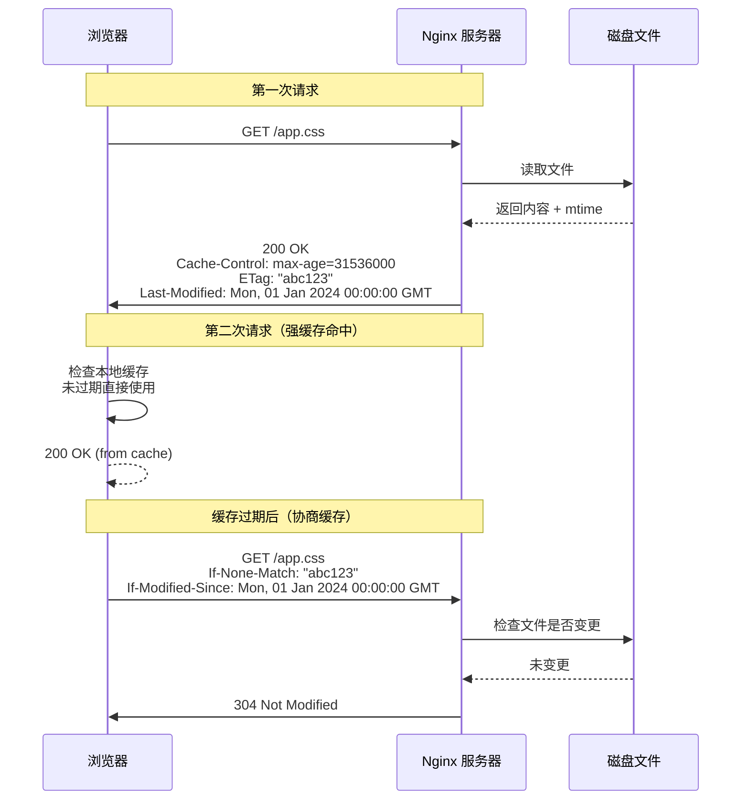
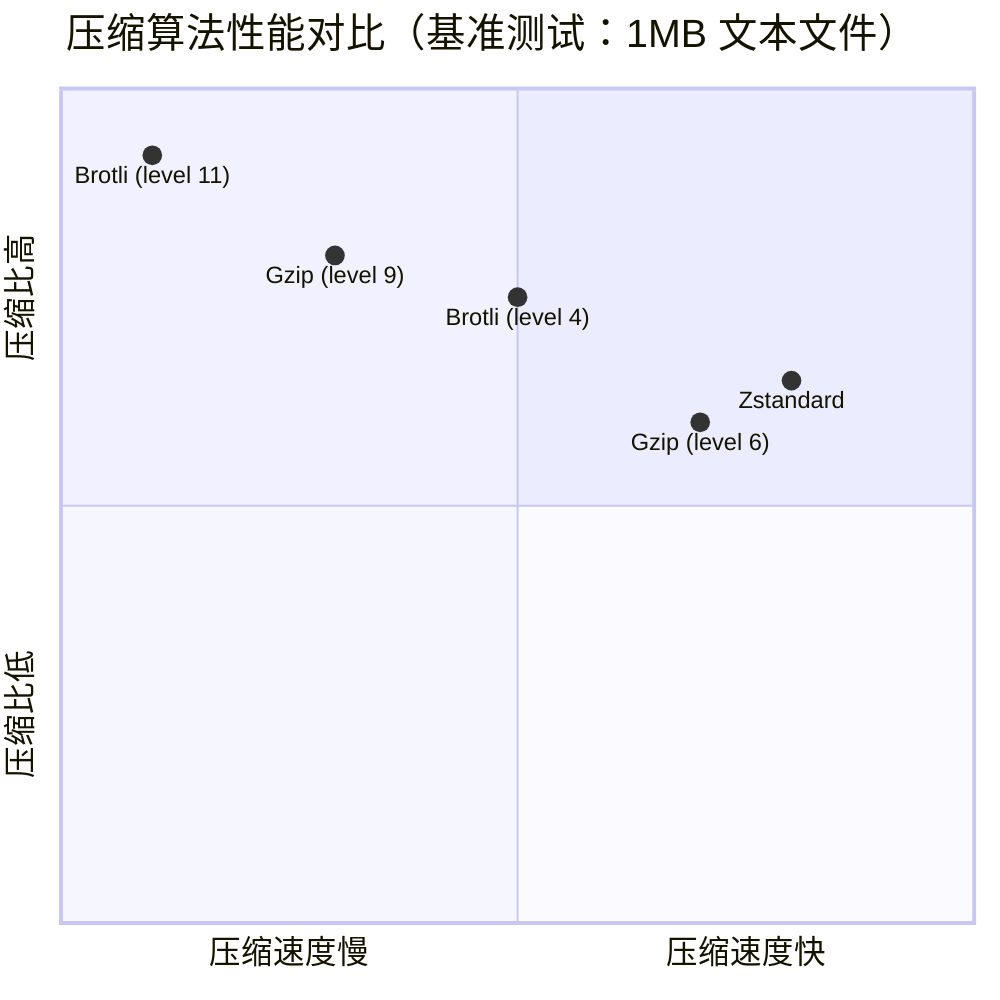

# 第 4 章 静态资源服务优化

## 学习目标
- ✅ 掌握 Nginx 静态文件服务的高效配置方法
- ✅ 理解并实现 Gzip、Brotli 压缩策略
- ✅ 精通浏览器缓存控制（Cache-Control、ETag、Last-Modified）
- ✅ 学会图片、字体等资源的优化技巧
- ✅ 能够配置 CDN 回源与防盗链机制
- ✅ 完成静态资源性能压测与调优

---

## 场景引入

假设你的电商网站遭遇以下问题：

**现状诊断**：
```bash
# 使用 Lighthouse 检测网站性能
# 结果：首屏加载 4.2 秒，其中静态资源占用 78%

# 查看 Nginx 访问日志
tail -f /var/log/nginx/access.log | awk '{print $7}' | sort | uniq -c | sort -rn | head -20

# 输出显示：
# 3520 /images/products/phone-case.jpg
# 2890 /css/app.css
# 2100 /js/vendor.js
# 1850 /fonts/roboto.woff2
```

**痛点分析**：
1. ❌ 每次刷新都重新下载相同资源（未启用缓存）
2. ❌ CSS/JS 文件体积过大（未开启压缩）
3. ❌ 高清大图直接暴露（未做懒加载与格式优化）
4. ❌ 被其他网站盗链图片（流量费用激增）

本章将系统解决这些问题，目标：**将静态资源加载时间从 4.2s 降至 1s 以内**。

---

## 核心原理

### 4.1 浏览器缓存机制全景图



**缓存优先级**：
1. **强缓存**（`Cache-Control: max-age`）：不发起请求，直接使用
2. **协商缓存**（`ETag` / `Last-Modified`）：发起请求，验证是否变更
3. **无缓存**：每次都完整下载

### 4.2 压缩算法对比



**选型建议**：
| 算法 | 压缩比 | 压缩速度 | 解压速度 | 浏览器支持 | 适用场景 |
|------|-------|---------|---------|-----------|---------|
| **Gzip** | 中 | 快 | 极快 | 100% | 通用默认选择 |
| **Brotli** | 高 | 慢 | 快 | 95%+ | 静态预压缩 |
| **Zstandard** | 中高 | 极快 | 极快 | 实验性 | 内部系统 |

### 4.3 图片格式演进路线

```mermaid
timeline
    title Web 图片格式发展历程
    section 1990s : GIF/JPEG<br/>基础格式
    section 2000s : PNG<br/>无损压缩
    section 2010 : WebP<br/>Google 推出
    section 2019 : AVIF<br/>开源免专利
    section 2024 : JPEG XL<br/>下一代格式
```

**2026 年推荐组合**：
- **首选**：AVIF（压缩比最优，支持率 89%）
- **备选**：WebP（兼容性最好，95%+）
- **兜底**：JPEG/PNG（老旧浏览器）

---

## 配置实战

### 4.4 Gzip 压缩配置（生产级）

```nginx
http {
    # === 启用 Gzip ===
    gzip on;
    
    # === 禁用 IE6 以下（有 bug）===
    gzip_disable "msie6";
    
    # === 根据 MIME 类型压缩 ===
    gzip_types 
        text/plain
        text/css
        text/xml
        text/javascript
        application/json
        application/javascript
        application/x-javascript
        application/xml
        application/xml+rss
        application/xhtml+xml
        image/svg+xml
        font/truetype
        font/opentype
        application/vnd.ms-fontobject
        application/x-font-ttf;
    
    # === 压缩级别（1-9，数字越大压缩比越高但越慢）===
    # 推荐值：6（平衡点）
    gzip_comp_level 6;
    
    # === 最小压缩文件大小（避免小文件越压越大）===
    gzip_min_length 1024;  # 小于 1KB 不压缩
    
    # === 缓冲配置 ===
    gzip_buffers 16 8k;
    gzip_buffer_size 4k;
    
    # === HTTP 版本要求 ===
    gzip_http_version 1.1;
    
    # === 添加 Vary 头（告知代理服务器按编码协商）===
    gzip_vary on;
    
    # === 禁用已压缩文件的二次压缩 ===
    gzip_proxied any;  # 或 no-cache/private/public
}
```

**验证压缩效果**：
```bash
# 测试 Gzip 是否生效
curl -I -H "Accept-Encoding: gzip" http://localhost/app.js

# 期望响应头：
# Content-Encoding: gzip
# Content-Length: 45678  # 压缩后大小

# 计算压缩比
# 原始大小 / 压缩后大小 = 压缩比（通常 3-5 倍）
```

### 4.5 Brotli 压缩配置（进阶优化）

```nginx
# 前提：编译 Nginx 时添加 brotli 模块
# ./configure --add-module=/path/to/brotli

http {
    # === 启用 Brotli ===
    brotli on;
    
    # === 压缩类型（同 Gzip）===
    brotli_types 
        text/plain
        text/css
        application/javascript
        application/json
        image/svg+xml;
    
    # === 压缩级别（0-11，推荐 4-6）===
    # 在线压缩用 4，预压缩用 11
    brotli_comp_level 4;
    
    # === 窗口大小（2^window 字节）===
    brotli_window 512k;
    
    # === 最小长度 ===
    brotli_min_length 1024;
    
    # === 禁用二次压缩 ===
    brotli_proxied any;
}
```

**静态预压缩策略**（推荐）：
```bash
# 构建时使用 brotli 预压缩（最高压缩级别）
# 生成 .css.br 和 .js.br 文件

# 安装 brotli 命令行工具
sudo apt install brotli -y

# 预压缩所有静态文件
find /var/www/shop -type f \( -name "*.css" -o -name "*.js" \) \
  -exec brotli -q 11 {} \;

# 输出示例：
# app.css → app.css.br（体积减少 78%）
# vendor.js → vendor.js.br（体积减少 82%）
```

```nginx
# Nginx 配置：优先返回 .br 文件
server {
    location /assets/ {
        root /var/www/shop;
        
        # 如果浏览器支持 Brotli 且存在 .br 文件
        if ($http_accept_encoding ~* br) {
            rewrite ^(.*)$ $1.br break;
        }
        
        # 否则尝试 Gzip
        if ($http_accept_encoding ~* gzip) {
            rewrite ^(.*)$ $1.gz break;
        }
        
        # 添加正确的 Content-Type 和 Encoding
        types {
            application/x-brotli br;
            application/x-gzip gz;
        }
        
        add_header Content-Encoding $content_encoding;
    }
}
```

### 4.6 浏览器缓存控制策略

```nginx
server {
    # === 静态资源：长期缓存（带指纹的文件）===
    # 匹配：/assets/app.a1b2c3d4.js 或 /assets/v1.2.3/logo.png
    location ~* ^/assets/(?:v[\d.]+|[a-f0-9]{8,})/.+$ {
        expires max;
        add_header Cache-Control "public, immutable";
        add_header X-Cache-Status "LONG_TERM";
        access_log off;
    }
    
    # === 图片资源：中期缓存 ===
    location ~* \.(jpg|jpeg|png|gif|ico|svg|webp|avif)$ {
        expires 30d;
        add_header Cache-Control "public, no-transform";
        add_header X-Cache-Status "MEDIUM_TERM";
    }
    
    # === 字体文件：长期缓存（极少变更）===
    location ~* \.(woff|woff2|ttf|eot|otf)$ {
        expires 1y;
        add_header Cache-Control "public, immutable";
        add_header Access-Control-Allow-Origin "*";  # CORS
    }
    
    # === CSS/JS：短期缓存（可能频繁更新）===
    location ~* \.(css|js)$ {
        expires 7d;
        add_header Cache-Control "public, must-revalidate";
        add_header X-Cache-Status "SHORT_TERM";
    }
    
    # === HTML 文件：禁止缓存（确保最新）===
    location ~* \.(html|htm)$ {
        expires -1;
        add_header Cache-Control "no-store, no-cache, must-revalidate, proxy-revalidate";
        add_header X-Cache-Status "NO_CACHE";
    }
    
    # === API 响应：根据业务需求 ===
    location /api/ {
        # 动态数据不缓存
        add_header Cache-Control "no-store";
        
        # 或使用私有缓存（仅用户浏览器可缓存）
        # add_header Cache-Control "private, max-age=60";
    }
}
```

**缓存策略速查表**：
| 资源类型 | Cache-Control | expires | 适用场景 |
|---------|--------------|---------|---------|
| **带指纹的静态文件** | `public, immutable` | `max` (5 年) | `app.a1b2c3.js` |
| **普通图片** | `public, no-transform` | `30d` | 产品图、Banner |
| **字体** | `public, immutable` | `1y` | WOFF2、TTF |
| **CSS/JS（无指纹）** | `public, must-revalidate` | `7d` | 传统构建 |
| **HTML** | `no-store` | `-1` | 主页面 |
| **API 数据** | `no-store` 或 `private` | 自定义 | 用户信息 |

### 4.7 ETag 与 Last-Modified 配置

```nginx
http {
    # === 启用 ETag（基于文件内容 hash）===
    etag on;
    
    # === 启用 Last-Modified（基于文件修改时间）===
    # 默认开启，可手动关闭
    # last_modified off;  # 不推荐关闭
    
    # === 精确 ETag（Nginx 1.11.0+）===
    # 使用更强的 hash 算法
    # etag_exact on;  # 默认关闭，消耗更多 CPU
}
```

**ETag vs Last-Modified 对比**：
| 特性 | ETag | Last-Modified |
|------|------|---------------|
| **精度** | 字节级（内容变更即变） | 秒级（1 秒内多次修改无法识别） |
| **性能** | 需计算 hash（消耗 CPU） | 直接读取 mtime（极快） |
| **集群一致性** | ⚠️ 多服务器可能不一致 | ✅ 时间戳天然一致 |
| **推荐用法** | 单服务器 + 高精度需求 | 集群部署 + 性能优先 |

### 4.8 图片优化实战

#### 方案 A：实时格式转换（动态服务）

```nginx
# 需要 Nginx 模块：ngx_http_image_filter_module

http {
    location ~* /images/products/ {
        alias /data/images/products/;
        
        # 自动转换为 WebP（如果浏览器支持）
        if ($http_accept ~* "image/webp") {
            set $image_type "webp";
        }
        
        # 调整图片尺寸（缩略图生成）
        location ~* /images/products/thumb/ {
            image_filter resize 300 300;
            image_filter_jpeg_quality 75;
            image_filter_webp_quality 80;
            image_filter_buffer 10M;
        }
        
        # 裁剪（中心裁剪）
        location ~* /images/products/crop/ {
            image_filter crop 400 400;
        }
    }
}
```

#### 方案 B：预生成多版本（推荐）

```bash
# 使用 ImageMagick 批量处理
sudo apt install imagemagick -y

# 生成缩略图
convert product.jpg -resize 300x300^ -gravity center -extent 300x300 product_thumb.jpg

# 转换为 WebP
cwebp -q 80 product.jpg -o product.webp

# 转换为 AVIF（更优压缩）
avifenc --min 0 --max 63 --minalpha 0 --maxalpha 63 -s 6 product.jpg product.avif

# 批量脚本
#!/bin/bash
for img in *.jpg; do
    basename="${img%.jpg}"
    cwebp -q 80 "$img" -o "${basename}.webp"
    convert "$img" -resize 300x300^ -gravity center -extent 300x300 "${basename}_thumb.jpg"
done
```

```nginx
# Nginx 配置：内容协商返回最佳格式
server {
    location /images/products/ {
        alias /data/images/products/;
        
        # 按优先级尝试不同格式
        try_files 
            $uri.avif         # 1. AVIF（最优）
            $uri.webp         # 2. WebP（兼容性好）
            $uri              # 3. 原始格式（JPEG/PNG）
            =404;
        
        # 添加正确的 Content-Type
        types {
            image/avif avif;
            image/webp webp;
        }
        
        # 添加响应头告知格式
        add_header X-Image-Format $content_type;
        
        # 长期缓存
        expires 30d;
        add_header Cache-Control "public, no-transform";
    }
}
```

### 4.9 防盗链配置

```nginx
server {
    location ~* \.(jpg|jpeg|png|gif|svg|webp|avif)$ {
        # === 基础防盗链 ===
        valid_referers none blocked server_names 
                         *.example.com example.com
                         google.com bing.com;  # 允许搜索引擎
        
        if ($invalid_referer) {
            # 方案 A：直接拒绝
            return 403;
            
            # 方案 B：返回占位图
            # rewrite /images/placeholder.jpg break;
            
            # 方案 C：记录日志后放行（监控用）
            # access_log /var/log/nginx/hotlink.log;
        }
        
        # === 高级：临时链接（带 token 验证）===
        # 适用于付费内容
        location /premium/images/ {
            valid_referers none blocked server_names;
            
            if ($invalid_referer) {
                # 检查 URL 中的临时 token
                # 格式：/premium/image.jpg?token=xxx&expires=1234567890
                if ($arg_token = "") {
                    return 403;
                }
                
                # TODO: 配合 Lua 脚本验证 token 有效性
            }
        }
    }
}
```

### 4.10 CDN 回源配置

```nginx
# 作为 CDN 源站（Origin Server）

server {
    listen 80;
    server_name origin.example.com;
    
    # 只允许 CDN 节点访问（白名单）
    # Cloudflare IP 段示例
    allow 173.245.48.0/20;
    allow 103.21.244.0/22;
    allow 103.22.200.0/22;
    deny all;
    
    location / {
        root /var/www/static;
        
        # 添加验证头部（CDN 回源验证）
        add_header X-Origin-Verify "secret_token_123";
        
        # 限制请求速率（防止源站被打爆）
        limit_req zone=cdn burst=100 nodelay;
    }
}

# 限流区域定义（放在 http 块）
limit_req_zone $binary_remote_addr zone=cdn:10m rate=100r/s;
```

---

## 完整示例文件

### 4.11 电商网站静态资源配置（完整版）

```nginx
# /etc/nginx/conf.d/static-assets.conf
# 专业电商网站静态资源优化配置

# === 限流区域定义 ===
limit_req_zone $binary_remote_addr zone=static:10m rate=50r/s;
limit_conn_zone $binary_remote_addr zone=static_conn:10m;

server {
    listen 80;
    server_name static.example.com;
    
    # === 根目录 ===
    root /data/static;
    
    # === 日志分离 ===
    access_log /var/log/nginx/static.access.log main;
    error_log /var/log/nginx/static.error.log warn;
    
    # === 全局缓存控制 ===
    add_header X-Server "Nginx-Static";
    
    # === 带版本号/指纹的资源（最长缓存）===
    # 匹配模式：
    #   /assets/v1.2.3/app.js
    #   /assets/a1b2c3d4/logo.png
    #   /build/20240101/styles.css
    location ~* ^/(?:assets|build)/(?:v[\d.]+|[a-f0-9]{8,}|[0-9]{8,})/(.+)$ {
        expires max;
        add_header Cache-Control "public, immutable";
        add_header X-Cache-Group "VERSIONED";
        
        # 预压缩检查
        gzip_static on;
        brotli_static on;
        
        access_log off;
    }
    
    # === 商品图片（中等缓存 + 防盗链）===
    location /images/products/ {
        alias /data/images/products/;
        
        # 多格式支持
        try_files 
            $uri.avif
            $uri.webp
            $uri
            =404;
        
        # 防盗链
        valid_referers none blocked server_names *.example.com;
        if ($invalid_referer) {
            return 403;
        }
        
        # 缓存 30 天
        expires 30d;
        add_header Cache-Control "public, no-transform";
        add_header X-Cache-Group "PRODUCT_IMAGES";
        
        # 限流
        limit_req zone=static burst=20 nodelay;
        limit_conn zone=static_conn 10;
    }
    
    # === Banner 与广告图 ===
    location /images/banners/ {
        alias /data/images/banners/;
        
        # Banner 经常更换，缓存较短
        expires 7d;
        add_header Cache-Control "public, must-revalidate";
        add_header X-Cache-Group "BANNERS";
    }
    
    # === 字体文件（CDN 友好）===
    location /fonts/ {
        alias /data/fonts/;
        
        # 允许跨域（CDN 必需）
        add_header Access-Control-Allow-Origin "*";
        
        # 长期缓存
        expires 1y;
        add_header Cache-Control "public, immutable";
        add_header X-Cache-Group "FONTS";
        
        # 字体 MIME 类型
        types {
            font/woff2 woff2;
            font/woff woff;
            font/ttf ttf;
        }
    }
    
    # === 视频资源（大文件优化）===
    location /videos/ {
        alias /data/videos/;
        
        # 启用范围请求（支持拖拽播放）
        add_header Accept-Ranges bytes;
        
        # 缓存 90 天
        expires 90d;
        add_header Cache-Control "public, no-transform";
        
        # 预读缓冲（提升大文件传输性能）
        read_ahead 512k;
        
        # 限制单个连接带宽（防止占满出口）
        limit_rate 10m;
    }
    
    # === 下载文件（限速 + 鉴权）===
    location /downloads/ {
        alias /data/downloads/;
        
        # 需要登录凭证（配合 auth_request）
        auth_request /auth/verify;
        
        # 限速
        limit_rate_after 10m;  # 前 10MB 不限速
        limit_rate 5m;         # 之后限速 5MB/s
        
        # 缓存策略
        expires 1d;
        add_header Cache-Control "private";
    }
    
    # === favicon.ico 特殊处理 ===
    location = /favicon.ico {
        log_not_found off;
        access_log off;
        expires 30d;
        add_header Cache-Control "public, immutable";
    }
    
    # === robots.txt ===
    location = /robots.txt {
        log_not_found off;
        access_log off;
        expires 1h;
        add_header Content-Type "text/plain";
    }
    
    # === 默认兜底规则 ===
    location / {
        # 未知静态资源不缓存
        expires 1h;
        add_header Cache-Control "public, must-revalidate";
        add_header X-Cache-Group "DEFAULT";
    }
    
    # === 错误页面美化 ===
    error_page 404 /404.html;
    error_page 500 502 503 504 /50x.html;
    
    location = /404.html {
        internal;
    }
    
    location = /50x.html {
        internal;
    }
}
```

---

## 常见错误与排查

### 4.12 缓存相关陷阱

#### 问题 1：缓存更新不生效

```nginx
# ❌ 错误：设置了长期缓存但文件会变
location /css/app.css {
    expires 1y;  # 用户 1 年内都不会更新！
}

# ✅ 解决方案 A：文件名加 hash
location ~* \.[a-f0-9]{8}\.css$ {
    expires 1y;
    add_header Cache-Control "public, immutable";
}

# ✅ 解决方案 B：缩短缓存时间
location ~* \.css$ {
    expires 7d;
    add_header Cache-Control "public, must-revalidate";
}
```

#### 问题 2：Brotli 未生效

```bash
# 检查 Nginx 是否编译了 brotli 模块
nginx -V 2>&1 | grep brotli

# 无输出说明未编译，需重新编译或使用 apt 安装
sudo apt install libnginx-mod-http-brotli -y
```

```nginx
# ❌ 错误：忘记启用 gzip_static
location /assets/ {
    brotli_static off;  # 不会查找 .br 文件
}

# ✅ 正确
location /assets/ {
    brotli_static on;   # 优先查找 .br 文件
    gzip_static on;     # 备选 .gz 文件
}
```

#### 问题 3：CORS 导致字体加载失败

```javascript
// 前端 CSS
@font-face {
    font-family: 'Roboto';
    src: url('https://static.example.com/fonts/roboto.woff2');
    // 跨域请求字体
}

// 浏览器报错：
// Access to fetch at '...' from origin '...' has been blocked by CORS policy
```

```nginx
# ✅ 解决方案：添加 CORS 头部
location /fonts/ {
    add_header Access-Control-Allow-Origin "*";
    # 或在生产环境指定域名
    # add_header Access-Control-Allow-Origin "https://www.example.com";
}
```

### 4.13 性能调试命令

```bash
# 1. 检查压缩效果
curl -I -H "Accept-Encoding: gzip, deflate, br" \
  http://localhost/app.js

# 查看响应头：
# Content-Encoding: br  # 使用了 Brotli
# Content-Length: 45678 # 压缩后大小

# 2. 检查缓存命中
curl -I http://localhost/assets/v1.0/app.css
# 第一次：HTTP/2 200
# 第二次：HTTP/2 200 (from cache)

# 3. 检查 ETag
curl -I http://localhost/app.css
# ETag: "5f8a9b2c-1234"

# 带条件请求
curl -I -H 'If-None-Match: "5f8a9b2c-1234"' \
  http://localhost/app.css
# 应返回：HTTP/2 304 Not Modified

# 4. 压测静态资源性能
ab -n 10000 -c 100 \
  -H "Accept-Encoding: gzip" \
  http://localhost/assets/app.js

# 关键指标：
# Requests per second: >5000 为优秀
# Time per request: <10ms 为优秀
```

---

## 性能与安全建议

### 4.14 sendfile 零拷贝优化

```nginx
http {
    # === 启用零拷贝（Linux 必开）===
    sendfile on;
    
    # === TCP 包优化 ===
    tcp_nopush on;      # 凑满一个 TCP 包再发送
    tcp_nodelay on;     # 低延迟场景关闭 Nagle 算法
    
    # === sendfile 文件大小限制 ===
    sendfile_max_chunk 2m;  # 单次 sendfile 最大 2MB
    
    # === 异步 I/O（大文件优化）===
    aio on;
    aio_write on;
    directio 512m;          # 大于 512MB 的文件使用直接 I/O
}
```

### 4.15 open_file_cache（元数据缓存）

```nginx
http {
    # === 文件描述符缓存 ===
    open_file_cache max=10000 inactive=20s;
    open_file_cache_valid 30s;
    open_file_cache_min_uses 2;
    open_file_cache_errors on;
    
    # === 作用 ===
    # 缓存文件描述符、大小、修改时间等元数据
    # 避免每次请求都调用 stat() 系统调用
    # 对高并发静态资源服务提升显著（20-30%）
}
```

### 4.16 安全加固清单

```nginx
# 1. 隐藏敏感文件
location ~ /\.(htaccess|htpasswd|git|svn|env|config) {
    deny all;
    return 404;
}

# 2. 禁止目录浏览
autoindex off;  # 默认关闭，确认一下

# 3. 限制请求方法
location /static/ {
    if ($request_method !~ ^(GET|HEAD)$) {
        return 405;
    }
}

# 4. 防止点击劫持
add_header X-Frame-Options "SAMEORIGIN" always;

# 5. 防止 MIME 类型嗅探
add_header X-Content-Type-Options "nosniff" always;
```

---

## 练习题

### 练习 1：搭建静态资源专用服务器
在一台独立服务器上部署 Nginx，要求：
- 域名：`static.shop.com`
- 启用 Brotli + Gzip 双重压缩
- 配置三级缓存策略：
  - 带指纹文件：1 年缓存
  - 普通图片：30 天缓存
  - HTML：不缓存
- 实现图片防盗链（仅允许 `*.shop.com`）
- 使用 `ab` 压测，达到 10000 QPS

### 练习 2：图片格式转换流水线
编写自动化脚本 `optimize-images.sh`：
1. 遍历 `/data/images/products/` 目录下所有 JPG/PNG
2. 为每张图片生成三种格式：AVIF、WebP、原格式
3. 生成三个尺寸：原图、800px 宽、300px 缩略图
4. 输出统计报告（原始体积 vs 优化后体积）
5. 配置 Nginx 实现内容协商返回最佳格式

### 练习 3：CDN 回源压力测试
模拟 CDN 节点对源站的压力：
1. 配置 Nginx 作为 CDN 源站
2. 使用 `siege` 或 `wrk` 模拟 1000 并发请求
3. 观察源站 CPU、内存、网络 IO
4. 调整 `limit_req` 和 `limit_conn` 参数
5. 找到最大承载阈值并撰写压测报告

---

## 本章小结

✅ **核心要点回顾**：
1. **缓存分层**：带指纹用 `immutable`，动态用 `must-revalidate`
2. **压缩选择**：Brotli 预压缩（静态）+ Gzip 实时（动态）
3. **图片优化**：AVIF > WebP > JPEG，配合懒加载
4. **防盗链**：`valid_referers` + 临时 token
5. **性能神器**：`sendfile` + `open_file_cache` + `aio`

🎯 **下一章预告**：
第 5 章进入 **反向代理核心功能**，深入讲解 `proxy_pass` 的 18 种用法、请求头传递、超时控制及负载均衡器健康检查机制。

📚 **参考资源**：
- [Nginx HTTP 模块文档](https://nginx.org/en/docs/http/)
- [Brotli 压缩规范](https://datatracker.ietf.org/doc/html/rfc7932)
- [Web 性能优化最佳实践](https://web.dev/fast/)
- [图片格式对比测试](https://cloudinary.com/blog/webp_and_brotli_compression)
