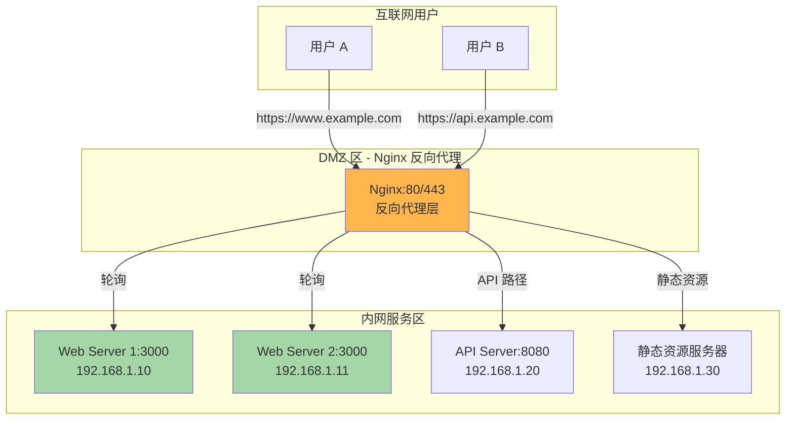
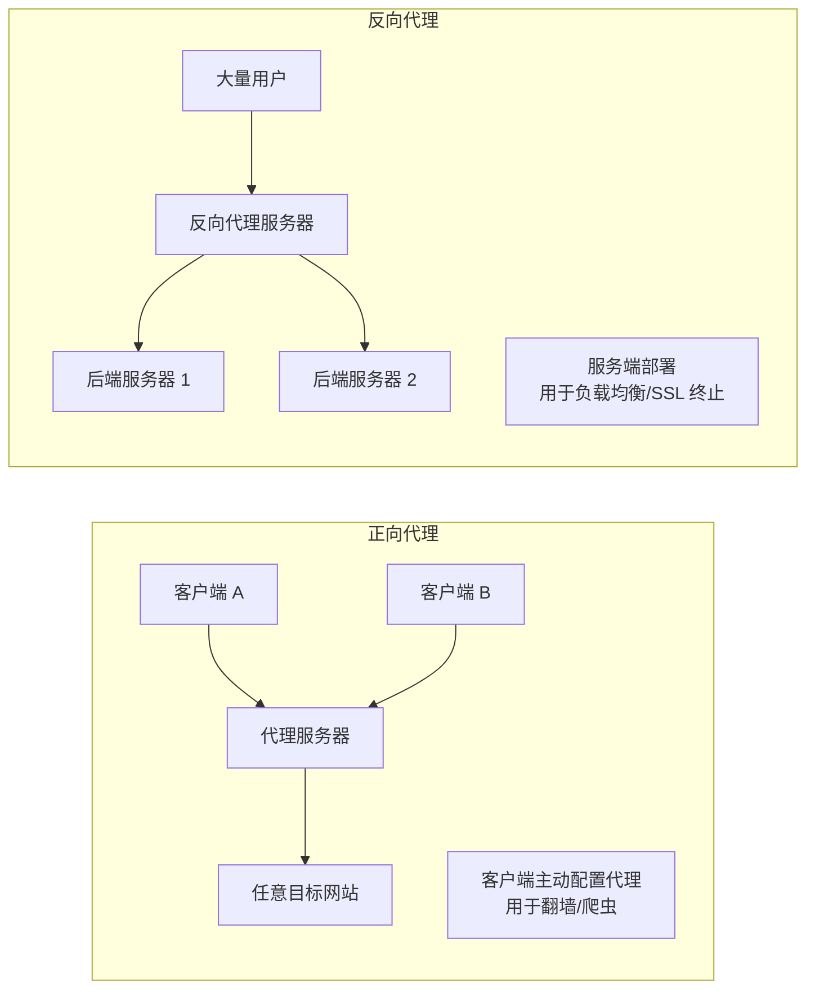
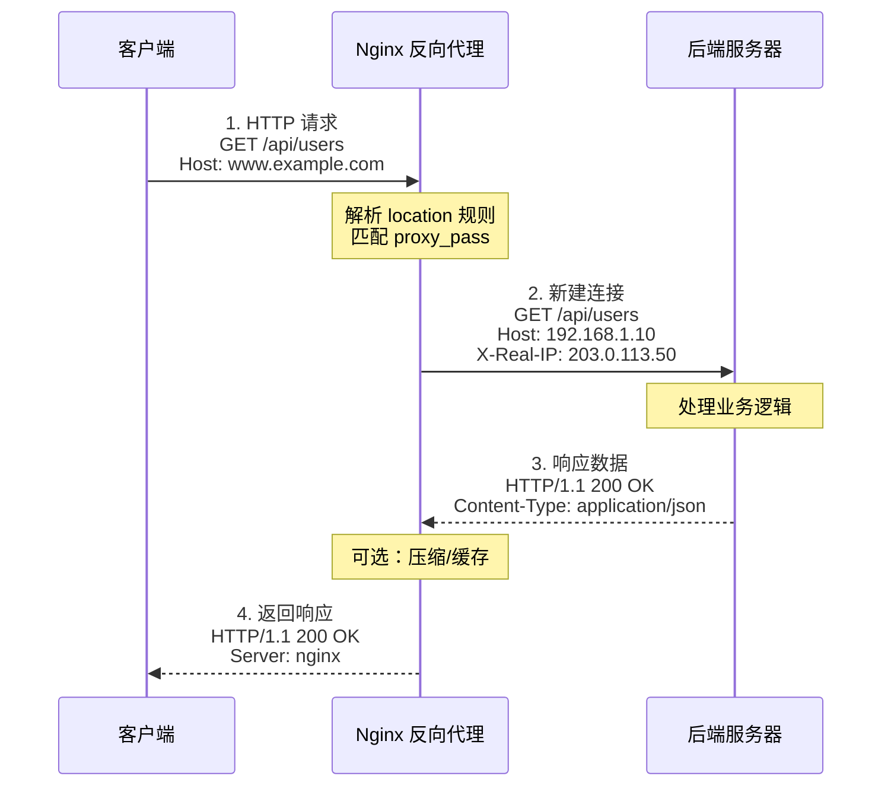
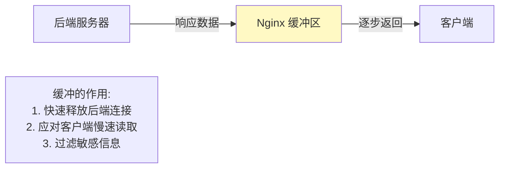

# 第 5 章 反向代理基础与实战

## 学习目标
- ✅ 理解反向代理的工作原理与应用场景
- ✅ 掌握 `proxy_pass` 的完整语法与路径映射规则
- ✅ 能够正确传递客户端真实 IP 与请求头
- ✅ 学会配置代理超时与缓冲优化
- ✅ 实现基于域名的虚拟主机路由
- ✅ 掌握代理缓存的基础配置方法

---

## 场景引入

假设你的公司有以下架构需求：



**核心问题**：
1. 如何让用户访问 `www.example.com` 时透明转发到内网 `192.168.1.10:3000`？
2. 后端服务器如何获取用户的真实 IP（而不是 Nginx 的内网 IP）？
3. 如何避免慢速后端拖垮整个代理服务？

本章将逐一解答这些问题。

---

## 核心原理

### 5.1 反向代理 vs 正向代理



**关键区别**：
| 维度 | 正向代理 | 反向代理 |
|------|---------|---------|
| **服务对象** | 客户端 | 服务器端 |
| **配置位置** | 客户端浏览器 | 服务端 DNS |
| **隐藏对象** | 客户端真实 IP | 后端服务器架构 |
| **典型用途** | 突破网络限制 | 负载均衡、SSL 终止、缓存加速 |

### 5.2 Nginx 反向代理工作流程



**关键要点**：
1. **两次握手**：客户端 ↔ Nginx，Nginx ↔ 后端
2. **协议独立**：客户端用 HTTPS，后端可用 HTTP
3. **头部重写**：可修改/添加请求头与响应头

---

## 配置实战

### 5.3 最小反向代理配置

```nginx
server {
    listen 80;
    server_name www.example.com;
    
    location / {
        # 最简单的反向代理
        proxy_pass http://192.168.1.10:3000;
    }
}
```

**工作原理**：
- 用户访问 `http://www.example.com/api/users`
- Nginx 转发到 `http://192.168.1.10:3000/api/users`
- 路径**完全保持不变**

### 5.4 proxy_pass 路径映射规则（重点）

#### 规则 1：末尾无斜杠（推荐）

```nginx
location /api/ {
    proxy_pass http://backend:3000;
}

# 请求：GET /api/users/123
# 转发：GET http://backend:3000/api/users/123
# 说明：完整路径透传
```

#### 规则 2：末尾有斜杠（路径替换）

```nginx
location /api/ {
    proxy_pass http://backend:3000/;
}

# 请求：GET /api/users/123
# 转发：GET http://backend:3000/users/123
# 说明：/api/ 被替换为 /
```

#### 规则 3：带 URI 的 proxy_pass

```nginx
location /api/ {
    proxy_pass http://backend:3000/v1;
}

# 请求：GET /api/users/123
# 转发：GET http://backend:3000/v1/users/123
# 说明：/api/ 被替换为 /v1
```

**记忆口诀**：
> **有斜杠，换前缀；无斜杠，原样传**

### 5.5 传递客户端真实 IP

```nginx
http {
    # === 定义信任的代理 IP 段 ===
    # 如果 Nginx 前面还有 CDN/负载均衡器，需要加入它们的 IP
    set_real_ip_from 10.0.0.0/8;
    set_real_ip_from 172.16.0.0/12;
    set_real_ip_from 192.168.0.0/16;
    set_real_ip_from 203.0.113.0/24;  # 示例公网 IP
    
    # 从哪个头部提取真实 IP
    real_ip_header X-Forwarded-For;
    
    # 递归查找（如果有多层代理）
    real_ip_recursive on;
}

server {
    listen 80;
    server_name www.example.com;
    
    location / {
        proxy_pass http://backend:3000;
        
        # === 必传的 4 个头部 ===
        
        # 1. Host（保持原始域名）
        proxy_set_header Host $host;
        
        # 2. 真实 IP（经过 real_ip 模块处理后）
        proxy_set_header X-Real-IP $remote_addr;
        
        # 3. 代理链（所有经过的 IP）
        proxy_set_header X-Forwarded-For $proxy_add_x_forwarded_for;
        
        # 4. 协议（http/https）
        proxy_set_header X-Forwarded-Proto $scheme;
        
        # === 可选但推荐的头部 ===
        
        # 5. 原始端口
        proxy_set_header X-Forwarded-Port $server_port;
        
        # 6. 原始 Host（包含端口）
        proxy_set_header X-Forwarded-Host $host:$server_port;
    }
}
```

**后端获取真实 IP 示例**（Node.js）：
```javascript
// Express 应用
app.get('/api/client-info', (req, res) => {
    // ❌ 错误：拿到的是 Nginx 内网 IP
    const wrongIP = req.connection.remoteAddress;
    
    // ✅ 正确：从头部提取
    const realIP = req.headers['x-real-ip'] || 
                   req.headers['x-forwarded-for']?.split(',')[0];
    
    res.json({
        realIP: realIP,
        originalHost: req.headers['x-forwarded-host'],
        protocol: req.headers['x-forwarded-proto']
    });
});
```

### 5.6 代理超时控制

```nginx
location /api/ {
    proxy_pass http://backend:3000;
    
    # === 三种超时时间 ===
    
    # 1. 连接后端超时（握手阶段）
    proxy_connect_timeout 60s;
    
    # 2. 发送请求体超时（上传大文件）
    proxy_send_timeout 60s;
    
    # 3. 等待响应超时（后端处理慢）
    proxy_read_timeout 60s;
    
    # === 场景化配置建议 ===
    
    # 普通 API 请求
    # connect: 5s, send: 10s, read: 30s
    
    # 文件上传接口
    # connect: 10s, send: 300s, read: 300s
    
    # 导出报表（长时间任务）
    # connect: 10s, send: 10s, read: 600s
}
```

**超时错误排查**：
```bash
# 查看 Nginx 错误日志
tail -f /var/log/nginx/error.log | grep "upstream timed out"

# 常见错误：
# 110: Connection timed out (connect)
# 110: Connection timed out (read)
```

### 5.7 代理缓冲优化

```nginx
http {
    # === 全局缓冲配置 ===
    
    # 启用缓冲（默认开启）
    proxy_buffering on;
    
    # 单个缓冲块大小（通常等于内存页大小 4KB）
    proxy_buffer_size 4k;
    
    # 缓冲块数量 × 大小 = 总缓冲容量
    proxy_buffers 8 4k;  # 32KB
    
    # 繁忙时可用的最大缓冲大小
    proxy_busy_buffers_size 8k;
    
    # 临时文件目录
    proxy_temp_path /var/nginx/tmp;
    
    # 临时文件最大大小（超过则直接返回给客户端）
    proxy_max_temp_file_size 1024m;
}

server {
    location /api/ {
        proxy_pass http://backend:3000;
        
        # === 针对不同接口的缓冲策略 ===
        
        # 小数据量 API（快速响应）
        location /api/users/ {
            proxy_buffering on;
            proxy_buffer_size 2k;
            proxy_buffers 4 2k;
        }
        
        # 大数据量 API（导出/报表）
        location /api/export/ {
            # 关闭缓冲，流式传输
            proxy_buffering off;
            proxy_request_buffering off;
            
            # 延长超时
            proxy_read_timeout 600s;
        }
        
        # SSE 实时推送
        location /sse/ {
            proxy_buffering off;
            proxy_cache off;
            proxy_request_buffering off;
            
            # 长连接
            proxy_read_timeout 86400s;
        }
    }
}
```

**缓冲机制图解**：


---

## 完整示例文件

### 5.8 多站点反向代理配置

```nginx
# /etc/nginx/conf.d/reverse-proxy.conf
# 企业级多站点反向代理配置

# === 上游服务器组定义 ===
upstream web_backend {
    least_conn;
    server 192.168.1.10:3000 max_fails=3 fail_timeout=30s;
    server 192.168.1.11:3000 max_fails=3 fail_timeout=30s;
    keepalive 32;
}

upstream api_backend {
    least_conn;
    server 192.168.1.20:8080 max_fails=3 fail_timeout=30s;
    server 192.168.1.21:8080 max_fails=3 fail_timeout=30s;
    keepalive 32;
}

# === 主站（WWW）===
server {
    listen 80;
    listen [::]:80;
    server_name www.example.com;
    
    # 强制跳转 HTTPS
    return 301 https://$server_name$request_uri;
}

server {
    listen 443 ssl http2;
    listen [::]:443 ssl http2;
    server_name www.example.com;
    
    # SSL 证书
    ssl_certificate /etc/nginx/ssl/www.example.com/fullchain.pem;
    ssl_certificate_key /etc/nginx/ssl/www.example.com/privkey.pem;
    
    # 日志
    access_log /var/log/nginx/www.access.log main;
    error_log /var/log/nginx/www.error.log warn;
    
    # 根位置：前端 SPA 应用
    location / {
        proxy_pass http://web_backend;
        
        # 必要头部
        proxy_set_header Host $host;
        proxy_set_header X-Real-IP $remote_addr;
        proxy_set_header X-Forwarded-For $proxy_add_x_forwarded_for;
        proxy_set_header X-Forwarded-Proto $scheme;
        
        # WebSocket 支持
        proxy_http_version 1.1;
        proxy_set_header Upgrade $http_upgrade;
        proxy_set_header Connection "upgrade";
        
        # 超时
        proxy_connect_timeout 10s;
        proxy_read_timeout 60s;
    }
    
    # API 路径：转发到 API 集群
    location /api/ {
        proxy_pass http://api_backend;
        
        # 头部传递
        proxy_set_header Host $host;
        proxy_set_header X-Real-IP $remote_addr;
        proxy_set_header X-Forwarded-For $proxy_add_x_forwarded_for;
        proxy_set_header X-Forwarded-Proto $scheme;
        
        # 超时（API 通常较快）
        proxy_connect_timeout 5s;
        proxy_read_timeout 30s;
    }
}

# === API 专用域名 ===
server {
    listen 80;
    listen [::]:80;
    server_name api.example.com;
    
    return 301 https://$server_name$request_uri;
}

server {
    listen 443 ssl http2;
    listen [::]:443 ssl http2;
    server_name api.example.com;
    
    ssl_certificate /etc/nginx/ssl/api.example.com/fullchain.pem;
    ssl_certificate_key /etc/nginx/ssl/api.example.com/privkey.pem;
    
    access_log /var/log/nginx/api.access.log main;
    error_log /var/log/nginx/api.error.log warn;
    
    # 全部流量转发到 API 后端
    location / {
        proxy_pass http://api_backend;
        
        proxy_set_header Host $host;
        proxy_set_header X-Real-IP $remote_addr;
        proxy_set_header X-Forwarded-For $proxy_add_x_forwarded_for;
        proxy_set_header X-Forwarded-Proto $scheme;
        
        # API 限流
        limit_req zone=api burst=20 nodelay;
    }
}

# === 管理后台（限制访问 IP）===
server {
    listen 443 ssl http2;
    server_name admin.example.com;
    
    ssl_certificate /etc/nginx/ssl/admin.example.com/fullchain.pem;
    ssl_certificate_key /etc/nginx/ssl/admin.example.com/privkey.pem;
    
    # IP 白名单
    allow 192.168.1.0/24;
    allow 10.0.0.0/8;
    deny all;
    
    location / {
        proxy_pass http://web_backend;
        
        proxy_set_header Host $host;
        proxy_set_header X-Real-IP $remote_addr;
        proxy_set_header X-Forwarded-For $proxy_add_x_forwarded_for;
    }
}
```

### 5.9 配套限流配置

```nginx
# /etc/nginx/conf.d/rate-limiting.conf
# 限流区域定义（放在 http 块）

# API 限流：每秒 10 请求，突发允许 20
limit_req_zone $binary_remote_addr zone=api:10m rate=10r/s;

# 全站限流：每秒 50 请求
limit_req_zone $binary_remote_addr zone=global:10m rate=50r/s;

# 连接数限制
limit_conn_zone $binary_remote_addr zone=conn_per_ip:10m;
```

---

## 常见错误与排查

### 5.10 经典陷阱

#### 问题 1：502 Bad Gateway

```bash
# 错误日志
tail -f /var/log/nginx/error.log
# 输出：connect() failed (111: Connection refused) while connecting to upstream

# 原因：后端服务未启动或监听地址错误

# 排查步骤
# 1. 检查后端是否运行
curl -I http://192.168.1.10:3000/health

# 2. 检查防火墙
sudo ufw status | grep 3000

# 3. 检查 Nginx 能否访问后端
telnet 192.168.1.10 3000
```

#### 问题 2：504 Gateway Timeout

```bash
# 错误日志
# upstream timed out (110: Connection timed out) while reading response header

# 原因：后端处理超时

# 解决方案
location /api/slow-endpoint/ {
    proxy_pass http://backend;
    
    # 增加超时时间
    proxy_read_timeout 120s;
    
    # 或者关闭缓冲（流式返回）
    proxy_buffering off;
}
```

#### 问题 3：后端获取不到真实 IP

```nginx
# ❌ 错误：忘记设置头部
location / {
    proxy_pass http://backend;
    # 缺少 proxy_set_header 指令
}

# ✅ 正确
location / {
    proxy_pass http://backend;
    proxy_set_header X-Real-IP $remote_addr;
    proxy_set_header X-Forwarded-For $proxy_add_x_forwarded_for;
}

# 后端验证（Node.js）
console.log(req.headers['x-real-ip']);  // 应显示客户端 IP
```

#### 问题 4：重定向循环

```nginx
# ❌ 错误：HTTPS 跳转逻辑不当
server {
    listen 80;
    return 301 https://$host$request_uri;
}

server {
    listen 443 ssl;
    location / {
        proxy_pass http://backend;
        # 后端也做了 301 跳转，形成死循环
    }
}

# ✅ 解决：传递协议信息，让后端知道已经是 HTTPS
proxy_set_header X-Forwarded-Proto $scheme;

# 后端根据此头部判断，不再重复跳转
```

### 5.11 调试技巧

```bash
# 1. 查看完整请求头（含转发后的）
curl -v http://localhost/api/test

# 2. 在 Nginx 配置中添加调试头部
location /api/ {
    proxy_pass http://backend;
    
    # 添加响应头便于调试
    add_header X-Upstream-Status $upstream_status;
    add_header X-Upstream-Response-Time $upstream_response_time;
    add_header X-Real-IP $remote_addr;
}

# 3. 分析响应头
curl -I http://localhost/api/test
# 查看 X-Upstream-* 自定义头部

# 4. 实时监控上游状态
nginx -T | grep upstream
```

---

## 性能与安全建议

### 5.12 性能优化清单

```nginx
http {
    # 1. 启用连接复用
    proxy_http_version 1.1;
    proxy_set_header Connection "";
    
    # 2. 调整缓冲大小（根据响应体大小）
    proxy_buffer_size 8k;
    proxy_buffers 16 8k;
    proxy_busy_buffers_size 24k;
    
    # 3. 临时文件目录使用 SSD
    proxy_temp_path /dev/shm/nginx_tmp;  # 内存盘
    
    # 4. 忽略后端响应头中的 Cache-Control（自己控制缓存）
    proxy_ignore_headers Cache-Control Expires Set-Cookie;
}
```

### 5.13 安全加固

```nginx
server {
    location / {
        proxy_pass http://backend;
        
        # 1. 隐藏后端响应头中的敏感信息
        proxy_hide_header X-Powered-By;
        proxy_hide_header Server;
        
        # 2. 限制请求体大小
        client_max_body_size 10M;
        
        # 3. 只允许特定 HTTP 方法
        if ($request_method !~ ^(GET|HEAD|POST|PUT|DELETE)$) {
            return 405;
        }
        
        # 4. 防止点击劫持
        add_header X-Frame-Options "SAMEORIGIN" always;
        
        # 5. 防止 MIME 嗅探
        add_header X-Content-Type-Options "nosniff" always;
    }
}
```

---

## 练习题

### 练习 1：搭建三节点反向代理环境
使用 Docker Compose 部署：
- 1 个 Nginx 容器（反向代理）
- 3 个 Node.js 容器（后端，端口 3001/3002/3003）
- 配置轮询负载均衡
- 验证每个请求被分发到不同后端
- 模拟一个后端宕机，观察故障转移

### 练习 2：真实 IP 传递实验
1. 搭建两层代理架构（Nginx → Nginx → Backend）
2. 在第一层 Nginx 设置 `X-Forwarded-For`
3. 在第二层 Nginx 启用 `real_ip_recursive on`
4. 在后端打印最终获取到的 IP
5. 绘制 IP 传递流程图

### 练习 3：超时与缓冲调优
针对以下场景配置不同的超时和缓冲参数：
- 普通 API 接口（响应 < 100KB，耗时 < 1s）
- 文件下载接口（响应 10MB，耗时 30s）
- SSE 实时推送（持续连接，小数据包）
- 使用 `ab` 压测对比性能差异

---

## 本章小结

✅ **核心要点回顾**：
1. **proxy_pass 斜杠规则**：有 `/` 换前缀，无 `/` 原样传
2. **真实 IP 传递**：`X-Real-IP` + `X-Forwarded-For` + `real_ip` 模块
3. **超时三要素**：connect/send/read 分别控制不同阶段
4. **缓冲优化**：小数据开缓冲，流数据关缓冲
5. **头部安全**：隐藏后端敏感信息，添加安全响应头

🎯 **下一章预告**：
第 6 章深入 **负载均衡策略**，详解轮询、权重、IP Hash、Least Conn 等算法的适用场景与配置技巧，并实现基于健康检查的动态负载均衡。

📚 **参考资源**：
- [Nginx 反向代理文档](https://nginx.org/en/docs/http/ngx_http_proxy_module.html)
- [真实 IP 传递最佳实践](https://www.nginx.com/resources/admin-guide/reverse-proxy/)
- [HTTP 头部规范](https://developer.mozilla.org/en-US/docs/Web/HTTP/Headers)
