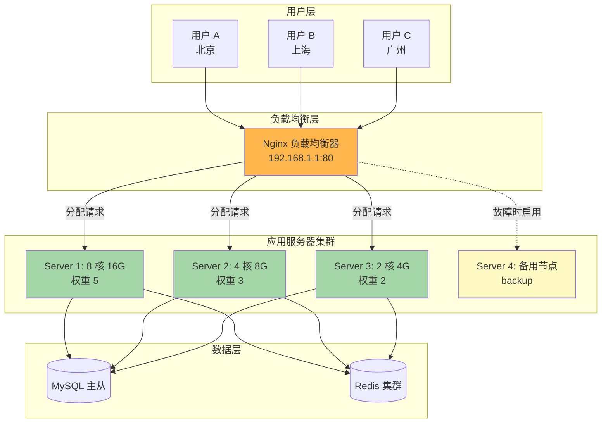
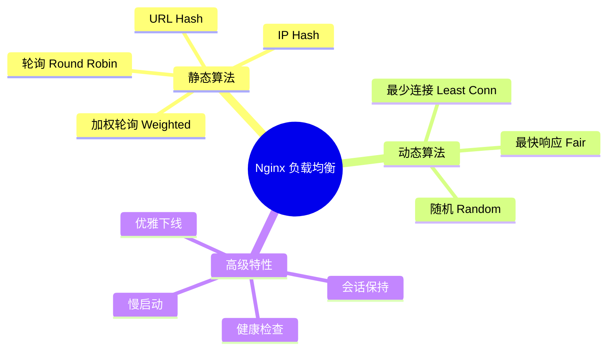
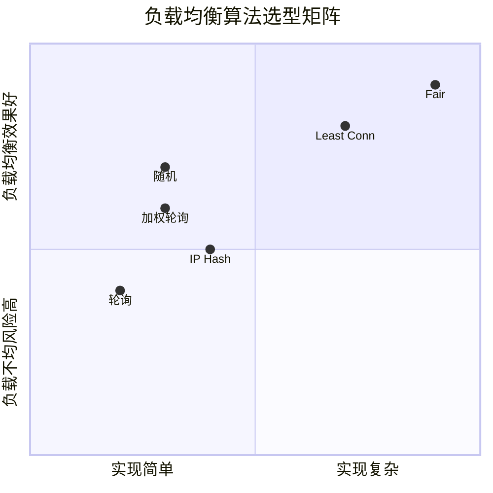
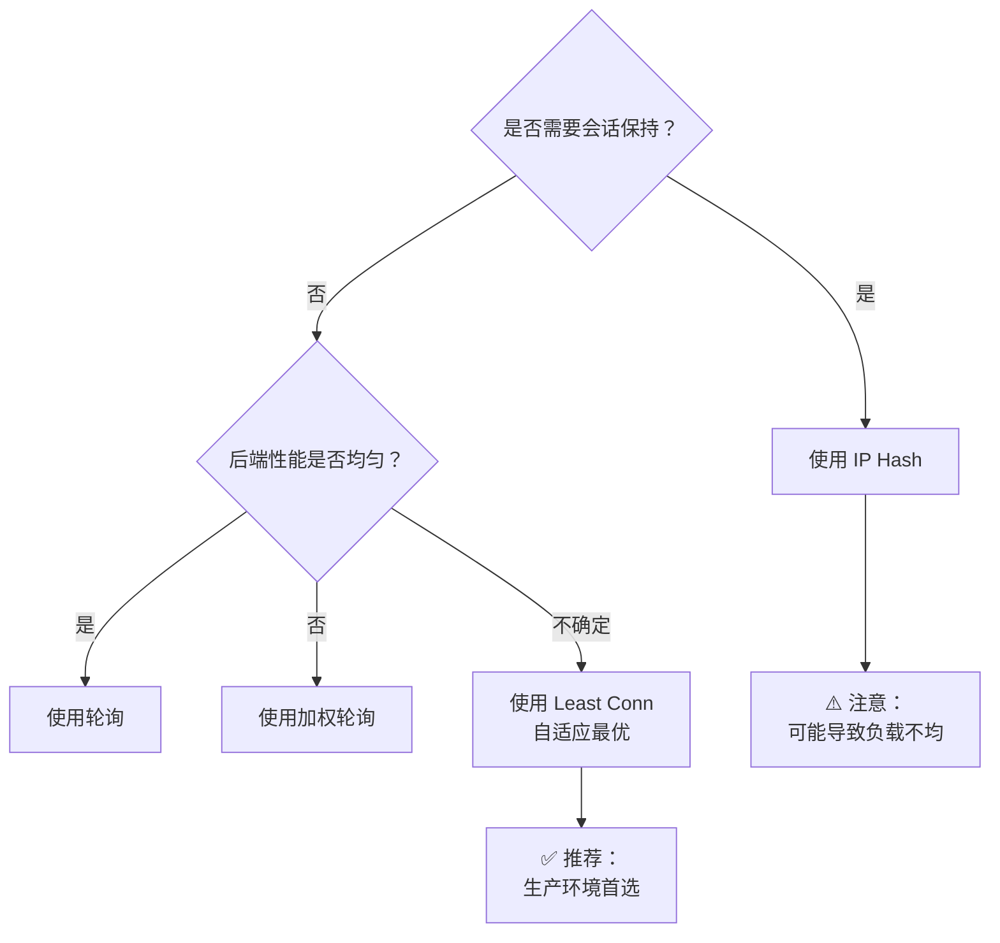
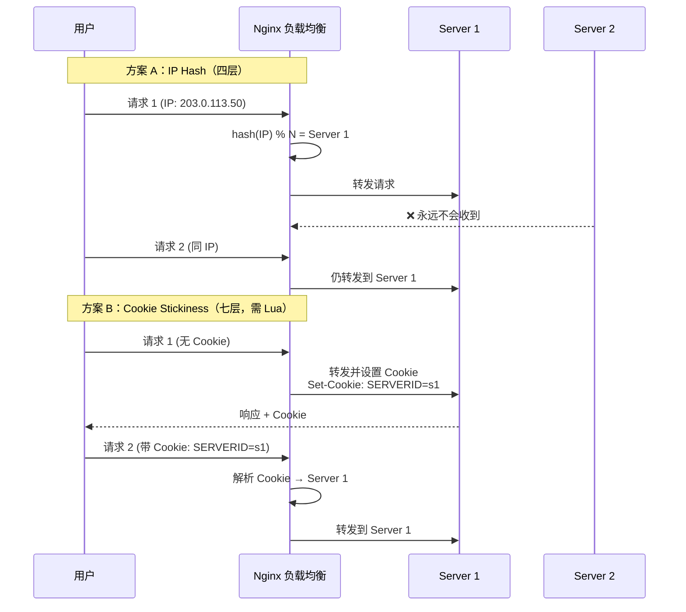
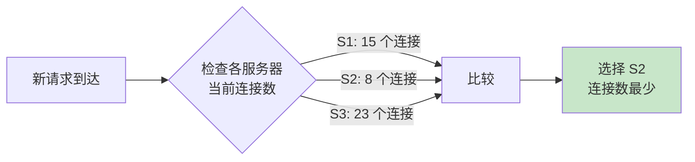
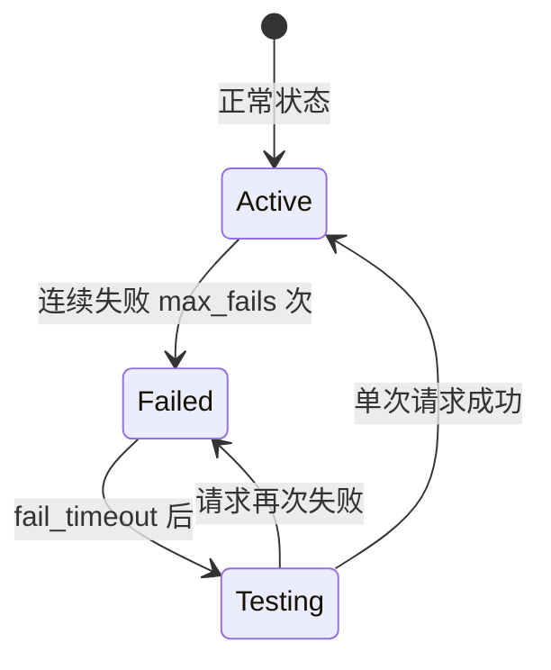

# 第 6 章 负载均衡策略与配置

## 学习目标
- ✅ 掌握 Nginx 支持的 7 种负载均衡算法
- ✅ 理解每种算法的适用场景与优缺点
- ✅ 能够配置加权轮询与会话保持
- ✅ 学会实现主动与被动健康检查
- ✅ 掌握一致性问题与解决方案
- ✅ 完成高并发场景下的负载均衡调优

---

## 场景引入

假设你的电商平台面临以下挑战：



**业务需求**：
1. 高性能服务器承担更多流量（按权重分配）
2. 用户会话需要保持（同一用户始终访问同一台服务器）
3. 服务器故障时自动剔除，恢复后自动加入
4. 避免某台服务器过载导致雪崩效应

本章将提供完整的解决方案。

---

## 核心原理

### 6.1 负载均衡算法全景图



### 6.2 算法对比与选型指南



**选型决策树**：


### 6.3 会话保持机制



---

## 配置实战

### 6.4 基础轮询（默认算法）

```nginx
upstream backend_round_robin {
    # 无需特殊配置，默认就是轮询
    server 192.168.1.10:8080;
    server 192.168.1.11:8080;
    server 192.168.1.12:8080;
}

server {
    location / {
        proxy_pass http://backend_round_robin;
    }
}
```

**特点**：
- ✅ 实现简单，零配置
- ✅ 适合后端性能一致的场景
- ❌ 无法区分服务器性能差异
- ❌ 无会话保持能力

### 6.5 加权轮询（生产常用）

```nginx
upstream backend_weighted {
    # 高性能服务器赋予更高权重
    server 192.168.1.10:8080 weight=5;  # 处理 5/10 的请求
    server 192.168.1.11:8080 weight=3;  # 处理 3/10 的请求
    server 192.168.1.12:8080 weight=2;  # 处理 2/10 的请求
}
```

**权重计算**：
```
总权重 = 5 + 3 + 2 = 10

Server 1 分配比例 = 5/10 = 50%
Server 2 分配比例 = 3/10 = 30%
Server 3 分配比例 = 2/10 = 20%
```

**适用场景**：
- 新旧服务器混用（新服务器权重高）
- 不同配置的服务器集群
- 灰度发布（新版本服务器权重低）

### 6.6 IP Hash（会话保持）

```nginx
upstream backend_ip_hash {
    ip_hash;  # 启用 IP Hash 算法
    
    server 192.168.1.10:8080;
    server 192.168.1.11:8080;
    server 192.168.1.12:8080;
}
```

**工作原理**：
```python
# Nginx IP Hash 算法伪代码
def get_server(client_ip, servers):
    ip_num = ip_to_int(client_ip)
    index = ip_num % len(servers)
    return servers[index]

# 示例
client_ip = "203.0.113.50"
# 转换为整数：3405803570
# 假设 3 台服务器：3405803570 % 3 = 1
# 结果：始终分配到 servers[1]
```

**优点**：
- ✅ 简单的会话保持
- ✅ 无需额外配置
- ✅ 同一 IP 始终访问同一台服务器

**缺点**：
- ⚠️ **负载可能严重不均**（大客户端独占一台服务器）
- ⚠️ NAT 环境下失效（多个用户共享一个出口 IP）
- ⚠️ 服务器宕机后会话丢失

**解决方案：一致性 Hash**（需第三方模块）
```nginx
# 使用 nginx-sticky-module
upstream backend_sticky {
    sticky route $cookie_SERVERID;
    
    server 192.168.1.10:8080;
    server 192.168.1.11:8080;
}
```

### 6.7 Least Conn（最少连接，推荐）

```nginx
upstream backend_least_conn {
    least_conn;  # 优先选择当前连接数最少的服务器
    
    server 192.168.1.10:8080;
    server 192.168.1.11:8080;
    server 192.168.1.12:8080;
}
```

**工作原理**：


**适用场景**：
- ✅ 长连接场景（WebSocket、HTTP/2）
- ✅ 请求处理时间差异大
- ✅ 后端性能不均
- ✅ **生产环境首选**

### 6.8 其他算法

#### URL Hash（缓存友好）

```nginx
upstream backend_url_hash {
    hash $request_uri consistent;  # consistent: 一致性哈希
    
    server 192.168.1.10:8080;
    server 192.168.1.11:8080;
}
```

**用途**：
- 相同 URL 始终路由到同一台服务器
- 适合**缓存服务器集群**（如 Varnish）
- `consistent` 关键字启用一致性哈希（服务器增减时影响最小）

#### Random 随机（简单高效）

```nginx
upstream backend_random {
    random two least_conn;  # 随机选 2 台，再选连接数少的
    
    server 192.168.1.10:8080;
    server 192.168.1.11:8080;
    server 192.168.1.12:8080;
}
```

**特点**：
- `random two`：随机选 2 台候选
- `least_conn`：从中选连接数少的
- 性能优于纯随机，接近 Least Conn

### 6.9 健康检查配置

#### 被动健康检查（内置）

```nginx
upstream backend_ha {
    least_conn;
    
    # max_fails: 失败次数阈值
    # fail_timeout: 失败后的隔离时间
    server 192.168.1.10:8080 max_fails=3 fail_timeout=30s;
    server 192.168.1.11:8080 max_fails=3 fail_timeout=30s;
    server 192.168.1.12:8080 max_fails=2 fail_timeout=20s;
    
    # backup: 仅当其他服务器都不可用时启用
    server 192.168.1.13:8080 backup;
}
```

**状态流转**：


**参数详解**：
| 参数 | 默认值 | 说明 |
|------|-------|------|
| `max_fails` | 1 | 标记为失败的连续失败次数 |
| `fail_timeout` | 10s | 失败后的隔离时长 + 下次探测等待时间 |
| `backup` | - | 备用服务器（仅在主服务器组全灭时启用） |

#### 主动健康检查（商业版/第三方模块）

```nginx
# 需要编译时添加 health_check 模块
# 或使用开源替代：nginx_upstream_check_module

upstream backend {
    server 192.168.1.10:8080;
    server 192.168.1.11:8080;
    
    # 主动健康检查配置
    health_check interval=5s fails=3 passes=2 uri=/health;
}

server {
    location / {
        proxy_pass http://backend;
    }
}
```

**检查参数**：
- `interval=5s`：每 5 秒检查一次
- `fails=3`：连续 3 次失败标记为宕机
- `passes=2`：连续 2 次成功标记为恢复
- `uri=/health`：健康检查端点

### 6.10 慢启动与优雅下线

#### 慢启动（避免新服务器被瞬间打垮）

```nginx
upstream backend_slow_start {
    least_conn;
    
    # slow_start: 启动后 gradualy 增加权重（商业版功能）
    server 192.168.1.10:8080 weight=5 slow_start=30s;
    server 192.168.1.11:8080 weight=3;
}
```

**工作过程**：
```
T=0s:   Server 1 启动，实际权重 = 0
T=15s:  实际权重 = 2.5（逐渐上升）
T=30s:  实际权重 = 5（达到设定值）
```

#### 优雅下线（运维必备）

```bash
# 场景：需要维护 Server 1，但不想中断现有连接

# 步骤 1：标记服务器为下线（修改配置）
# upstream backend {
#     server 192.168.1.10:8080 down;  # ← 添加 down
#     server 192.168.1.11:8080;
# }

# 步骤 2：平滑重载 Nginx
sudo nginx -t && sudo nginx -s reload

# 效果：
# - 不再分配新请求到 Server 1
# - 已有连接继续服务直至完成
# - 无感知切换
```

---

## 完整示例文件

### 6.11 电商网站高可用负载均衡配置

```nginx
# /etc/nginx/conf.d/load-balancer.conf
# 生产级电商网站负载均衡配置

# === 限流区域 ===
limit_req_zone $binary_remote_addr zone=api_limit:10m rate=20r/s;
limit_conn_zone $binary_remote_addr zone=conn_limit:10m;

# === 用户服务集群（加权轮询 + 会话保持）===
upstream user_service {
    ip_hash;  # 用户会话需要保持
    
    server 192.168.1.10:3000 weight=3 max_fails=3 fail_timeout=30s;
    server 192.168.1.11:3000 weight=2 max_fails=3 fail_timeout=30s;
    server 192.168.1.12:3000 weight=1 max_fails=3 fail_timeout=30s;
    
    keepalive 64;  # 长连接池
}

# === 订单服务集群（Least Conn + 健康检查）===
upstream order_service {
    least_conn;  # 订单处理时间差异大，用 Least Conn
    
    server 192.168.1.20:3001 max_fails=2 fail_timeout=20s;
    server 192.168.1.21:3001 max_fails=2 fail_timeout=20s;
    server 192.168.1.22:3001 max_fails=2 fail_timeout=20s;
    
    # 备用节点（异地灾备）
    server 192.168.2.10:3001 backup max_fails=1 fail_timeout=60s;
    
    keepalive 64;
}

# === 商品服务集群（URL Hash 缓存友好）===
upstream product_service {
    hash $request_uri consistent;  # 相同商品 URL 固定到同一台
    
    server 192.168.1.30:3002 max_fails=3 fail_timeout=30s;
    server 192.168.1.31:3002 max_fails=3 fail_timeout=30s;
    
    keepalive 32;
}

# === API 网关入口 ===
server {
    listen 80;
    server_name api.shop.com;
    
    return 301 https://$server_name$request_uri;
}

server {
    listen 443 ssl http2;
    server_name api.shop.com;
    
    ssl_certificate /etc/nginx/ssl/api.shop.com/fullchain.pem;
    ssl_certificate_key /etc/nginx/ssl/api.shop.com/privkey.pem;
    
    access_log /var/log/nginx/api.lb.access.log main;
    error_log /var/log/nginx/api.lb.error.log warn;
    
    # === 用户相关 API ===
    location /api/v1/users/ {
        proxy_pass http://user_service;
        
        proxy_set_header Host $host;
        proxy_set_header X-Real-IP $remote_addr;
        proxy_set_header X-Forwarded-For $proxy_add_x_forwarded_for;
        
        # 限流
        limit_req zone=api_limit burst=10 nodelay;
        limit_conn zone=conn_limit 20;
        
        # 超时（用户操作通常较快）
        proxy_connect_timeout 5s;
        proxy_read_timeout 30s;
    }
    
    # === 订单相关 API（长超时）===
    location /api/v1/orders/ {
        proxy_pass http://order_service;
        
        proxy_set_header Host $host;
        proxy_set_header X-Real-IP $remote_addr;
        proxy_set_header X-Forwarded-For $proxy_add_x_forwarded_for;
        
        # 订单创建可能较慢
        proxy_connect_timeout 10s;
        proxy_read_timeout 120s;
        
        # 缓冲优化
        proxy_buffering on;
        proxy_buffer_size 8k;
        proxy_buffers 16 8k;
    }
    
    # === 商品查询（缓存友好）===
    location /api/v1/products/ {
        proxy_pass http://product_service;
        
        proxy_set_header Host $host;
        proxy_set_header X-Real-IP $remote_addr;
        proxy_set_header X-Forwarded-For $proxy_add_x_forwarded_for;
        
        # 商品查询频繁，开启缓存
        proxy_cache api_cache;
        proxy_cache_valid 200 5m;
        proxy_cache_use_stale error timeout updating;
    }
    
    # === 健康检查端点 ===
    location = /health {
        access_log off;
        return 200 "OK\n";
        add_header Content-Type text/plain;
    }
}
```

---

## 常见错误与排查

### 6.12 经典陷阱

#### 问题 1：IP Hash 导致负载严重不均

```bash
# 现象：一台服务器 CPU 100%，其他闲置

# 查看各服务器连接数
watch -n 1 'netstat -an | grep :8080 | wc -l'

# 原因：某个大客户（或 NAT 出口）占用大量 IP
# 解决：改用 Least Conn
upstream backend {
    least_conn;  # ← 替换 ip_hash
    server ...;
}
```

#### 问题 2：Backup 服务器永不工作

```nginx
# ❌ 错误：所有主服务器都有 max_fails，但 fail_timeout 太短
upstream backend {
    server 192.168.1.10:8080 max_fails=1 fail_timeout=1s;  # 1 秒后就恢复
    server 192.168.1.11:8080 max_fails=1 fail_timeout=1s;
    server 192.168.1.12:8080 backup;
}

# ✅ 正确：合理设置失败阈值
upstream backend {
    server 192.168.1.10:8080 max_fails=3 fail_timeout=30s;
    server 192.168.1.11:8080 max_fails=3 fail_timeout=30s;
    server 192.168.1.12:8080 backup;
}
```

#### 问题 3：Keepalive 未生效

```nginx
# ❌ 错误：忘记设置 Connection 头部
upstream backend {
    keepalive 32;
}

location / {
    proxy_pass http://backend;
    # 缺少这两行，keepalive 无效！
}

# ✅ 正确
location / {
    proxy_pass http://backend;
    proxy_http_version 1.1;
    proxy_set_header Connection "";
}
```

### 6.13 监控与告警

```bash
# 1. 查看 upstream 状态（需第三方模块）
curl http://localhost/status/upstreams

# 2. 日志分析各后端请求分布
awk '{print $7}' /var/log/nginx/access.log | \
  sort | uniq -c | sort -rn

# 3. 实时监控各服务器连接数
watch -n 1 'for port in 3000 3001 3002; do
  echo -n "Port $port: "
  netstat -an | grep :$port | wc -l
done'

# 4. 配置告警（连续 5 次失败）
# upstream backend {
#     server 192.168.1.10:8080 max_fails=5 fail_timeout=60s;
# }
# 当标记为 failed 时，触发告警脚本
```

---

## 性能与安全建议

### 6.14 性能优化清单

```nginx
http {
    # 1. 长连接池（必开）
    upstream backend {
        least_conn;
        server 192.168.1.10:8080;
        keepalive 64;           # 每个 worker 维持 64 个长连接
        keepalive_timeout 60s;  # 空闲 60 秒后关闭
        keepalive_requests 100; # 每个连接最多 100 个请求
    }
    
    # 2. 调整失败检测灵敏度
    # 高并发场景：降低 max_fails，缩短 fail_timeout
    # 低并发场景：提高 max_fails，延长 fail_timeout
    
    # 3. 使用变量实现动态 upstream（高级）
    set $backend_server "192.168.1.10:8080";
    location / {
        proxy_pass http://$backend_server;
    }
}
```

### 6.15 安全加固

```nginx
upstream backend {
    # 1. 内网服务器禁止直接访问（通过防火墙实现）
    # iptables -A INPUT -p tcp --dport 8080 -s 192.168.1.0/24 -j ACCEPT
    # iptables -A INPUT -p tcp --dport 8080 -j DROP
    
    least_conn;
    server 192.168.1.10:8080 max_fails=3 fail_timeout=30s;
}

server {
    location / {
        proxy_pass http://backend;
        
        # 2. 限制请求方法
        if ($request_method !~ ^(GET|HEAD|POST|PUT|DELETE)$) {
            return 405;
        }
        
        # 3. 隐藏后端信息
        proxy_hide_header X-Powered-By;
        proxy_hide_header Server;
        
        # 4. 防止 DNS 重绑定攻击
        proxy_set_header Host $host;
    }
}
```

---

## 练习题

### 练习 1：对比测试各种算法
搭建包含 3 台后端的实验环境：
1. 分别配置轮询、加权轮询、IP Hash、Least Conn
2. 使用 `ab` 或 `wrk` 发送 10000 个请求
3. 统计各服务器接收到的请求数分布
4. 绘制柱状图对比均衡性
5. 模拟一台服务器宕机，观察故障转移时间

### 练习 2：实现会话保持
需求：用户登录后，后续请求必须访问同一台服务器
1. 使用 IP Hash 实现基础版本
2. 测试 NAT 环境下的表现（多用户共享 IP）
3. （进阶）使用 Lua 实现基于 Cookie 的会话保持
4. 对比两种方案的优劣

### 练习 3：高可用架构设计
设计一个支持 10 万 QPS 的电商网站负载均衡架构：
- 前端：Nginx 集群（至少 2 台，Keepalived VIP）
- 应用层：微服务集群（按业务拆分 upstream）
- 要求：
  - 任意单台服务器宕机不影响服务
  - 支持不停机扩容
  - 撰写架构文档与应急预案

---

## 本章小结

✅ **核心要点回顾**：
1. **算法选型**：Least Conn 最通用，IP Hash 用于会话保持
2. **健康检查**：被动检查足够，主动检查需第三方模块
3. **长连接池**：`keepalive` 显著提升性能（必配）
4. **优雅下线**：使用 `down` 标记 + `reload` 实现零停机维护
5. **权重量化**：根据服务器性能比例设置 weight

🎯 **下一章预告**：
第 7 章讲解 **高级代理配置**，包括请求/响应头改写、URL 重写、条件判断、AB 测试、蓝绿部署等生产环境高级玩法。

📚 **参考资源**：
- [Nginx Upstream 模块](https://nginx.org/en/docs/http/ngx_http_upstream_module.html)
- [负载均衡最佳实践](https://www.nginx.com/resources/admin-guide/load-balancer/)
- [一致性 Hash 算法详解](https://www.toptal.com/big-data/consistent-hashing)
