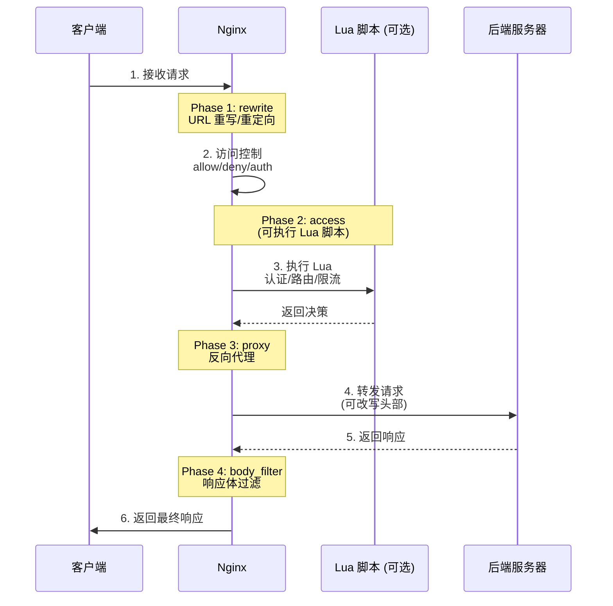
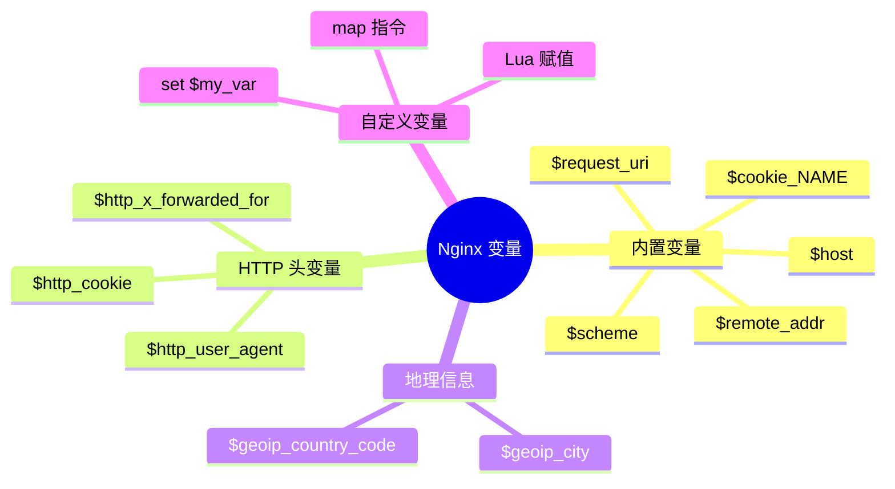
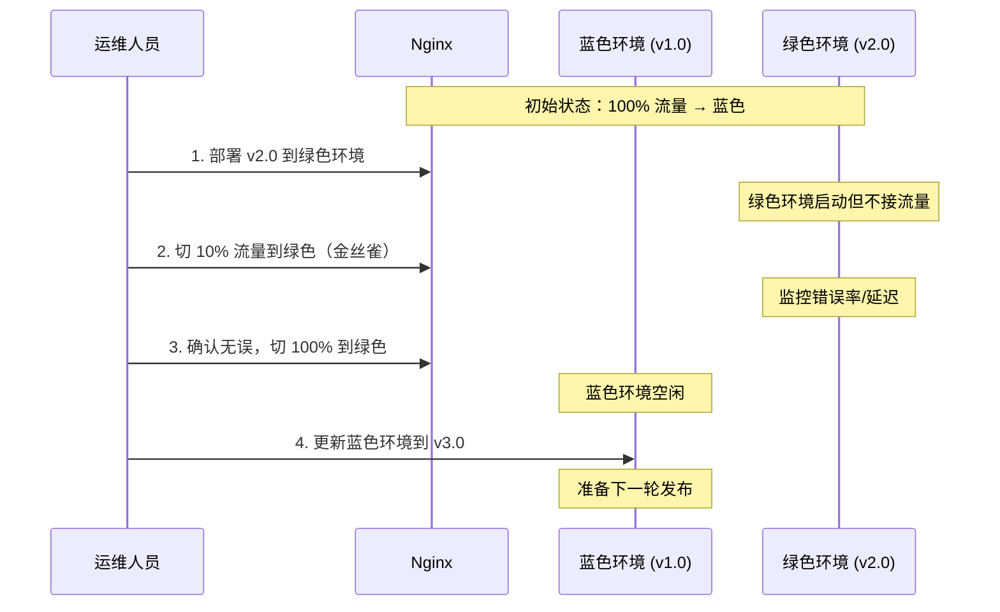

# 第 7 章 高级代理配置与实战

## 学习目标
- ✅ 掌握请求/响应头的改写技巧
- ✅ 学会基于条件的智能路由（AB 测试、灰度发布）
- ✅ 实现蓝绿部署与金丝雀发布
- ✅ 精通 URL 重写与重定向
- ✅ 能够配置代理认证与访问控制
- ✅ 掌握子请求与并行请求优化

---

## 场景引入

假设你的团队需要实现以下高级需求：

```mermaid
graph TB
    subgraph 用户请求
        Req[HTTPS 请求<br/>api.shop.com]
    end
    
    subgraph Nginx 高级处理
        Rewrite[URL 重写层<br/>/v1/users → /api/users]
        Auth[认证层<br/>JWT 验证]
        Canary[金丝雀路由<br/>10% 流量到新版本]
        ABTest[AB 测试分组<br/>user_id % 10]
        RateLimit[限流熔断<br/>令牌桶算法]
    end
    
    subgraph 后端集群
        Stable[稳定版 v2.3.0<br/>90% 流量]
        Canary2[金丝雀 v2.4.0-beta<br/>10% 流量]
        GroupA[A 版本/绿色主题]
        GroupB[B 版本/蓝色主题]
    end
    
    Req --> Rewrite
    Rewrite --> Auth
    Auth -->|验证通过 | Canary
    Auth -->|验证失败 | Error[返回 401]
    
    Canary -->|hash(cookie) < 0.1 | Canary2
    Canary -->|其他 | Stable
    
    Stable --> ABTest
    ABTest -->|user_id % 2 = 0 | GroupA
    ABTest -->|user_id % 2 = 1 | GroupB
    
    style Canary fill:#fff9c4
    style ABTest fill:#e1f5fe
    style GroupA fill:#c8e6c9
    style GroupB fill:#bbdefb
```

**业务场景**：
1. **灰度发布**：10% 用户访问新版本，观察稳定性
2. **AB 测试**：50% 用户看绿色按钮，50% 看蓝色按钮
3. **API 版本兼容**：`/v1/users` 自动映射到 `/api/v1/users`
4. **JWT 认证**：未登录用户直接拒绝
5. **黑白名单**：VIP 用户走专属通道

本章将逐一实现这些高级功能。

---

## 核心原理

### 7.1 请求处理流水线



### 7.2 变量系统全景图



---

## 配置实战

### 7.3 请求头改写

#### 添加自定义头部

```nginx
location /api/ {
    proxy_pass http://backend;
    
    # === 添加请求头传给后端 ===
    
    # 1. 添加追踪 ID
    proxy_set_header X-Request-ID $request_id;
    
    # 2. 添加客户端信息
    proxy_set_header X-Client-IP $remote_addr;
    proxy_set_header X-Client-Port $remote_port;
    
    # 3. 添加原始 Host
    proxy_set_header X-Forwarded-Host $host:$server_port;
    
    # 4. 添加协议版本
    proxy_set_header X-Forwarded-Proto $scheme;
    
    # 5. 自定义业务头部
    proxy_set_header X-User-Type "premium";  # 硬编码示例
    
    # === 删除敏感头部 ===
    
    # 6. 不传递 Cookie（减少后端负担）
    proxy_set_header Cookie "";
    
    # 7. 隐藏 Referer（隐私保护）
    proxy_set_header Referer "";
}
```

#### 条件式头部改写

```nginx
location /api/ {
    proxy_pass http://backend;
    
    # 根据 User-Agent 添加标记
    if ($http_user_agent ~* "Mobile") {
        set $device_type "mobile";
    }
    
    if ($http_user_agent ~* "iPhone") {
        set $device_type "iphone";
    }
    
    # 传递设备类型给后端
    proxy_set_header X-Device-Type $device_type;
    
    # 根据协议添加安全标记
    if ($scheme = https) {
        proxy_set_header X-Secure "true";
    }
}
```

⚠️ **警告**：`if` 在 location 中有诸多限制，复杂逻辑建议用 `map` 或 Lua。

### 7.4 Map 指令（优雅的条件判断）

```nginx
http {
    # === 示例 1：根据域名映射后端 ===
    map $host $backend_pool {
        default         backend_main;
        www.example.com backend_main;
        m.example.com   backend_mobile;
        api.example.com backend_api;
    }
    
    # === 示例 2：根据用户 ID 分流（AB 测试）===
    map $http_cookie $ab_group {
        default         "A";
        "~*test_group=(\d+)" $1;  # 从 Cookie 提取
    }
    
    # === 示例 3：根据 IP 段标记用户类型 ===
    map $remote_addr $user_tier {
        default             "normal";
        192.168.1.0/24      "vip";
        10.0.0.0/8          "internal";
        203.0.113.0/24      "partner";
    }
    
    # === 示例 4：根据 URI 特征选择缓存策略 ===
    map $request_uri $cache_zone {
        default                 "off";
        ~^/api/products/        "products";
        ~^/api/categories/      "categories";
        ~*\.(jpg|png|css|js)$   "static";
    }
    
    server {
        location / {
            # 使用 map 的结果
            proxy_pass http://$backend_pool;
            
            add_header X-AB-Group $ab_group;
            add_header X-User-Tier $user_tier;
            proxy_cache $cache_zone;
        }
    }
}
```

**Map vs If 对比**：
| 特性 | Map | If |
|------|-----|----|
| **性能** | ✅ 高（初始化时构建哈希表） | ❌ 低（每次请求求值） |
| **可读性** | ✅ 清晰 | ❌ 混乱 |
| **功能** | ✅ 支持正则捕获 | ⚠️ 有限 |
| **推荐使用** | ✅ **强烈推荐** | ❌ 避免使用 |

### 7.5 URL 重写与重定向

#### 内部重写（rewrite）

```nginx
server {
    listen 80;
    server_name shop.com;
    
    # === 规则 1：旧版 API 路径兼容 ===
    # /v1/users → /api/v1/users
    rewrite ^/v1/(.*)$ /api/v1/$1 last;
    
    # === 规则 2：移动端跳转 ===
    # m.shop.com/* → shop.com/mobile/*
    if ($host ~* ^m\.shop\.com) {
        rewrite ^(.*)$ /mobile$1 last;
    }
    
    # === 规则 3：去除尾部斜杠 ===
    # /products/ → /products
    rewrite ^/(.+)/$ /$1 permanent;
    
    # === 规则 4：多语言支持 ===
    # /en/products → /products?lang=en
    rewrite ^/(en|zh|ja)/(.*)$ /$2?lang=$1 last;
    
    location / {
        proxy_pass http://backend;
    }
}
```

**Rewrite Flag 详解**：
| Flag | 含义 | 使用场景 |
|------|------|---------|
| `last` | 停止当前匹配，重新匹配 location | 内部跳转 |
| `break` | 停止当前匹配，不再重新匹配 | 复杂规则链 |
| `redirect` | 临时重定向（302） | 短期活动页 |
| `permanent` | 永久重定向（301） | SEO 友好迁移 |

#### 外部重定向（return）

```nginx
server {
    # === 强制 HTTPS ===
    listen 80;
    return 301 https://$host$request_uri;
}

server {
    listen 443 ssl;
    
    # === 旧域名迁移 ===
    if ($host = old-shop.com) {
        return 301 https://new-shop.com$request_uri;
    }
    
    # === 维护页面 ===
    location = /maintenance {
        return 503 "系统维护中，请稍后再试\n";
    }
    
    # === 禁止访问特定路径 ===
    location ~ /\.git {
        return 403 "Access denied\n";
    }
    
    # === 短链接服务 ===
    location ~ ^/go/([a-zA-Z0-9]+)$ {
        # 从数据库查找到真实 URL 后
        return 302 https://example.com/very/long/url/path;
    }
}
```

### 7.6 AB 测试与灰度发布

#### 方案 A：基于 Cookie 的灰度发布

```nginx
http {
    # 从 Cookie 提取灰度标记，如果没有则随机分配
    map $http_cookie $canary_version {
        default                 "stable";
        "~*canary=(stable|new)" $1;
        "~*__cfduid=[^;]+"      "stable";  # Cloudflare Cookie
    }
    
    # 金丝雀上游（10% 流量）
    upstream backend_canary {
        server 192.168.1.10:8080;
    }
    
    # 稳定版上游（90% 流量）
    upstream backend_stable {
        server 192.168.1.11:8080;
        server 192.168.1.12:8080;
    }
    
    server {
        location / {
            # 根据 map 结果选择上游
            if ($canary_version = "new") {
                proxy_pass http://backend_canary;
            } else {
                proxy_pass http://backend_stable;
            }
            
            # 添加调试头部
            add_header X-Canary-Version $canary_version;
        }
    }
}
```

#### 方案 B：基于用户 ID 的 AB 测试

```nginx
http {
    # 从 JWT 或 Cookie 提取用户 ID
    map $http_cookie $user_id {
        default         "0";
        "~*uid=(\d+)"   $1;
    }
    
    # 计算分组（偶数 A 组，奇数 B 组）
    map $user_id $ab_group {
        default     "A";
        "~*[02468]$" "A";  # 偶数结尾
        "~*[13579]$" "B";  # 奇数结尾
    }
    
    upstream backend_a {
        server 192.168.1.20:8080;  # 绿色主题
    }
    
    upstream backend_b {
        server 192.168.1.21:8080;  # 蓝色主题
    }
    
    server {
        location / {
            if ($ab_group = "B") {
                proxy_pass http://backend_b;
            } else {
                proxy_pass http://backend_a;
            }
            
            add_header X-AB-Group $ab_group;
        }
    }
}
```

#### 方案 C：基于权重的金丝雀发布（推荐）

```nginx
upstream backend_release {
    # 稳定版：权重 90
    server 192.168.1.10:8080 weight=9;
    
    # 金丝雀版：权重 10
    server 192.168.1.11:8080 weight=1;
    
    least_conn;
}

server {
    location / {
        proxy_pass http://backend_release;
        
        # 记录版本号便于排查
        add_header X-Upstream-Server $upstream_addr;
    }
}
```

### 7.7 蓝绿部署配置

```nginx
# 蓝绿部署：两个完全独立的环境，一键切换

upstream backend_blue {
    server 192.168.1.10:8080 max_fails=3 fail_timeout=30s;
    server 192.168.1.11:8080 max_fails=3 fail_timeout=30s;
}

upstream backend_green {
    server 192.168.2.10:8080 max_fails=3 fail_timeout=30s;
    server 192.168.2.11:8080 max_fails=3 fail_timeout=30s;
}

# 环境变量控制（通过 include 动态切换）
# /etc/nginx/conf.d/active_environment.conf
# 内容：set $active_env "blue"; 或 "green"

server {
    listen 443 ssl;
    server_name shop.com;
    
    location / {
        # 根据变量选择环境
        if ($active_env = "blue") {
            proxy_pass http://backend_blue;
        }
        
        if ($active_env = "green") {
            proxy_pass http://backend_green;
        }
        
        add_header X-Active-Environment $active_env;
    }
}

# 切换命令：
# echo 'set $active_env "green";' > /etc/nginx/conf.d/active_environment.conf
# nginx -s reload
```

**蓝绿部署流程**：


### 7.8 代理认证与访问控制

#### 基础认证（HTTP Basic Auth）

```nginx
server {
    location /admin/ {
        # 1. 创建密码文件
        # htpasswd -c /etc/nginx/.htpasswd admin
        # 输入密码：Admin@123
        
        # 2. 启用认证
        auth_basic "管理员专区";
        auth_basic_user_file /etc/nginx/.htpasswd;
        
        # 3. 代理到后端
        proxy_pass http://backend;
    }
    
    # API 密钥认证
    location /api/internal/ {
        # 检查 X-API-Key 头部
        if ($http_x_api_key != "secret_api_key_123") {
            return 401 "Invalid API Key\n";
        }
        
        proxy_pass http://internal_backend;
    }
}
```

#### JWT Token 验证（需 Lua）

```nginx
# 需要安装 lua-resty-jwt 模块

server {
    location /api/protected/ {
        # 执行 Lua 脚本验证 JWT
        access_by_lua_block {
            local jwt = require "resty.jwt"
            
            -- 从 Authorization 头提取 token
            local auth_header = ngx.var.http_authorization
            if not auth_header then
                ngx.status = 401
                ngx.say("Missing Authorization header")
                return ngx.exit(401)
            end
            
            -- 解析 Bearer token
            local token = auth_header:match("^Bearer%s+(.+)$")
            if not token then
                ngx.status = 401
                ngx.say("Invalid Authorization format")
                return ngx.exit(401)
            end
            
            -- 验证签名
            local jwt_obj = jwt:verify("your-secret-key", token)
            if not jwt_obj["verified"] then
                ngx.status = 401
                ngx.say("Invalid JWT signature")
                return ngx.exit(401)
            end
            
            -- 检查过期时间
            if jwt_obj["payload"]["exp"] < os.time() then
                ngx.status = 401
                ngx.say("JWT expired")
                return ngx.exit(401)
            end
            
            -- 将用户信息传递给后端
            ngx.var.user_id = jwt_obj["payload"]["sub"]
            ngx.var.user_role = jwt_obj["payload"]["role"]
        }
        
        # 验证通过，转发请求
        proxy_set_header X-User-ID $user_id;
        proxy_set_header X-User-Role $user_role;
        proxy_pass http://backend;
    }
}
```

### 7.9 子请求与并行请求

#### 子请求（内部重定向）

```nginx
server {
    location /page/ {
        # 先尝试返回缓存的静态版本
        try_files $uri $uri.html @dynamic;
    }
    
    location @dynamic {
        # 如果静态文件不存在，动态生成
        proxy_pass http://backend;
    }
    
    # 认证子请求
    location /private/ {
        auth_request /auth/check;
        
        proxy_pass http://backend;
    }
    
    location = /auth/check {
        internal;  # 仅内部访问
        proxy_pass http://auth-service/validate;
        proxy_pass_request_body off;
        proxy_set_header Content-Length "";
    }
}
```

#### 并行请求（提升性能）

```nginx
# 使用 echo 模块或 Lua 实现并行请求
# 场景：首页需要聚合用户信息 + 商品信息 + 推荐列表

location /index {
    # 并行请求三个后端
    echo_location_async /api/user-info;
    echo_location_async /api/product-list;
    echo_location_async /api/recommendations;
}

# 或使用 Lua resty.http 实现更复杂的并行
location /dashboard {
    content_by_lua_block {
        local http = require "resty.http"
        local httpc = http.new()
        
        -- 并行发起三个请求
        local res1, res2, res3 = 
            httpc:request({path = "/api/user"}),
            httpc:request({path = "/api/orders"}),
            httpc:request({path = "/api/messages"})
        
        -- 合并响应返回
        ngx.say(res1.body, res2.body, res3.body)
    }
}
```

---

## 完整示例文件

### 7.10 生产级灰度发布配置

```nginx
# /etc/nginx/conf.d/canary-release.conf
# 电商网站灰度发布与 AB 测试完整配置

# === 第一步：定义所有上游 ===
upstream backend_stable {
    least_conn;
    server 192.168.1.10:8080 max_fails=3 fail_timeout=30s;
    server 192.168.1.11:8080 max_fails=3 fail_timeout=30s;
    server 192.168.1.12:8080 max_fails=3 fail_timeout=30s;
    keepalive 64;
}

upstream backend_canary {
    least_conn;
    server 192.168.1.20:8080 max_fails=3 fail_timeout=30s;  # 新版本
    keepalive 32;
}

upstream backend_green {
    least_conn;
    server 192.168.2.10:8080 max_fails=3 fail_timeout=30s;  # 绿色环境
    server 192.168.2.11:8080 max_fails=3 fail_timeout=30s;
    keepalive 64;
}

# === 第二步：定义路由规则 ===
http {
    # 灰度标记优先级：Cookie > Header > 默认
    map $http_cookie$http_x_canary $canary_flag {
        default                     "stable";
        "~*canary=new"              "canary";
        "~*X-Canary:new"            "canary";
    }
    
    # VIP 用户标识
    map $http_cookie $is_vip {
        default         "0";
        "~*vip=true"    "1";
    }
    
    # AB 测试分组（基于用户 ID 奇偶）
    map $http_cookie $ab_test_group {
        default         "A";
        "~*uid=(\d+)"   $1;
        "~*[02468]$"    "A";
        "~*[13579]$"    "B";
    }
    
    server {
        listen 443 ssl http2;
        server_name api.shop.com;
        
        ssl_certificate /etc/nginx/ssl/api.shop.com/fullchain.pem;
        ssl_certificate_key /etc/nginx/ssl/api.shop.com/privkey.pem;
        
        # === 主路由逻辑 ===
        location / {
            # 1. VIP 用户总是访问稳定版
            if ($is_vip = "1") {
                set $target_upstream "backend_stable";
            }
            
            # 2. 显式请求金丝雀版本
            if ($canary_flag = "canary") {
                set $target_upstream "backend_canary";
            }
            
            # 3. 默认：90% 稳定版 + 10% 金丝雀
            if ($target_upstream = "") {
                # 使用随机数决定（实际生产用 hash 保证一致性）
                set $random_num $msec;
                if ($random_num ~ "[0-9]$") {
                    set $target_upstream "backend_stable";
                } else {
                    set $target_upstream "backend_canary";
                }
            }
            
            # 执行代理
            proxy_pass http://$target_upstream;
            
            # 必要头部
            proxy_set_header Host $host;
            proxy_set_header X-Real-IP $remote_addr;
            proxy_set_header X-Forwarded-For $proxy_add_x_forwarded_for;
            
            # 传递灰度标记给后端
            proxy_set_header X-Canary-Flag $canary_flag;
            proxy_set_header X-Is-VIP $is_vip;
            proxy_set_header X-AB-Test-Group $ab_test_group;
            
            # 调试头部（生产环境应关闭）
            add_header X-Target-Upstream $target_upstream;
            add_header X-Canary-Flag $canary_flag;
            add_header X-AB-Test-Group $ab_test_group;
        }
        
        # === 健康检查端点 ===
        location = /health {
            access_log off;
            return 200 "OK\n";
            add_header Content-Type text/plain;
        }
        
        # === 紧急熔断开关 ===
        location /emergency/ {
            # 如果检测到严重错误，立即全部切回稳定版
            if ($canary_error_rate > 0.05) {
                proxy_pass http://backend_stable;
            }
        }
    }
}
```

---

## 常见错误与排查

### 7.11 经典陷阱

#### 问题 1：If 嵌套导致逻辑混乱

```nginx
# ❌ 错误：多层 if 难以维护
location / {
    if ($http_cookie ~ "vip") {
        if ($http_user_agent ~ "Mobile") {
            set $target "vip_mobile";
        }
    }
}

# ✅ 正确：使用 map 简化
http {
    map "$http_cookie:$http_user_agent" $target {
        default                 "normal";
        "~vip:.*Mobile.*"       "vip_mobile";
        "~vip:.*"               "vip_desktop";
    }
    
    server {
        location / {
            proxy_pass http://$target;
        }
    }
}
```

#### 问题 2：Rewrite 死循环

```nginx
# ❌ 错误：缺少 last flag
server {
    rewrite ^/old/(.*)$ /new/$1;  # 没有 last，继续匹配下一条
    rewrite ^/new/(.*)$ /final/$1;  # 又被匹配！
}
# 结果：/old/page → /final/page（非预期）

# ✅ 正确
server {
    rewrite ^/old/(.*)$ /new/$1 last;  # 停止并重新匹配 location
}
```

#### 问题 3：Map 变量作用域错误

```nginx
# ❌ 错误：在 server 块外使用 map 变量
http {
    map $host $backend { ... }
    
    # 这里不能使用 $backend！
    # upstream test {
    #     server $backend;  # 报错
    # }
}

# ✅ 正确：在 location 或 server 中使用
server {
    location / {
        proxy_pass http://$backend;  # ✓ 可以
    }
}
```

### 7.12 调试技巧

```bash
# 1. 查看变量实际值
# 在配置中添加
add_header X-Debug-Var $your_variable;

curl -I https://shop.com
# 查看响应头中的 X-Debug-Var

# 2. 测试 rewrite 规则
nginx -T | grep rewrite

# 3. 模拟不同 Cookie
curl -H "Cookie: canary=new" https://shop.com

# 4. 日志记录路由决策
log_format route '$remote_addr - $request_uri -> $target_upstream';
access_log /var/log/nginx/route.log route;
```

---

## 练习题

### 练习 1：实现完整的灰度发布系统
需求：
1. 定义 stable/canary 两个 upstream
2. 支持通过 Cookie 显式指定版本
3. 默认 90%/10% 流量分配
4. VIP 用户始终访问 stable
5. 添加监控日志记录路由分布
6. 编写自动化测试脚本验证

### 练习 2：AB 测试平台搭建
实现一个支持多维度分组的 AB 测试框架：
- 按用户 ID 奇偶分组
- 按地域分组（国内/海外）
- 按设备类型分组（Mobile/Desktop）
- 支持动态调整分组比例
- 输出分组统计报表

### 练习 3：蓝绿部署演练
1. 搭建 blue/green 两套独立环境
2. 编写一键切换脚本（修改配置 + reload）
3. 模拟故障场景：绿色环境有 bug，快速回滚到蓝色
4. 撰写应急预案文档

---

## 本章小结

✅ **核心要点回顾**：
1. **Map 优于 If**：性能更好，语法更清晰
2. **灰度发布**：Cookie 优先，权重兜底
3. **AB 测试**：基于用户特征 Hash 保证一致性
4. **蓝绿部署**：环境变量控制，一键切换
5. **JWT 认证**：Lua 脚本验证，传递用户信息

🎯 **下一章预告**：
第 8 章深入 **WebSocket 与长连接**，讲解实时通信、SSE 推送、HTTP/2 Server Push 等现代 Web 技术的 Nginx 配置方案。

📚 **参考资源**：
- [Nginx Rewrite 模块](https://nginx.org/en/docs/http/ngx_http_rewrite_module.html)
- [Map 指令详解](https://nginx.org/en/docs/http/ngx_http_map_module.html)
- [灰度发布最佳实践](https://martinfowler.com/articles/canary-release.html)
