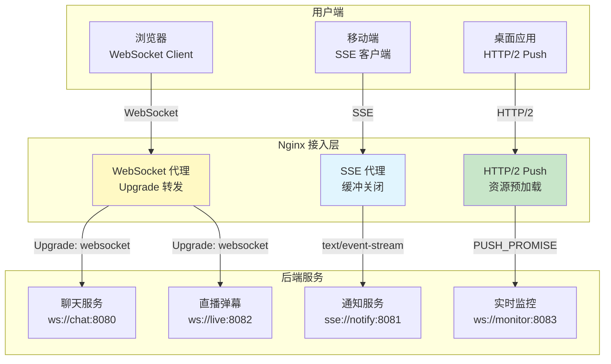
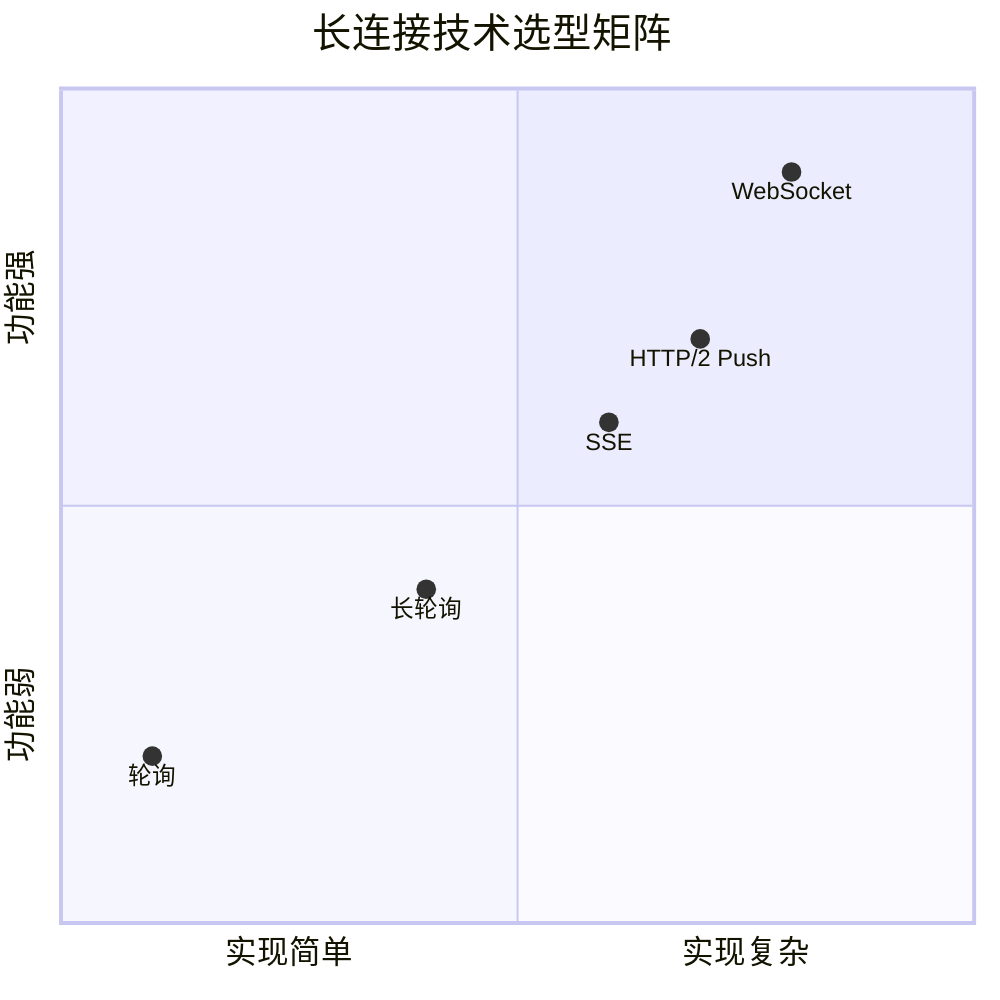
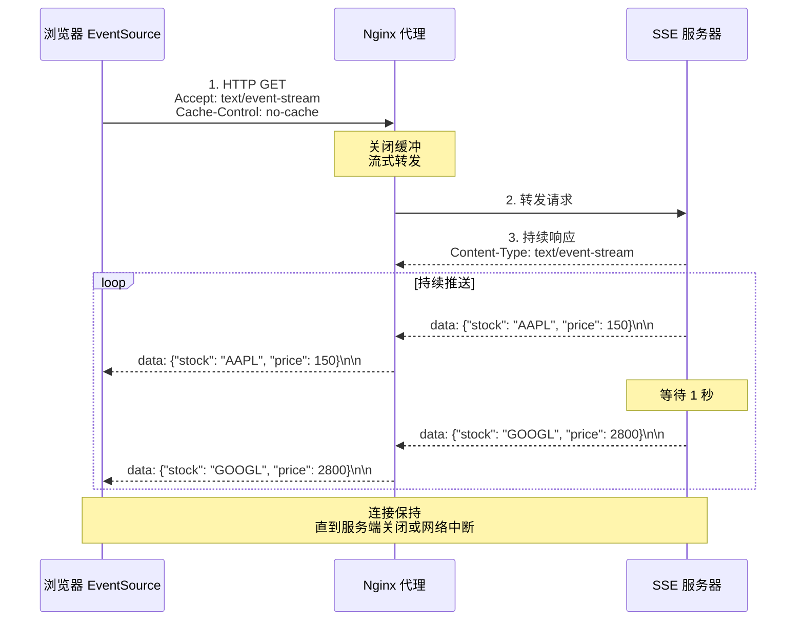
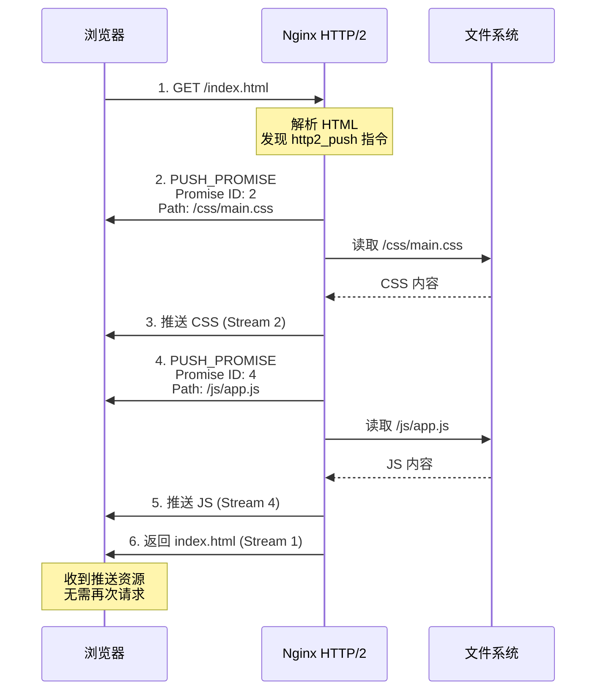

# 第 8 章 WebSocket 与长连接实战

## 学习目标
- ✅ 理解 WebSocket 协议原理与握手过程
- ✅ 掌握 Nginx WebSocket 反向代理配置
- ✅ 学会 SSE（Server-Sent Events）实时推送
- ✅ 精通 HTTP/2 Server Push 优化
- ✅ 能够配置长连接超时与保活
- ✅ 实现百万级并发连接的架构设计

---

## 场景引入

假设你的应用需要支持以下实时功能：



**业务需求**：
1. **在线聊天室**：支持 10 万用户同时在线，消息延迟 < 100ms
2. **股票行情推送**：每秒更新 1000 次，数据不丢失
3. **直播弹幕**：高并发写入，实时广播给所有观众
4. **文件上传进度**：实时显示上传百分比
5. **协同编辑**：多人同时编辑文档，状态实时同步

本章将提供完整的长连接解决方案。

---

## 核心原理

### 8.1 长连接技术对比



**技术对比表**：
| 技术 | 方向 | 延迟 | 兼容性 | 适用场景 |
|------|------|------|--------|---------|
| **轮询** | 双向 | 高（轮询间隔） | 全部 | 简单状态检查 |
| **长轮询** | 双向 | 中 | 全部 | 即时消息 |
| **SSE** | 单向（服务器→客户端） | 低 | 现代浏览器 | 新闻推送、股票行情 |
| **WebSocket** | 双向全双工 | 极低 | 现代浏览器 | 聊天、游戏、协同编辑 |
| **HTTP/2 Push** | 单向 | 低 | HTTP/2 浏览器 | 资源预加载 |

### 8.2 WebSocket 握手流程

```mermaid
sequenceDiagram
    participant Client as 浏览器
    participant Nginx as Nginx 代理
    participant Backend as WebSocket 后端
    
    Note over Client,Backend: 阶段 1: HTTP 握手升级
    
    Client->>Nginx: 1. HTTP 请求<br/>GET /chat HTTP/1.1<br/>Upgrade: websocket<br/>Connection: Upgrade<br/>Sec-WebSocket-Key: dGhlIHNhbXBsZSBub25jZQ==
    
    Note over Nginx: 检测 Upgrade 头部<br/>转发到 WebSocket 上游
    
    Nginx->>Backend: 2. 转发握手请求<br/>Upgrade: websocket<br/>Connection: upgrade<br/>Sec-WebSocket-Key: ...
    
    Note over Backend: 验证 Key<br/>生成 Accept
    
    Backend-->>Nginx: 3. 响应握手<br/>HTTP/1.1 101 Switching Protocols<br/>Upgrade: websocket<br/>Connection: Upgrade<br/>Sec-WebSocket-Accept: s3pPLMBiTxaQ9kYGzzhZRbK+xOo=
    
    Nginx-->>Client: 4. 返回握手响应
    
    Note over Client,Backend: 阶段 2: WebSocket 全双工通信
    
    Client->>Nginx->>Backend: 5. 发送消息 (Frame)
    Backend->>Nginx->>Client: 6. 接收消息 (Frame)
    
    Note over Client,Backend: TCP 连接保持<br/>直到任意一方关闭
```

**关键点**：
1. **协议升级**：从 HTTP/1.1 升级到 WebSocket（基于 TCP）
2. **一次性握手**：后续通信不再经过 HTTP 层
3. **长连接保持**：Nginx 必须维持 TCP 连接不断开

### 8.3 SSE 工作原理



**SSE 消息格式**：
```
event: message
data: {"type": "price_update", "symbol": "AAPL"}

event: heartbeat
data: ping

data: 多行消息
data: 第二行
data: 第三行
```

---

## 配置实战

### 8.4 WebSocket 基础配置

```nginx
http {
    # === 定义 WebSocket 上游 ===
    upstream websocket_backend {
        server 192.168.1.10:8080;
        server 192.168.1.11:8080;
        
        # 长连接池（重要！）
        keepalive 100;
    }
    
    server {
        listen 443 ssl http2;
        server_name ws.example.com;
        
        ssl_certificate /etc/nginx/ssl/ws.example.com/fullchain.pem;
        ssl_certificate_key /etc/nginx/ssl/ws.example.com/privkey.pem;
        
        location /ws/ {
            proxy_pass http://websocket_backend;
            
            # === 关键配置：WebSocket 升级 ===
            
            # 1. 使用 HTTP/1.1（WebSocket 要求）
            proxy_http_version 1.1;
            
            # 2. 传递 Upgrade 头部
            proxy_set_header Upgrade $http_upgrade;
            
            # 3. 传递 Connection 头部
            proxy_set_header Connection "upgrade";
            
            # === 标准代理头部 ===
            proxy_set_header Host $host;
            proxy_set_header X-Real-IP $remote_addr;
            proxy_set_header X-Forwarded-For $proxy_add_x_forwarded_for;
            proxy_set_header X-Forwarded-Proto $scheme;
            
            # === 长连接超时配置 ===
            
            # WebSocket 连接可能持续数小时
            proxy_connect_timeout 60s;
            proxy_send_timeout 3600s;   # 1 小时
            proxy_read_timeout 3600s;   # 1 小时
            
            # 缓冲设置（建议关闭）
            proxy_buffering off;
            proxy_request_buffering off;
        }
    }
}
```

### 8.5 多路径 WebSocket 路由

```nginx
upstream chat_servers {
    server 192.168.1.20:8080;
    server 192.168.1.21:8080;
}

upstream game_servers {
    server 192.168.1.30:8080;
    server 192.168.1.31:8080;
}

upstream notification_servers {
    server 192.168.1.40:8080;
}

server {
    listen 443 ssl;
    server_name realtime.example.com;
    
    # === 聊天服务 ===
    location /ws/chat/ {
        proxy_pass http://chat_servers;
        
        proxy_http_version 1.1;
        proxy_set_header Upgrade $http_upgrade;
        proxy_set_header Connection "upgrade";
        
        proxy_read_timeout 86400s;  # 24 小时
    }
    
    # === 游戏实时对战 ===
    location /ws/game/ {
        proxy_pass http://game_servers;
        
        proxy_http_version 1.1;
        proxy_set_header Upgrade $http_upgrade;
        proxy_set_header Connection "upgrade";
        
        # 游戏对低延迟要求更高
        proxy_read_timeout 3600s;
    }
    
    # === 通知推送 ===
    location /ws/notification/ {
        proxy_pass http://notification_servers;
        
        proxy_http_version 1.1;
        proxy_set_header Upgrade $http_upgrade;
        proxy_set_header Connection "upgrade";
        
        proxy_read_timeout 7200s;  # 2 小时
    }
}
```

### 8.6 SSE（Server-Sent Events）配置

```nginx
upstream sse_backend {
    server 192.168.1.50:8081;
    keepalive 100;
}

server {
    listen 443 ssl http2;
    server_name sse.example.com;
    
    location /events {
        proxy_pass http://sse_backend;
        
        # === SSE 关键配置 ===
        
        # 1. 禁用缓冲（实时性要求）
        proxy_buffering off;
        proxy_cache off;
        
        # 2. 关闭请求缓冲（流式传输）
        proxy_request_buffering off;
        
        # 3. 设置正确的 Content-Type
        proxy_set_header Accept text/event-stream;
        
        # 4. 禁止缓存
        proxy_set_header Cache-Control no-cache;
        proxy_set_header Pragma no-cache;
        
        # 5. 标准头部
        proxy_set_header Host $host;
        proxy_set_header X-Real-IP $remote_addr;
        proxy_set_header X-Forwarded-For $proxy_add_x_forwarded_for;
        
        # 6. 长超时
        proxy_connect_timeout 60s;
        proxy_send_timeout 60s;
        proxy_read_timeout 86400s;  # 24 小时
        
        # 7. 添加响应头（便于调试）
        add_header Content-Type text/event-stream;
        add_header X-Accel-Buffering no;  # 禁用 Nginx 加速缓冲
    }
}
```

**前端 SSE 客户端代码**：
```javascript
// 浏览器端连接 SSE
const eventSource = new EventSource('https://sse.example.com/events');

// 监听消息
eventSource.addEventListener('message', (event) => {
    const data = JSON.parse(event.data);
    console.log('收到推送:', data);
});

// 监听连接打开
eventSource.addEventListener('open', () => {
    console.log('SSE 连接已建立');
});

// 监听错误
eventSource.addEventListener('error', (error) => {
    if (eventSource.readyState === EventSource.CLOSED) {
        console.log('连接已关闭');
    } else {
        console.log('连接错误，尝试重连...');
    }
});

// 手动关闭
// eventSource.close();
```

### 8.7 HTTP/2 Server Push 配置

```nginx
server {
    listen 443 ssl http2;
    server_name www.example.com;
    
    ssl_certificate /etc/nginx/ssl/www.example.com/fullchain.pem;
    ssl_certificate_key /etc/nginx/ssl/www.example.com/privkey.pem;
    
    location / {
        root /var/www/html;
        index index.html;
        
        # === HTTP/2 Push 配置 ===
        
        # 主动推送关键资源
        http2_push /static/css/main.css;
        http2_push /static/js/app.js;
        http2_push /static/js/vendor.js;
        http2_push /images/logo.png;
        
        # 或者使用 http2_push_link（更灵活）
        # 在 HTML 中添加：<link rel="preload" href="/style.css" as="style">
        # Nginx 自动推送
        http2_push_on_preload on;
        http2_push_link on;
    }
    
    # 推送字体文件
    location ~* \.(woff2?|ttf|otf)$ {
        add_header Access-Control-Allow-Origin *;
        
        # 字体文件通常较小，适合推送
        http2_push $uri;
    }
}
```

**HTTP/2 Push 工作流程**：


### 8.8 长连接超时调优

```nginx
http {
    # === 全局长连接配置 ===
    
    # 1. 保持连接空闲超时
    keepalive_timeout 65s;         # 默认 65 秒
    keepalive_requests 100;        # 单个连接最多 100 个请求
    keepalive_time 1h;             # 连接总存活时间（Nginx 1.21+）
    
    # 2. 发送/读取超时
    send_timeout 60s;              # 客户端读取超时
    client_body_timeout 60s;       # 客户端写入超时
    
    # === 针对 WebSocket 的优化 ===
    
    map $http_upgrade $connection_upgrade {
        default upgrade;
        ''      close;
    }
    
    server {
        location /ws/ {
            proxy_pass http://websocket_backend;
            
            proxy_http_version 1.1;
            proxy_set_header Upgrade $http_upgrade;
            proxy_set_header Connection $connection_upgrade;
            
            # 超长超时（聊天可能持续数小时）
            proxy_read_timeout 86400s;
            
            # 心跳检测（防止僵尸连接）
            # 每 30 秒发送一次 ping
            proxy_socket_keepalive on;
            tcp_keepidle 30s;
            tcp_keepinterval 10s;
            tcp_keepprobe 3;
        }
    }
}
```

### 8.9 连接数限制与保护

```nginx
http {
    # === 限制每个 IP 的连接数 ===
    limit_conn_zone $binary_remote_addr zone=ws_conn:10m;
    
    # === 限制总连接数（防 DDoS）===
    # 需要第三方模块：nginx-limit-conn-module
    
    server {
        location /ws/ {
            # 每个 IP 最多 10 个 WebSocket 连接
            limit_conn ws_conn 10;
            limit_conn_status 429;
            limit_conn_log_level warn;
            
            # 标准 WebSocket 配置
            proxy_pass http://websocket_backend;
            proxy_http_version 1.1;
            proxy_set_header Upgrade $http_upgrade;
            proxy_set_header Connection "upgrade";
            
            proxy_read_timeout 86400s;
        }
    }
}
```

---

## 完整示例文件

### 8.10 实时聊天室完整配置

```nginx
# /etc/nginx/conf.d/websocket-chat.conf
# 生产级实时聊天室 WebSocket 配置

# === 限流区域 ===
limit_conn_zone $binary_remote_addr zone=chat_conn:10m;
limit_req_zone $binary_remote_addr zone=chat_req:10m rate=10r/s;

# === WebSocket 上游集群 ===
upstream chat_backend {
    least_conn;  # WebSocket 推荐 Least Conn
    
    server 192.168.1.10:8080 max_fails=3 fail_timeout=30s;
    server 192.168.1.11:8080 max_fails=3 fail_timeout=30s;
    server 192.168.1.12:8080 max_fails=3 fail_timeout=30s;
    
    # 长连接池
    keepalive 100;
}

# === 聊天服务器 ===
server {
    listen 80;
    server_name chat.example.com;
    return 301 https://$server_name$request_uri;
}

server {
    listen 443 ssl http2;
    server_name chat.example.com;
    
    ssl_certificate /etc/nginx/ssl/chat.example.com/fullchain.pem;
    ssl_certificate_key /etc/nginx/ssl/chat.example.com/privkey.pem;
    
    access_log /var/log/nginx/chat.access.log main;
    error_log /var/log/nginx/chat.error.log warn;
    
    # === WebSocket 入口 ===
    location /ws/chat/ {
        # 连接数限制
        limit_conn chat_conn 5;  # 每 IP 最多 5 个连接
        limit_req zone=chat_req burst=20 nodelay;
        
        # WebSocket 代理
        proxy_pass http://chat_backend;
        
        # 协议升级
        proxy_http_version 1.1;
        proxy_set_header Upgrade $http_upgrade;
        proxy_set_header Connection "upgrade";
        
        # 客户端信息
        proxy_set_header Host $host;
        proxy_set_header X-Real-IP $remote_addr;
        proxy_set_header X-Forwarded-For $proxy_add_x_forwarded_for;
        proxy_set_header X-Forwarded-Proto $scheme;
        
        # 长超时
        proxy_connect_timeout 60s;
        proxy_send_timeout 86400s;
        proxy_read_timeout 86400s;
        
        # 关闭缓冲
        proxy_buffering off;
        proxy_request_buffering off;
        
        # 心跳检测
        proxy_socket_keepalive on;
    }
    
    # === REST API（聊天历史、用户信息等）===
    location /api/chat/ {
        proxy_pass http://chat_backend;
        
        proxy_set_header Host $host;
        proxy_set_header X-Real-IP $remote_addr;
        proxy_set_header X-Forwarded-For $proxy_add_x_forwarded_for;
        
        # API 超时较短
        proxy_read_timeout 30s;
        
        # 开启缓冲
        proxy_buffering on;
        proxy_buffer_size 4k;
        proxy_buffers 8 4k;
    }
    
    # === 静态资源（聊天界面）===
    location / {
        root /var/www/chat;
        index index.html;
        
        # HTTP/2 Push
        http2_push /static/css/chat.css;
        http2_push /static/js/chat-app.js;
        
        # 缓存控制
        location ~* \.(css|js)$ {
            expires 7d;
            add_header Cache-Control "public, immutable";
        }
    }
    
    # === 健康检查 ===
    location = /health {
        access_log off;
        return 200 "OK\n";
        add_header Content-Type text/plain;
    }
}
```

---

## 常见错误与排查

### 8.11 经典陷阱

#### 问题 1：WebSocket 连接立即断开

```nginx
# ❌ 错误：忘记设置 Connection 头部
location /ws/ {
    proxy_pass http://backend;
    proxy_http_version 1.1;
    # 缺少这两行导致握手失败
    # proxy_set_header Upgrade $http_upgrade;
    # proxy_set_header Connection "upgrade";
}

# ✅ 正确
location /ws/ {
    proxy_pass http://backend;
    proxy_http_version 1.1;
    proxy_set_header Upgrade $http_upgrade;
    proxy_set_header Connection "upgrade";
}
```

#### 问题 2：SSE 推送延迟严重

```nginx
# ❌ 错误：缓冲未关闭
location /events {
    proxy_pass http://sse_backend;
    # 默认 proxy_buffering on，导致数据积压
}

# ✅ 正确
location /events {
    proxy_pass http://sse_backend;
    proxy_buffering off;           # ← 关键
    proxy_cache off;               # ← 关键
    proxy_request_buffering off;   # ← 关键
}
```

#### 问题 3：连接数过多导致内存溢出

```bash
# 现象：Nginx worker 进程内存持续增长

# 原因：大量僵尸连接未释放

# 解决方案
location /ws/ {
    # 1. 限制连接数
    limit_conn zone_per_ip 10;
    
    # 2. 设置最大连接存活时间
    proxy_read_timeout 86400s;
    
    # 3. 启用 TCP Keepalive
    proxy_socket_keepalive on;
    
    # 4. 监控连接数
    # stub_status 模块
}

# 监控命令
watch -n 1 'netstat -an | grep :8080 | wc -l'
```

### 8.12 调试技巧

```bash
# 1. 查看 WebSocket 连接数
netstat -an | grep :8080 | grep ESTABLISHED | wc -l

# 2. 抓包分析 WebSocket 握手
tcpdump -i eth0 -A port 8080 | grep -E "Upgrade|Connection"

# 3. 测试 WebSocket 连接
# 使用 wscat 工具
wscat -c wss://chat.example.com/ws/chat/

# 4. 查看 Nginx 错误日志
tail -f /var/log/nginx/error.log | grep "upstream prematurely closed"

# 5. 模拟高并发连接
ab -n 1000 -c 100 https://chat.example.com/ws/chat/
```

---

## 练习题

### 练习 1：搭建实时聊天室
需求：
1. 部署 3 个 WebSocket 后端节点
2. Nginx 配置负载均衡与健康检查
3. 实现连接数限制（每 IP 最多 5 个）
4. 编写前端页面连接 WebSocket
5. 压测：模拟 1000 个并发连接

### 练习 2：股票行情 SSE 推送
实现一个股票价格实时推送系统：
1. 后端每秒推送最新价格
2. Nginx 配置 SSE 代理（关闭缓冲）
3. 前端使用 EventSource 接收数据
4. 绘制实时价格曲线图
5. 测试断线重连机制

### 练习 3：HTTP/2 Push 性能优化
1. 搭建包含 CSS/JS/图片的网站
2. 配置 HTTP/2 Push 预加载关键资源
3. 使用 Chrome DevTools 对比 Push 前后的加载时间
4. 分析 Network 面板中的 PUSH_PROMISE
5. 撰写性能优化报告

---

## 本章小结

✅ **核心要点回顾**：
1. **WebSocket 升级**：`Upgrade` + `Connection` 头部缺一不可
2. **长超时配置**：WebSocket/SSE 需设置 `proxy_read_timeout` 为小时级
3. **缓冲控制**：实时推送必须关闭 `proxy_buffering`
4. **连接保护**：使用 `limit_conn` 防止单 IP 占用过多连接
5. **心跳检测**：启用 `proxy_socket_keepalive` 清理僵尸连接

🎯 **下一章预告**：
第 9 章讲解 **gRPC 与 HTTP/2 转发**，深入微服务架构下的 RPC 通信优化、双向流式传输及 Nginx 作为 gRPC 网关的配置实践。

📚 **参考资源**：
- [Nginx WebSocket 代理](https://www.nginx.com/blog/websocket-nginx/)
- [SSE 规范](https://html.spec.whatwg.org/multipage/server-sent-events.html)
- [HTTP/2 Push 最佳实践](https://web.dev/push-notifications/)
