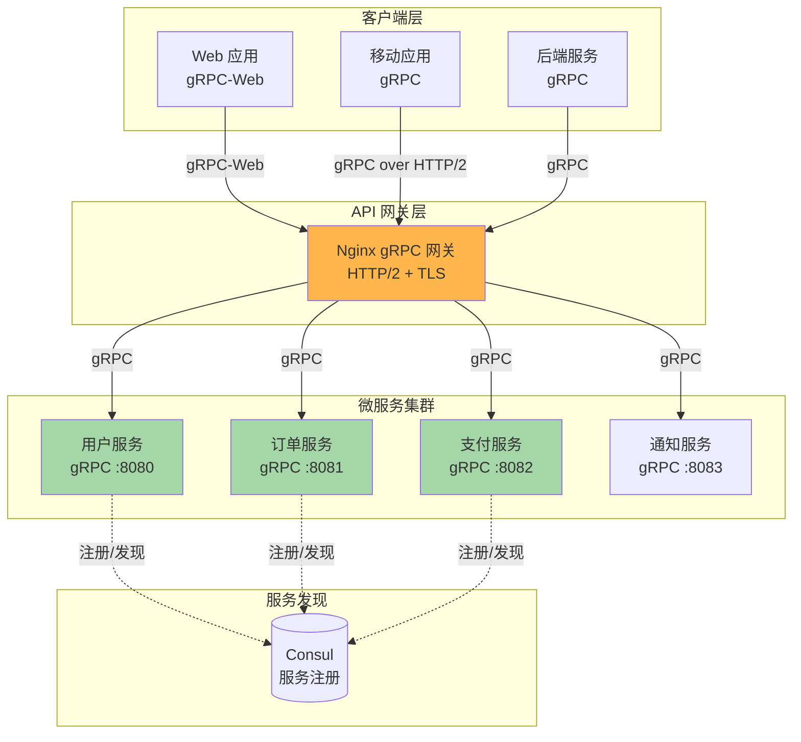
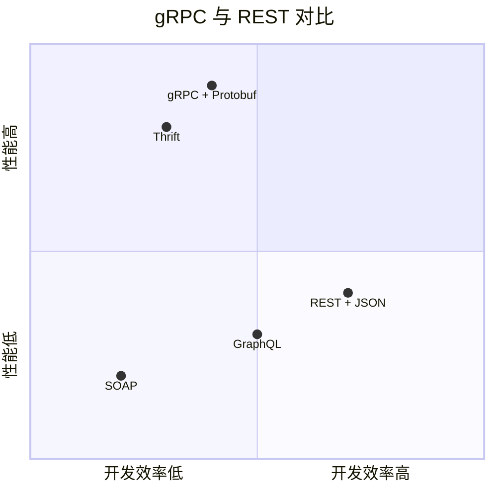

# 第 9 章 gRPC 与 HTTP/2 转发实战

## 学习目标
- ✅ 理解 gRPC 协议原理与适用场景
- ✅ 掌握 Nginx gRPC 反向代理配置
- ✅ 学会 gRPC 负载均衡与健康检查
- ✅ 精通 gRPC-Web 桥接配置
- ✅ 能够配置 HTTP/2 双向流式传输
- ✅ 实现微服务架构下的 gRPC 网关

---

## 场景引入

假设你的公司正在构建微服务架构：



**业务需求**：
1. **高性能 RPC**：服务间通信延迟 < 10ms，吞吐量 > 10K QPS
2. **类型安全**：Protocol Buffers 强类型接口定义
3. **双向流式**：实时数据同步（如直播弹幕推送）
4. **多语言互通**：Java/Go/Python/Node.js 服务无缝通信
5. **Web 端支持**：浏览器通过 gRPC-Web 访问后端

本章将提供完整的 gRPC 解决方案。

---

## 核心原理

### 9.1 gRPC vs REST API



**技术对比**：
| 维度 | REST + JSON | gRPC + Protobuf |
|------|------------|----------------|
| **数据格式** | JSON（文本） | Protobuf（二进制） |
| **性能** | 中（解析慢） | 高（序列化快 5-10 倍） |
| **类型安全** | 弱（动态类型） | 强（静态类型） |
| **代码生成** | 手动/Swagger | 自动生成（多语言） |
| **流式支持** | SSE/WebSocket | 原生支持（双向流） |
| **浏览器兼容** | ✅ 完美 | ⚠️ 需 gRPC-Web |
| **调试友好** | ✅ 可读 | ❌ 需工具解析 |

### 9.2 gRPC 通信模式

```mermaid
sequenceDiagram
    participant Client as gRPC 客户端
    participant Nginx as Nginx 网关
    participant Server as gRPC 服务端
    
    Note over Client,Server: 模式 1: Unary RPC（简单请求响应）
    
    Client->>Nginx: 1. 单次请求<br/>POST /package.Service/Method<br/>Content-Type: application/grpc
    Nginx->>Server: 转发请求
    Server-->>Nginx: 单次响应<br/>gRPC-Status: 0
    Nginx-->>Client: 返回响应
    
    Note over Client,Server: 模式 2: Server Streaming（服务器流式）
    
    Client->>Nginx: 1. 请求<br/>GetStockPrices(symbol="AAPL")
    Nginx->>Server: 转发
    Server-->>Nginx: 流式响应 1<br/>price=150
    Nginx-->>Client: 推送数据 1
    Server-->>Nginx: 流式响应 2<br/>price=151
    Nginx-->>Client: 推送数据 2
    
    Note over Client,Server: 模式 3: Client Streaming（客户端流式）
    
    Client->>Nginx: 流式请求 1<br/>UploadChunk(data)
    Nginx->>Server: 转发
    Client->>Nginx: 流式请求 2<br/>UploadChunk(data)
    Nginx->>Server: 转发
    Server-->>Nginx: 最终响应<br/>UploadComplete
    Nginx-->>Client: 完成
    
    Note over Client,Server: 模式 4: Bidirectional Streaming（双向流）
    
    Client->>Nginx: 建立双向流
    loop 持续通信
        Client->>Nginx->>Server: 客户端消息
        Server->>Nginx->>Client: 服务端消息
    end
```

### 9.3 Protocol Buffers 简介

```protobuf
// 示例：用户服务 proto 定义
syntax = "proto3";

package user;

service UserService {
    // Unary RPC
    rpc GetUser(GetUserRequest) returns (GetUserResponse);
    
    // Server streaming
    rpc ListUsers(ListUsersRequest) returns (stream User);
    
    // Client streaming
    rpc CreateUser(stream User) returns (CreateUserResponse);
    
    // Bidirectional streaming
    rpc Chat(stream ChatMessage) returns (stream ChatMessage);
}

message User {
    int64 id = 1;
    string name = 2;
    string email = 3;
}

message GetUserRequest {
    int64 user_id = 1;
}

message GetUserResponse {
    User user = 1;
}
```

---

## 配置实战

### 9.4 基础 gRPC 代理配置

```nginx
http {
    # === 定义 gRPC 上游 ===
    upstream grpc_backend {
        server 192.168.1.10:8080;
        server 192.168.1.11:8080;
        
        # 长连接池（gRPC 基于 HTTP/2）
        keepalive 100;
    }
    
    server {
        # gRPC 必须使用 HTTP/2 + TLS（生产环境）
        listen 443 ssl http2;
        server_name grpc.example.com;
        
        ssl_certificate /etc/nginx/ssl/grpc.example.com/fullchain.pem;
        ssl_certificate_key /etc/nginx/ssl/grpc.example.com/privkey.pem;
        
        # ALPN 协议协商（gRPC 要求）
        ssl_protocols TLSv1.2 TLSv1.3;
        ssl_ciphers HIGH:!aNULL:!MD5;
        
        location / {
            # === gRPC 代理关键配置 ===
            
            # 1. 使用 gRPC_pass
            grpc_pass grpc://grpc_backend;
            
            # 2. 设置 HTTP/2
            grpc_http_version 2;
            
            # 3. 传递必要头部
            grpc_set_header Host $host;
            grpc_set_header X-Real-IP $remote_addr;
            grpc_set_header X-Forwarded-For $proxy_add_x_forwarded_for;
            
            # 4. SSL 证书验证（可选）
            # grpc_ssl_certificate /etc/nginx/ssl/client.crt;
            # grpc_ssl_certificate_key /etc/nginx/ssl/client.key;
            
            # 5. 超时配置
            grpc_connect_timeout 5s;
            grpc_send_timeout 30s;
            grpc_read_timeout 30s;
            
            # 6. 缓冲（默认开启）
            grpc_buffering on;
            grpc_buffer_size 4k;
        }
    }
}
```

⚠️ **注意**：`grpc_pass` 指令需要 Nginx ≥ 1.13.10 且编译时包含 `--with-http_grpc_module`。

### 9.5 gRPC 服务路由

```nginx
upstream user_service {
    server 192.168.1.10:8080 max_fails=3 fail_timeout=30s;
    keepalive 64;
}

upstream order_service {
    server 192.168.1.20:8081 max_fails=3 fail_timeout=30s;
    keepalive 64;
}

upstream payment_service {
    server 192.168.1.30:8082 max_fails=3 fail_timeout=30s;
    keepalive 64;
}

server {
    listen 443 ssl http2;
    server_name api.example.com;
    
    ssl_certificate /etc/nginx/ssl/api.example.com/fullchain.pem;
    ssl_certificate_key /etc/nginx/ssl/api.example.com/privkey.pem;
    
    # === 用户服务 ===
    location /user.UserService/ {
        grpc_pass grpc://user_service;
        
        grpc_set_header Host $host;
        grpc_set_header X-Real-IP $remote_addr;
        grpc_set_header X-Forwarded-For $proxy_add_x_forwarded_for;
        
        grpc_read_timeout 30s;
    }
    
    # === 订单服务 ===
    location /order.OrderService/ {
        grpc_pass grpc://order_service;
        
        grpc_set_header Host $host;
        grpc_set_header X-Real-IP $remote_addr;
        grpc_set_header X-Forwarded-For $proxy_add_x_forwarded_for;
        
        # 订单操作可能较慢
        grpc_read_timeout 120s;
    }
    
    # === 支付服务（高安全性）===
    location /payment.PaymentService/ {
        grpc_pass grpc://payment_service;
        
        # 额外安全检查
        if ($http_authorization = "") {
            return 401;
        }
        
        grpc_set_header Host $host;
        grpc_set_header X-Real-IP $remote_addr;
        grpc_set_header X-Forwarded-For $proxy_add_x_forwarded_for;
        grpc_set_header Authorization $http_authorization;
        
        # 严格超时
        grpc_connect_timeout 3s;
        grpc_read_timeout 60s;
    }
}
```

### 9.6 gRPC 负载均衡策略

```nginx
# === 方案 1：轮询（默认）===
upstream grpc_round_robin {
    server 192.168.1.10:8080;
    server 192.168.1.11:8080;
    server 192.168.1.12:8080;
    
    keepalive 100;
}

# === 方案 2：加权轮询 ===
upstream grpc_weighted {
    server 192.168.1.10:8080 weight=5;
    server 192.168.1.11:8080 weight=3;
    server 192.168.1.12:8080 weight=2;
    
    least_conn;  # 推荐结合 Least Conn
    keepalive 100;
}

# === 方案 3：IP Hash（会话保持）===
upstream grpc_ip_hash {
    ip_hash;
    
    server 192.168.1.10:8080;
    server 192.168.1.11:8080;
    
    keepalive 100;
}

# === 方案 4：Least Conn（推荐）===
upstream grpc_least_conn {
    least_conn;
    
    server 192.168.1.10:8080 max_fails=3 fail_timeout=30s;
    server 192.168.1.11:8080 max_fails=3 fail_timeout=30s;
    server 192.168.1.12:8080 max_fails=3 fail_timeout=30s;
    
    keepalive 100;
}

server {
    location / {
        grpc_pass grpc://grpc_least_conn;
    }
}
```

### 9.7 gRPC-Web 桥接配置

```nginx
# gRPC-Web 允许浏览器直接调用 gRPC 服务
# 需要 Nginx 作为协议转换层

upstream grpc_backend {
    server 192.168.1.10:8080;
    keepalive 64;
}

server {
    listen 443 ssl http2;
    server_name api.example.com;
    
    ssl_certificate /etc/nginx/ssl/api.example.com/fullchain.pem;
    ssl_certificate_key /etc/nginx/ssl/api.example.com/privkey.pem;
    
    # === gRPC-Web 入口 ===
    location /grpc/ {
        # 1. 允许 CORS（浏览器跨域）
        add_header Access-Control-Allow-Origin * always;
        add_header Access-Control-Allow-Methods "GET, POST, OPTIONS" always;
        add_header Access-Control-Allow-Headers "Content-Type,Authorization,x-grpc-web" always;
        add_header Access-Control-Expose-Grpc-Status 1;
        add_header Access-Control-Expose-Grpc-Message 1;
        
        # 处理预检请求
        if ($request_method = OPTIONS) {
            add_header Content-Length 0;
            add_header Content-Type text/plain;
            return 204;
        }
        
        # 2. 转发到 gRPC 后端
        grpc_pass grpc://grpc_backend;
        
        grpc_set_header Host $host;
        grpc_set_header X-Real-IP $remote_addr;
        grpc_set_header X-Forwarded-For $proxy_add_x_forwarded_for;
        
        # 3. 传递 gRPC-Web 特定头部
        grpc_set_header X-Grpc-Web $http_x_grpc_web;
        
        # 4. 超时
        grpc_read_timeout 30s;
    }
    
    # === 原生 gRPC 入口（服务端调用）===
    location / {
        grpc_pass grpc://grpc_backend;
        
        grpc_set_header Host $host;
        grpc_set_header X-Real-IP $remote_addr;
        grpc_set_header X-Forwarded-For $proxy_add_x_forwarded_for;
    }
}
```

**前端 gRPC-Web 调用示例**：
```javascript
// 浏览器端使用 gRPC-Web 客户端
import {UserServiceClient} from './proto/user_grpc_web_pb';
import {GetUserRequest} from './proto/user_pb';

const client = new UserServiceClient('https://api.example.com');

const request = new GetUserRequest();
request.setUserId(123);

client.getUser(request, {}, (err, response) => {
    if (err) {
        console.error('gRPC 错误:', err);
    } else {
        console.log('用户信息:', response.getUser());
    }
});
```

### 9.8 gRPC 健康检查

```nginx
upstream grpc_backend {
    server 192.168.1.10:8080 max_fails=3 fail_timeout=30s;
    server 192.168.1.11:8080 max_fails=3 fail_timeout=30s;
    
    least_conn;
    keepalive 100;
    
    # 主动健康检查（商业版或第三方模块）
    # health_check interval=5s fails=3 passes=2 uri=/grpc.health.v1.Health/Check;
}

server {
    listen 443 ssl http2;
    server_name grpc.example.com;
    
    # === 健康检查端点 ===
    location = /health {
        access_log off;
        
        # 返回 gRPC 健康状态
        grpc_return 200 "OK\n";
        add_header Content-Type application/grpc;
    }
    
    # === 主服务 ===
    location / {
        grpc_pass grpc://grpc_backend;
        
        grpc_set_header Host $host;
        grpc_set_header X-Real-IP $remote_addr;
        
        # 健康检查传递
        grpc_set_header X-Health-Check "true";
    }
}
```

**gRPC 健康检查协议**：
```protobuf
// 标准健康检查服务
service Health {
    rpc Check(HealthCheckRequest) returns (HealthCheckResponse);
}

message HealthCheckRequest {
    string service = 1;  // 服务名，空字符串检查整体健康
}

message HealthCheckResponse {
    enum ServingStatus {
        UNKNOWN = 0;
        SERVING = 1;
        NOT_SERVING = 2;
    }
    ServingStatus status = 1;
}
```

### 9.9 gRPC 限流与熔断

```nginx
http {
    # === 限流区域 ===
    limit_req_zone $binary_remote_addr zone=grpc_limit:10m rate=100r/s;
    limit_conn_zone $binary_remote_addr zone=grpc_conn:10m;
    
    server {
        location / {
            # 1. 请求限流
            limit_req zone=grpc_limit burst=200 nodelay;
            limit_req_status 429;
            
            # 2. 连接数限制
            limit_conn zone=grpc_conn 50;
            limit_conn_status 429;
            
            # 3. gRPC 代理
            grpc_pass grpc://grpc_backend;
            
            grpc_set_header Host $host;
            grpc_set_header X-Real-IP $remote_addr;
            
            # 4. 熔断保护（需 Lua 模块）
            # access_by_lua_block {
            #     local circuit_breaker = require "resty.circuitbreaker"
            #     
            #     local cb = circuit_breaker:new({
            #         timeout = 60,          -- 熔断持续时间
            #         threshold = 5,         -- 失败阈值
            #         window_size = 10       -- 统计窗口
            #     })
            #     
            #     local ok, err = cb:run(function()
            #         -- 执行健康检查
            #     end)
            #     
            #     if not ok then
            #         ngx.status = 503
            #         ngx.say("Service unavailable")
            #         return ngx.exit(503)
            #     end
            # }
        }
    }
}
```

---

## 完整示例文件

### 9.10 微服务 gRPC 网关完整配置

```nginx
# /etc/nginx/conf.d/grpc-gateway.conf
# 生产级微服务 gRPC 网关配置

# === 限流区域 ===
limit_req_zone $binary_remote_addr zone=grpc_global:10m rate=1000r/s;
limit_conn_zone $binary_remote_addr zone=grpc_conn_per_ip:10m;

# === 用户服务集群 ===
upstream user_grpc {
    least_conn;
    server 192.168.1.10:8080 max_fails=3 fail_timeout=30s;
    server 192.168.1.11:8080 max_fails=3 fail_timeout=30s;
    server 192.168.1.12:8080 max_fails=3 fail_timeout=30s;
    keepalive 100;
}

# === 订单服务集群 ===
upstream order_grpc {
    least_conn;
    server 192.168.1.20:8081 max_fails=3 fail_timeout=30s;
    server 192.168.1.21:8081 max_fails=3 fail_timeout=30s;
    keepalive 64;
}

# === 支付服务集群 ===
upstream payment_grpc {
    least_conn;
    server 192.168.1.30:8082 max_fails=2 fail_timeout=20s;
    server 192.168.1.31:8082 max_fails=2 fail_timeout=20s;
    keepalive 64;
}

# === gRPC 网关服务器 ===
server {
    listen 80;
    server_name grpc.example.com;
    return 301 https://$server_name$request_uri;
}

server {
    listen 443 ssl http2;
    server_name grpc.example.com;
    
    # === SSL 配置 ===
    ssl_certificate /etc/nginx/ssl/grpc.example.com/fullchain.pem;
    ssl_certificate_key /etc/nginx/ssl/grpc.example.com/privkey.pem;
    
    ssl_protocols TLSv1.2 TLSv1.3;
    ssl_ciphers ECDHE+AESGCM:DHE+AESGCM:ECDHE+RSA:DHE+RSA;
    ssl_prefer_server_ciphers on;
    
    # ALPN for gRPC
    ssl_alpn_protocols h2 http/1.1;
    
    # === 日志 ===
    access_log /var/log/nginx/grpc.access.log main;
    error_log /var/log/nginx/grpc.error.log warn;
    
    # === 全局限流 ===
    limit_req zone=grpc_global burst=2000 nodelay;
    limit_conn zone=grpc_conn_per_ip 100;
    
    # === 用户服务路由 ===
    location /user. {
        grpc_pass grpc://user_grpc;
        
        grpc_set_header Host $host;
        grpc_set_header X-Real-IP $remote_addr;
        grpc_set_header X-Forwarded-For $proxy_add_x_forwarded_for;
        
        grpc_connect_timeout 5s;
        grpc_send_timeout 30s;
        grpc_read_timeout 60s;
    }
    
    # === 订单服务路由 ===
    location /order. {
        grpc_pass grpc://order_grpc;
        
        grpc_set_header Host $host;
        grpc_set_header X-Real-IP $remote_addr;
        grpc_set_header X-Forwarded-For $proxy_add_x_forwarded_for;
        
        # 订单操作较慢
        grpc_read_timeout 120s;
    }
    
    # === 支付服务路由（高安全）===
    location /payment. {
        # 安全检查
        if ($http_authorization = "") {
            grpc_return 401;
        }
        
        grpc_pass grpc://payment_grpc;
        
        grpc_set_header Host $host;
        grpc_set_header X-Real-IP $remote_addr;
        grpc_set_header X-Forwarded-For $proxy_add_x_forwarded_for;
        grpc_set_header Authorization $http_authorization;
        
        # 严格超时
        grpc_connect_timeout 3s;
        grpc_read_timeout 60s;
    }
    
    # === gRPC-Web 支持 ===
    location /grpc.web/ {
        # CORS
        add_header Access-Control-Allow-Origin * always;
        add_header Access-Control-Allow-Methods "GET, POST, OPTIONS" always;
        add_header Access-Control-Allow-Headers "Content-Type,Authorization,x-grpc-web" always;
        
        if ($request_method = OPTIONS) {
            add_header Content-Length 0;
            add_header Content-Type text/plain;
            return 204;
        }
        
        # 转发到对应服务
        grpc_pass grpc://user_grpc;
        
        grpc_set_header X-Grpc-Web $http_x_grpc_web;
    }
    
    # === 健康检查 ===
    location = /health {
        access_log off;
        grpc_return 200 "OK\n";
        add_header Content-Type application/grpc;
    }
    
    # === 服务发现状态页 ===
    location = /status {
        stub_status on;
        allow 192.168.1.0/24;
        deny all;
    }
}
```

---

## 常见错误与排查

### 9.11 经典陷阱

#### 问题 1：缺少 HTTP/2 支持

```nginx
# ❌ 错误：没有启用 http2
server {
    listen 443 ssl;  # 缺少 http2
    location / {
        grpc_pass grpc://backend;  # 报错
    }
}

# ✅ 正确
server {
    listen 443 ssl http2;  # ← 必须启用 HTTP/2
    location / {
        grpc_pass grpc://backend;
    }
}
```

#### 问题 2：ALPN 协议未协商

```bash
# 现象：gRPC 连接失败，错误 "upstream protocol mismatch"

# 原因：SSL 配置未启用 ALPN

# ✅ 解决
server {
    listen 443 ssl http2;
    
    ssl_protocols TLSv1.2 TLSv1.3;
    ssl_alpn_protocols h2 http/1.1;  # ← 明确声明支持 HTTP/2
}
```

#### 问题 3：gRPC-Web CORS 错误

```nginx
# ❌ 错误：忘记添加 CORS 头部
location /grpc/ {
    grpc_pass grpc://backend;
    # 浏览器报错：CORS policy blocked
}

# ✅ 正确
location /grpc/ {
    add_header Access-Control-Allow-Origin * always;
    add_header Access-Control-Allow-Methods "GET, POST, OPTIONS" always;
    add_header Access-Control-Allow-Headers "Content-Type,x-grpc-web" always;
    
    if ($request_method = OPTIONS) {
        return 204;
    }
    
    grpc_pass grpc://backend;
}
```

### 9.12 调试技巧

```bash
# 1. 检查 Nginx 是否编译了 gRPC 模块
nginx -V 2>&1 | grep grpc
# 应看到：--with-http_grpc_module

# 2. 测试 gRPC 连接（使用 grpcurl 工具）
grpcurl -plaintext grpc.example.com:443 list
grpcurl -plaintext grpc.example.com:443 user.UserService/GetUser

# 3. 抓包分析 gRPC 流量
tcpdump -i eth0 -A port 8080 | grep -E "Content-Type.*grpc"

# 4. 查看 gRPC 错误日志
tail -f /var/log/nginx/error.log | grep "grpc"

# 5. 监控 gRPC 连接数
watch -n 1 'netstat -an | grep :8080 | grep ESTABLISHED | wc -l'
```

---

## 练习题

### 练习 1：搭建 gRPC 微服务网关
需求：
1. 部署 2 个 gRPC 后端服务（Go/Python）
2. Nginx 配置反向代理与负载均衡
3. 实现基于路径的路由（/user. → 用户服务）
4. 配置健康检查与故障转移
5. 使用 grpcurl 测试所有 RPC 方法

### 练习 2：gRPC-Web 浏览器集成
实现一个完整的 Web 应用：
1. 编写 proto 文件并生成 JS 代码
2. Nginx 配置 gRPC-Web 桥接
3. 前端使用 gRPC-Web 客户端调用后端
4. 处理 CORS 预检请求
5. 实现错误处理与重试机制

### 练习 3：gRPC 性能压测
1. 使用 ghz 工具进行 gRPC 压测
2. 对比 Unary/Streaming 性能差异
3. 调整 keepalive 参数观察效果
4. 找出性能瓶颈并优化
5. 撰写性能测试报告

---

## 本章小结

✅ **核心要点回顾**：
1. **HTTP/2 必需**：gRPC 依赖 HTTP/2 的多路复用与头部压缩
2. **TLS 加密**：生产环境必须启用 SSL/TLS
3. **长连接池**：`keepalive` 显著提升性能
4. **gRPC-Web**：浏览器需要 CORS + 协议转换
5. **健康检查**：使用标准 `/grpc.health.v1.Health/Check` 接口

🎯 **下一章预告**：
第三篇进入**安全与性能**主题，第 10 章深入讲解 HTTPS/TLS 1.3 配置、HTTP/3 QUIC 协议落地及证书管理最佳实践。

📚 **参考资源**：
- [Nginx gRPC 模块](https://nginx.org/en/docs/http/ngx_http_grpc_module.html)
- [gRPC 官方文档](https://grpc.io/docs/)
- [gRPC-Web GitHub](https://github.com/grpc/grpc-web)
