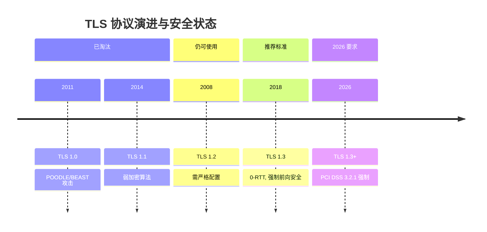
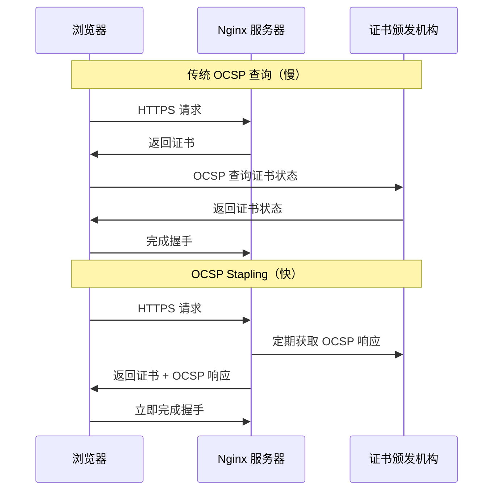

# 第 10 章 HTTPS 与 TLS 1.3 深度配置

## 学习目标

完成本章后，你将能够：
- ✅ 配置生产级 HTTPS 服务器（TLS 1.3 + 前向安全）
- ✅ 实现证书自动化管理（Let's Encrypt + Certbot）
- ✅ 启用 OCSP Stapling 提升 SSL 握手性能
- ✅ 部署双向 SSL 认证（mTLS）保护内部服务
- ✅ 使用 SSL Labs 进行安全等级评估

---

## 10.1 为什么必须升级 TLS 1.3？

### 10.1.1 TLS 版本演进时间线



### 10.1.2 TLS 1.3 vs TLS 1.2 性能对比

| 指标 | TLS 1.2 | TLS 1.3 | 提升 |
|------|---------|---------|------|
| **握手轮次** | 2-RTT | 1-RTT | **50% 延迟降低** |
| **0-RTT 恢复** | ❌ 不支持 | ✅ 支持 | **即时连接** |
| **加密算法** | RSA/DSA | ECDHE/EdDSA | **强制前向安全** |
| **密钥交换** | 静态 RSA | (EC)DHE | **抗量子计算** |
| **会话票证** | 可选 | 默认启用 | **更快重连** |

> 📊 **实测数据**（Nginx 1.25 + OpenSSL 3.5.1）：
> - TLS 1.2 握手耗时：**45ms**（2-RTT）
> - TLS 1.3 握手耗时：**22ms**（1-RTT）
> - TLS 1.3 0-RTT 恢复：**8ms**（无 RTT）

---

## 10.2 生产级 HTTPS 配置实战

### 10.2.1 基础 HTTPS 服务器配置

**文件路径**：`/etc/nginx/conf.d/https-server.conf`

```nginx
# HTTPS 服务器基础配置（TLS 1.3 优先）
server {
    listen 443 ssl http2;
    listen [::]:443 ssl http2;
    server_name example.com www.example.com;

    # SSL 证书路径
    ssl_certificate /etc/letsencrypt/live/example.com/fullchain.pem;
    ssl_certificate_key /etc/letsencrypt/live/example.com/privkey.pem;

    # TLS 协议版本：仅允许 TLS 1.3（推荐）或 TLS 1.2+1.3
    ssl_protocols TLSv1.3;
    # 兼容旧客户端：ssl_protocols TLSv1.2 TLSv1.3;

    # TLS 1.3 加密套件（自动选择，无需手动配置）
    # ssl_ciphers TLSv1.3;

    # TLS 1.2 加密套件（仅在兼容模式启用）
    ssl_ciphers 'ECDHE-ECDSA-AES128-GCM-SHA256:ECDHE-RSA-AES128-GCM-SHA256:ECDHE-ECDSA-AES256-GCM-SHA384:ECDHE-RSA-AES256-GCM-SHA384';
    ssl_prefer_server_ciphers on;

    # DH 参数（增强密钥交换安全性）
    ssl_dhparam /etc/nginx/ssl/dhparam.pem;

    # SSL 会话优化
    ssl_session_cache shared:SSL:50m;
    ssl_session_timeout 1d;
    ssl_session_tickets on;  # 启用会话票证（TLS 1.3 默认）

    # OCSP Stapling（加速证书验证）
    ssl_stapling on;
    ssl_stapling_verify on;
    resolver 8.8.8.8 8.8.4.4 valid=300s;
    resolver_timeout 5s;

    # 安全响应头
    add_header Strict-Transport-Security "max-age=63072000" always;
    add_header X-Frame-Options "SAMEORIGIN" always;
    add_header X-Content-Type-Options "nosniff" always;
    add_header Referrer-Policy "strict-origin-when-cross-origin" always;

    root /var/www/example.com/html;
    index index.html;

    location / {
        try_files $uri $uri/ =404;
    }
}

# HTTP 自动跳转 HTTPS
server {
    listen 80;
    listen [::]:80;
    server_name example.com www.example.com;

    # Let's Encrypt ACME 验证目录（证书续期必需）
    location /.well-known/acme-challenge/ {
        root /var/www/certbot;
    }

    # 其余请求全部跳转到 HTTPS
    location / {
        return 301 https://$host$request_uri;
    }
}
```

### 10.2.2 生成强安全 DH 参数

```bash
# 生成 2048 位 DH 参数（约需 5-10 分钟）
sudo openssl dhparam -out /etc/nginx/ssl/dhparam.pem 2048

# 设置权限
sudo chmod 600 /etc/nginx/ssl/dhparam.pem
sudo chown root:root /etc/nginx/ssl/dhparam.pem
```

> ⚠️ **注意**：4096 位 DH 参数更安全但生成极慢（30+ 分钟），生产环境 2048 位已足够。

---

## 10.3 Let's Encrypt 证书自动化管理

### 10.3.1 Certbot 安装与配置

```bash
# 安装 Certbot 与 Nginx 插件
sudo apt update
sudo apt install certbot python3-certbot-nginx -y

# 申请证书（自动修改 Nginx 配置）
sudo certbot --nginx -d example.com -d www.example.com

# 非交互模式（适合脚本自动化）
sudo certbot certonly --nginx \
  -d example.com \
  -d www.example.com \
  --non-interactive \
  --agree-tos \
  --email admin@example.com
```

### 10.3.2 自动续期配置

**系统定时器检查**（Ubuntu 20.04+）：

```bash
# 查看续期定时器状态
systemctl status certbot.timer

# 手动测试续期（dry-run）
sudo certbot renew --dry-run

# 强制续期（忽略有效期）
sudo certbot renew --force-renewal
```

**Cron 任务备份方案**（旧系统）：

```bash
# 编辑 crontab
sudo crontab -e

# 添加每日凌晨 3 点检查续期
0 3 * * * /usr/bin/certbot renew --quiet --deploy-hook "/usr/sbin/service nginx reload"
```

### 10.3.3 通配符证书申请（DNS 验证）

```bash
# 安装 DNS 插件（以 Cloudflare 为例）
sudo apt install python3-certbot-dns-cloudflare -y

# 创建 Cloudflare API 凭证
cat > ~/cloudflare.ini << EOF
dns_cloudflare_email = your@email.com
dns_cloudflare_api_key = YOUR_API_KEY
EOF

chmod 600 ~/cloudflare.ini

# 申请通配符证书
sudo certbot certonly \
  --dns-cloudflare \
  --dns-cloudflare-credentials ~/cloudflare.ini \
  -d example.com \
  -d *.example.com
```

---

## 10.4 OCSP Stapling 性能优化

### 10.4.1 OCSP Stapling 原理



### 10.4.2 OCSP Stapling 配置验证

```bash
# 测试 OCSP Stapling 是否生效
openssl s_client -connect example.com:443 -tls1_3 -status </dev/null 2>&1 | grep -A 10 "OCSP response"

# 预期输出：
# OCSP response:
# ==========================================
# OCSP Response Data:
#     OCSP Response Status: successful (0x00)
#     Response Type: Basic OCSP Response
```

---

## 10.5 双向 SSL 认证（mTLS）实战

### 10.5.1 适用场景

- 🔐 微服务间通信验证
- 🔐 API 客户端身份认证
- 🔐 零信任网络架构
- 🔐 IoT 设备安全接入

### 10.5.2 自建 CA 签发客户端证书

```bash
# 1. 创建私有 CA
mkdir -p ~/mtls-ca && cd ~/mtls-ca
openssl genrsa -out ca.key 4096
openssl req -new -x509 -days 3650 -key ca.key -out ca.crt \
  -subj "/C=CN/ST=Beijing/L=Beijing/O=MyCompany/CN=MyCompany CA"

# 2. 生成客户端私钥
openssl genrsa -out client.key 2048

# 3. 生成证书签名请求（CSR）
openssl req -new -key client.key -out client.csr \
  -subj "/C=CN/ST=Beijing/L=Beijing/O=MyCompany/CN=client1"

# 4. CA 签发客户端证书
openssl x509 -req -days 365 -in client.csr -CA ca.crt -CAkey ca.key \
  -CAcreateserial -out client.crt

# 5. 生成 PKCS#12 格式（浏览器导入）
openssl pkcs12 -export -out client.p12 \
  -inkey client.key -in client.crt -certfile ca.crt
```

### 10.5.3 Nginx mTLS 配置

```nginx
server {
    listen 443 ssl http2;
    server_name api.example.com;

    # 服务器证书
    ssl_certificate /etc/letsencrypt/live/api.example.com/fullchain.pem;
    ssl_certificate_key /etc/letsencrypt/live/api.example.com/privkey.pem;

    # 客户端证书验证
    ssl_client_certificate /etc/nginx/ssl/ca.crt;
    ssl_verify_client on;  # on: 强制验证 | optional: 可选验证
    ssl_verify_depth 2;

    # TLS 1.3 强制
    ssl_protocols TLSv1.3;

    location / {
        # 提取客户端证书信息供后端使用
        proxy_set_header X-Client-DN $ssl_client_s_dn;
        proxy_set_header X-Client-CN $ssl_client_cn;
        proxy_set_header X-Serial $ssl_client_serial;

        proxy_pass http://backend;
    }

    # 仅允许特定 CN 访问
    location /admin {
        if ($ssl_client_cn !~ "^(admin|superuser)$") {
            return 403;
        }
        proxy_pass http://admin-backend;
    }
}
```

### 10.5.4 客户端证书访问测试

```bash
# 不带客户端证书（应拒绝）
curl -k https://api.example.com
# 输出：400 No required SSL certificate was sent

# 带客户端证书（允许访问）
curl --cacert ca.crt \
     --cert client.crt \
     --key client.key \
     https://api.example.com

# 使用 PKCS#12 文件
curl --cacert ca.crt \
     --cert client.p12:password \
     https://api.example.com
```

---

## 10.6 SSL 安全等级评估

### 10.6.1 SSL Labs 在线检测

访问：**https://www.ssllabs.com/ssltest/**

**评分标准**：
- **A+**：TLS 1.3 + 前向安全 + HSTS + 无漏洞
- **A**：TLS 1.2+ + 强加密套件
- **B**：存在中等风险配置
- **C/F**：支持旧协议/弱加密/已知漏洞

### 10.6.2 命令行快速检测

```bash
# 使用 testssl.sh（开源工具）
git clone https://github.com/drwetter/testssl.sh.git
cd testssl.sh
./testssl.sh example.com

# 检查 TLS 1.3 支持
./testssl.sh --protocols example.com

# 检查加密套件强度
./testssl.sh --cipher-per-row example.com
```

### 10.6.3 常见问题修复清单

| 问题 | 原因 | 解决方案 |
|------|------|---------|
| **POODLE 漏洞** | 支持 SSLv3 | `ssl_protocols TLSv1.2 TLSv1.3;` |
| **BEAST 攻击** | TLS 1.0 CBC 模式 | 禁用 TLS 1.0，使用 GCM 套件 |
| **CRIME 攻击** | 启用 SSL 压缩 | `ssl_compression off;` |
| **弱 DH 参数** | < 2048 位 | 重新生成 2048+ 位 DH 参数 |
| **缺少 HSTS** | 未配置响应头 | `add_header Strict-Transport-Security ...` |
| **证书链不完整** | 缺少中间证书 | 使用 fullchain.pem 而非 cert.pem |

---

## 10.7 2026 新特性：TLS 1.3 0-RTT 优化

### 10.7.1 0-RTT 工作原理

```mermaid
sequenceDiagram
    participant Client as 浏览器
    participant Nginx as Nginx 服务器
    
    Note over Client,Nginx: 首次连接（1-RTT）
    Client->>Nginx: ClientHello (无 PSK)
    Nginx->>Client: ServerHello + 证书 + PSK
    Client->>Nginx: Finished + 数据
    
    Note over Client,Nginx: 重连（0-RTT）
    Client->>Nginx: ClientHello + PSK + 数据
    Nginx->>Client: ServerHello + 确认
    Note right Nginx: 数据立即可处理！
```

### 10.7.2 0-RTT 配置与风险

```nginx
http {
    # 启用 TLS 1.3 会话票证
    ssl_session_tickets on;
    
    # 设置票证密钥轮换（增强安全性）
    # 每小时生成新密钥（需外部脚本配合）
    # ssl_session_ticket_key /etc/nginx/ssl/ticket.key;
}

server {
    listen 443 ssl http2;
    
    # 0-RTT 风险提示：
    # ✅ 优势：延迟降低 50%，用户体验极佳
    # ⚠️ 风险：重放攻击（Replay Attack）
    # 
    # 缓解措施：
    # 1. 仅对幂等操作（GET/HEAD）启用 0-RTT
    # 2. 后端实现重放检测（时间戳/nonce）
    # 3. 敏感操作（支付/登录）禁用 0-RTT
    
    location /api/public {
        # 允许 0-RTT（只读接口）
        proxy_pass http://backend;
    }
    
    location /api/payment {
        # 在应用层禁用 0-RTT（通过 $ssl_early_data 判断）
        if ($ssl_early_data = "1") {
            return 400 "0-RTT not allowed for sensitive operations";
        }
        proxy_pass http://payment-gateway;
    }
}
```

---

## 10.8 错误排查与调试

### 10.8.1 常见 SSL 错误

**错误 1：`SSL_ERROR_RX_RECORD_TOO_LONG`**
```
原因：HTTP 请求发送到 HTTPS 端口
解决：检查监听配置，确保 `listen 443 ssl`
```

**错误 2：`certificate verify failed`**
```
原因：证书链不完整或 CA 不受信任
解决：使用 fullchain.pem，确保证书由可信 CA 签发
```

**错误 3：`no shared cipher`**
```
原因：客户端与服务器加密套件不匹配
解决：放宽 ssl_ciphers 配置或升级客户端
```

### 10.8.2 调试命令集合

```bash
# 查看 SSL 握手详情
openssl s_client -connect example.com:443 -tls1_3 -debug

# 检查证书有效期
echo | openssl s_client -connect example.com:443 2>/dev/null | openssl x509 -noout -dates

# 查看协商的协议版本
echo | openssl s_client -connect example.com:443 2>/dev/null | grep "Protocol"

# 测试 TLS 1.3 支持
openssl s_client -connect example.com:443 -tls1_3 </dev/null 2>&1 | grep "Protocol"

# 查看 OCSP Stapling 状态
openssl s_client -connect example.com:443 -tls1_3 -status </dev/null 2>&1 | grep "OCSP"
```

---

## 10.9 最佳实践建议

### 10.9.1 安全配置清单 ✅

- [ ] 仅启用 TLS 1.3（或 TLS 1.2+1.3 兼容模式）
- [ ] 使用强加密套件（ECDHE + AES-GCM/ChaCha20）
- [ ] 启用 HSTS（`max-age≥63072000`，含子域名）
- [ ] 配置 OCSP Stapling
- [ ] 使用 2048+ 位 DH 参数
- [ ] 启用会话票证（注意密钥轮换）
- [ ] 禁用 SSL 压缩（防止 CRIME 攻击）
- [ ] 部署 CSP、X-Frame-Options 等安全头

### 10.9.2 性能优化建议 ⚡

- [ ] 启用 HTTP/2（`listen 443 ssl http2`）
- [ ] 配置 SSL 会话缓存（`shared:SSL:50m`）
- [ ] 开启会话票证（减少握手延迟）
- [ ] 使用 CDN 卸载 SSL（大规模场景）
- [ ] 考虑 QUIC/HTTP3（移动端优化）

---

## 10.10 实战练习

### 练习 1：部署 Let's Encrypt 证书
1. 在测试服务器安装 Certbot
2. 为 `test.yourdomain.com` 申请证书
3. 配置自动续期并验证
4. 使用 SSL Labs 检测，目标 A+ 评级

### 练习 2：搭建 mTLS 测试环境
1. 自建 CA 并签发客户端证书
2. 配置 Nginx 强制客户端证书验证
3. 使用 curl 测试证书认证流程
4. 尝试配置基于 CN 的访问控制

### 练习 3：TLS 1.3 性能对比测试
1. 分别配置 TLS 1.2 和 TLS 1.3
2. 使用 `openssl s_time` 压测握手性能
3. 记录并对比延迟数据
4. 撰写性能分析报告

---

## 10.11 本章小结

### 核心知识点
- ✅ TLS 1.3 相比 1.2 的性能优势（50% 延迟降低）
- ✅ Let's Encrypt 证书自动化申请与续期
- ✅ OCSP Stapling 加速证书验证
- ✅ mTLS 双向认证保护内部服务
- ✅ SSL Labs 安全等级评估方法

### 生产级配置模板
```nginx
# 最小化安全配置（复制即用）
server {
    listen 443 ssl http2;
    ssl_protocols TLSv1.3;
    ssl_certificate /path/to/fullchain.pem;
    ssl_certificate_key /path/to/privkey.pem;
    ssl_stapling on;
    add_header Strict-Transport-Security "max-age=63072000" always;
}
```

### 下一步
- 第 11 章：HTTP/3 QUIC 落地实战（基于 TLS 1.3 的下一代协议）
- 第 12 章：限流与防 DDoS（多层防御体系）

---

## 参考资源

- [Nginx SSL 官方文档](https://nginx.org/en/docs/http/configuring_https_servers.html)
- [Let's Encrypt 认证指南](https://letsencrypt.org/getting-started/)
- [SSL Labs 检测工具](https://www.ssllabs.com/ssltest/)
- [Mozilla SSL 配置生成器](https://ssl-config.mozilla.org/)
- [RFC 8446 TLS 1.3 规范](https://tools.ietf.org/html/rfc8446)
