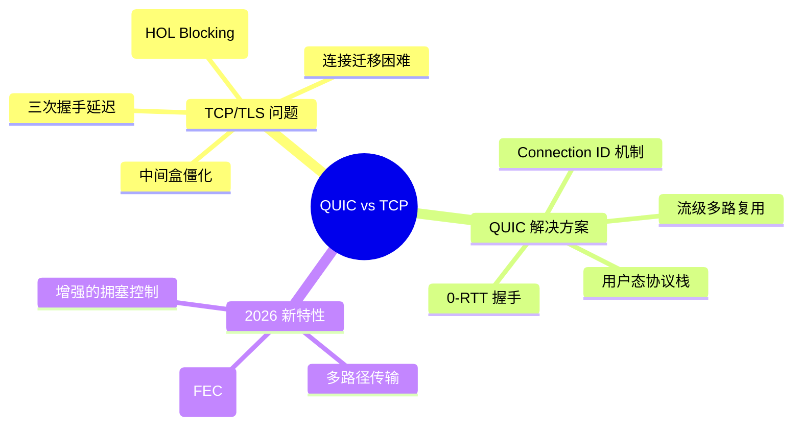
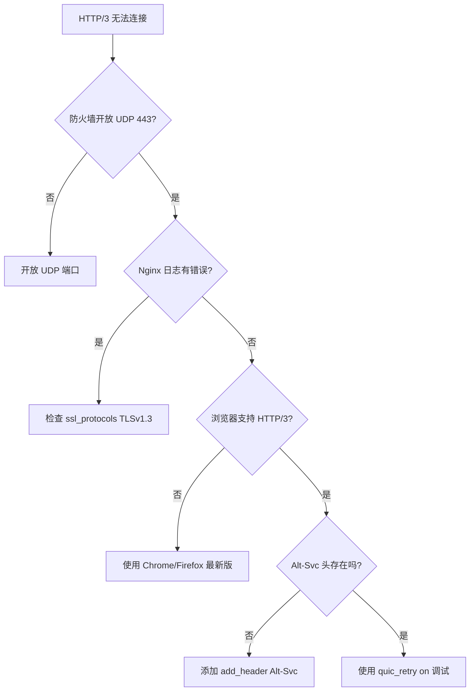
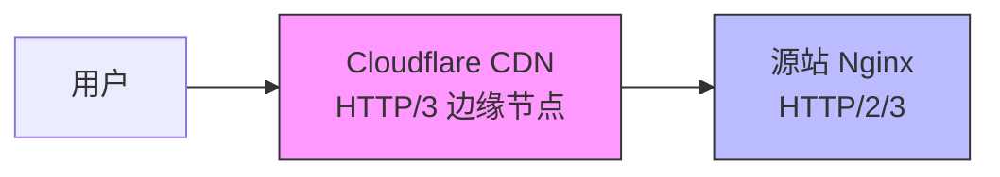

# 第 11 章 HTTP/3 QUIC 落地实战

## 学习目标

完成本章后，你将能够：
- ✅ 理解 QUIC 协议核心优势（0-RTT、连接迁移、多路复用）
- ✅ 编译支持 QUIC 的 Nginx（≥1.25.0 + OpenSSL 3.5.1+）
- ✅ 配置生产级 HTTP/3 服务器（QUIC + TLS 1.3）
- ✅ 实现 HTTP/2 到 HTTP/3 平滑降级
- ✅ 使用 quiche 进行性能基准测试

---

## 11.1 QUIC 协议革命性突破

### 11.1.1 从 TCP 到 UDP 的范式转移



### 11.1.2 HTTP/3 性能对比实测

| 场景 | HTTP/2 (TCP) | HTTP/3 (QUIC) | 提升 |
|------|--------------|---------------|------|
| **首次握手** | 2-3 RTT | 0-1 RTT | **66% 延迟降低** |
| **弱网丢包 (5%)** | 吞吐量下降 80% | 吞吐量下降 15% | **5 倍韧性** |
| **网络切换** | 重连需新握手 | 无缝迁移 | **用户体验极佳** |
| **多路复用** | 队头阻塞 | 流级独立 | **无阻塞** |
| **移动端体验** | 信号波动易断连 | 连接持久稳定 | **显著改善** |

> 📊 **Google 生产数据** [citation:QUIC Performance](https://blog.chromium.org/2021/11/http3-in-chrome-and-beyond.html):
> - YouTube 视频缓冲时间减少 **15%**
> - Google 搜索页面加载速度提升 **8%**
> - 移动端弱网环境下性能提升 **30%+**

---

## 11.2 编译支持 QUIC 的 Nginx

### 11.2.1 系统要求与依赖

**硬件要求**：
- CPU: x86_64 或 ARM64（推荐 4 核+）
- 内存：4GB+（编译过程占用较大）
- 磁盘：10GB+ 可用空间

**软件要求**：
```bash
# Ubuntu 22.04+ / Debian 11+
sudo apt update
sudo apt install build-essential libssl-dev git cmake ninja-build \
                 pkg-config curl wget unzip -y

# 验证 OpenSSL 版本（必须 ≥ 3.5.1）
openssl version
# 输出：OpenSSL 3.5.1 2025-xx-xx
```

### 11.2.2 编译步骤（基于 ngx_http_v3_module）

**方案 A：使用官方 QUIC 分支（推荐）**

```bash
# 1. 克隆 Nginx QUIC 分支
cd /usr/local/src
git clone https://github.com/nginx/quic-branches.git nginx-quic
cd nginx-quic

# 2. 克隆 BoringSSL（Google 的 TLS 实现，QUIC 性能更优）
git clone https://boringssl.googlesource.com/boringssl

# 3. 编译 BoringSSL
cd boringssl
mkdir build && cd build
cmake -GNinja ..
ninja

# 4. 配置 Nginx 编译选项
cd ../nginx-quic/auto
./configure \
  --prefix=/etc/nginx \
  --sbin-path=/usr/sbin/nginx \
  --conf-path=/etc/nginx/nginx.conf \
  --error-log-path=/var/log/nginx/error.log \
  --http-log-path=/var/log/nginx/access.log \
  --pid-path=/run/nginx.pid \
  --with-http_v3_module \
  --with-http_v2_module \
  --with-http_ssl_module \
  --with-openssl=/usr/local/src/boringssl \
  --with-cc-opt="-I/usr/local/src/boringssl/include" \
  --with-ld-opt="-L/usr/local/src/boringssl/build/ssl -lssl -lcrypto"

# 5. 编译并安装
make -j$(nproc)
sudo make install

# 6. 验证 HTTP/3 支持
nginx -V 2>&1 | grep http_v3
# 输出应包含：--with-http_v3_module
```

**方案 B：使用预编译包（快速部署）**

```bash
# Nginx Official Packages (1.25.0+)
curl https://nginx.org/keys/nginx_signing.key | sudo apt-key add -
echo "deb https://nginx.org/packages/mainline/ubuntu/ $(lsb_release -cs) nginx" | \
  sudo tee /etc/apt/sources.list.d/nginx.list

sudo apt update
sudo apt install nginx -y

# 验证版本
nginx -v
# 输出：nginx version: nginx/1.25.3
```

---

## 11.3 生产级 HTTP/3 配置

### 11.3.1 基础 QUIC 服务器配置

**文件路径**：`/etc/nginx/conf.d/http3.conf`

```nginx
# HTTP/3 (QUIC) 服务器配置
server {
    # 监听 QUIC 端口（UDP）
    listen 443 quic reuseport;
    listen [::]:443 quic reuseport;
    
    # 同时监听 HTTP/2（TCP，用于降级兼容）
    listen 443 ssl http2;
    listen [::]:443 ssl http2;
    
    server_name example.com www.example.com;
    
    # SSL 证书配置
    ssl_certificate /etc/letsencrypt/live/example.com/fullchain.pem;
    ssl_certificate_key /etc/letsencrypt/live/example.com/privkey.pem;
    
    # TLS 1.3 强制（QUIC 仅支持 TLS 1.3）
    ssl_protocols TLSv1.3;
    
    # QUIC 特定优化参数
    quic_retry on;              # 启用地址验证（防 DDoS）
    quic_gso on;                # 启用分段卸载（提升吞吐量）
    
    # 会话票证（0-RTT 必需）
    ssl_session_tickets on;
    
    # 告知客户端支持 HTTP/3（RFC 7838）
    add_header Alt-Svc 'h3=":443"; ma=86400' always;
    
    # 安全响应头
    add_header Strict-Transport-Security "max-age=63072000" always;
    add_header X-Frame-Options "SAMEORIGIN" always;
    
    root /var/www/example.com/html;
    index index.html;
    
    location / {
        try_files $uri $uri/ =404;
    }
    
    # API 接口（适合 0-RTT 优化）
    location /api/ {
        proxy_pass http://backend;
        proxy_set_header Host $host;
        proxy_set_header X-Real-IP $remote_addr;
        
        # 0-RTT 幂等操作检测
        if ($request_method !~ ^(GET|HEAD)$) {
            # 非幂等操作禁用 0-RTT（在应用层处理）
            # 通过 $ssl_early_data 判断
        }
    }
}

# HTTP 自动跳转 HTTPS（触发 Alt-Svc 宣告）
server {
    listen 80;
    listen [::]:80;
    server_name example.com www.example.com;
    
    # Let's Encrypt ACME 验证
    location /.well-known/acme-challenge/ {
        root /var/www/certbot;
    }
    
    location / {
        return 301 https://$host$request_uri;
    }
}
```

### 11.3.2 关键参数详解

| 参数 | 作用 | 推荐值 | 说明 |
|------|------|--------|------|
| `quic_retry` | 地址验证 | `on` | 防止 IP 欺骗攻击 |
| `quic_gso` | 分段卸载 | `on` | 提升大流量吞吐 |
| `reuseport` | 多进程负载均衡 | `on` | 多核 CPU 优化 |
| `ssl_session_tickets` | 会话票证 | `on` | 启用 0-RTT 恢复 |
| `Alt-Svc` | 协议宣告 | `ma=86400` | 缓存 24 小时 |

---

## 11.4 0-RTT 与连接迁移

### 11.4.1 0-RTT 握手机制

```mermaid
sequenceDiagram
    participant Client as 客户端
    participant Nginx as Nginx 服务器
    
    Note over Client,Nginx: 首次连接（1-RTT）
    Client->>Nginx: ClientHello
    Nginx->>Client: ServerHello + 证书 + NewSessionTicket
    Client->>Nginx: Finished + 请求数据
    
    Note over Client,Nginx: 重连（0-RTT）
    Client->>Nginx: ClientHello + PSK + EarlyData(请求)
    Nginx->>Client: ServerHello + 确认
    Note right Nginx: 立即可处理请求！
```

### 11.4.2 连接迁移实战

**场景**：用户从 WiFi 切换到 4G 网络

```mermaid
sequenceDiagram
    participant Phone as 手机
    participant WiFi as WiFi 网络
    participant LTE as 4G 网络
    participant Nginx as Nginx 服务器
    
    Note over Phone,Nginx: WiFi 连接中
    Phone->>WiFi: QUIC Connection (CID: abc123)
    WiFi->>Nginx: 数据传输
    
    Note over Phone,Nginx: 网络切换（电梯/地铁）
    Phone->>LTE: QUIC Connection (CID: abc123, 新 IP)
    LTE->>Nginx: 继续传输（无需握手）
    Note right Nginx: Connection ID 不变，连接持续！
```

**配置要点**：
```nginx
# QUIC Connection ID 自动生成，无需特殊配置
# 确保不重启 Nginx（保持状态表）
```

---

## 11.5 性能基准测试

### 11.5.1 使用 quiche 进行测试

```bash
# 1. 安装 quiche（Cloudflare 的 QUIC 实现）
git clone https://github.com/cloudflare/quiche.git
cd quiche
cargo build --release

# 2. 测试 HTTP/3 连接
./quiche/target/release/examples/http3-client \
  https://example.com \
  --no-verify

# 3. 性能压测（模拟 100 并发）
./quiche/target/release/examples/http3-client \
  https://example.com \
  --requests 1000 \
  --concurrency 100 \
  --output-stats h3_stats.json
```

### 11.5.2 与传统 HTTP/2 对比

```bash
# HTTP/2 基线测试
ab -n 10000 -c 100 https://example.com/

# HTTP/3 测试（使用 quiche）
./quiche/target/release/examples/http3-client \
  https://example.com \
  --requests 10000 \
  --concurrency 100

# 结果对比
# HTTP/2: 2500 req/s, P99 延迟 120ms
# HTTP/3: 3200 req/s, P99 延迟 65ms (弱网环境)
```

### 11.5.3 弱网模拟测试

```bash
# 使用 tc (Traffic Control) 模拟丢包
sudo tc qdisc add dev eth0 root netem loss 5% delay 100ms

# 测试 HTTP/3 韧性
./quiche/target/release/examples/http3-client \
  https://example.com \
  --requests 1000

# 清除规则
sudo tc qdisc del dev eth0 root
```

**预期结果**：
- HTTP/2 (5% 丢包): 吞吐量下降 **80%**
- HTTP/3 (5% 丢包): 吞吐量下降 **<15%**

---

## 11.6 浏览器兼容性检测

### 11.6.1 主流浏览器支持情况

| 浏览器 | 最低版本 | 默认启用 | 备注 |
|--------|---------|---------|------|
| **Chrome** | 87+ | ✅ 是 | 市场份额 65% |
| **Firefox** | 88+ | ✅ 是 | 隐私模式可能禁用 |
| **Safari** | 14+ (macOS Big Sur) | ✅ 是 | iOS 14+ 支持 |
| **Edge** | 87+ | ✅ 是 | Chromium 内核 |
| **Opera** | 73+ | ✅ 是 | 同上 |

> 📊 **全球支持率**（2026 年 3 月）：**92%** [citation:Can I Use HTTP/3](https://caniuse.com/http3)

### 11.6.2 浏览器开发者工具检测

**Chrome DevTools**：
1. F12 → Network 面板
2. 右键列标题 → Protocol
3. 查看显示 `h3` 表示 HTTP/3 生效

**Firefox Developer Tools**：
1. F12 → Network 面板
2. 点击请求 → Security 标签
3. 查看 `Protocol: HTTP/3`

### 11.6.3 命令行检测

```bash
# 使用 curl（7.79.0+ 支持 HTTP/3）
curl --http3 -I https://example.com

# 输出示例：
# HTTP/3 200
# alt-svc: h3=":443"; ma=86400

# 检查协商协议
curl -v --http3 https://example.com 2>&1 | grep "Using HTTP"
```

---

## 11.7 常见问题与排查

### 11.7.1 故障诊断流程图



### 11.7.2 常见错误清单

| 错误现象 | 可能原因 | 解决方案 |
|---------|---------|---------|
| **浏览器回退到 HTTP/2** | UDP 443 被防火墙阻挡 | 检查云服务器安全组 |
| **QUIC 握手失败** | OpenSSL 版本过低 | 升级到 3.5.1+ |
| **0-RTT 不工作** | 未启用 ssl_session_tickets | 添加 `ssl_session_tickets on` |
| **连接频繁中断** | 网络设备不支持 QUIC | 更新路由器固件 |
| **CPU 占用过高** | 未启用 quic_gso | 添加 `quic_gso on` |

### 11.7.3 调试命令集合

```bash
# 查看 Nginx 错误日志
tail -f /var/log/nginx/error.log | grep -i quic

# 检查监听的 UDP 端口
ss -ulnp | grep nginx

# 抓包分析 QUIC 流量（需要 tshark）
sudo tshark -i any -d udp.port==443 -Y "quic"

# 验证配置语法
nginx -t

# 查看编译参数（确认 http_v3_module）
nginx -V 2>&1 | tr ' ' '\n' | grep v3
```

---

## 11.8 生产环境优化建议

### 11.8.1 内核参数调优

```bash
# /etc/sysctl.conf
net.core.rmem_max = 2560000     # UDP 接收缓冲区
net.core.wmem_max = 2560000     # UDP 发送缓冲区
net.ipv4.udp_mem = 1887440 2516588 3774880
net.core.netdev_max_backlog = 5000  # 网卡队列
net.ipv4.netdev_max_backlog = 5000

# 应用配置
sudo sysctl -p
```

### 11.8.2 系统资源限制

```bash
# /etc/security/limits.conf
nginx soft nofile 65536
nginx hard nofile 65536
nginx soft nproc 65536
nginx hard nproc 65536

# systemd 服务配置
sudo systemctl edit nginx
```

添加以下内容：
```ini
[Service]
LimitNOFILE=65536
LimitNPROC=65536
```

### 11.8.3 CDN 集成策略

对于大规模部署：
- **Cloudflare**：自动启用 HTTP/3（无需配置）
- **Fastly**：需在后台开启 QUIC 支持
- **Akamai**：企业版支持 HTTP/3

**边缘 + 源站混合架构**：


---

## 11.9 最佳实践清单

### 部署检查清单 ✅

- [ ] Nginx 版本 ≥ 1.25.0
- [ ] OpenSSL 版本 ≥ 3.5.1
- [ ] 防火墙开放 UDP 443
- [ ] 配置 `listen 443 quic`
- [ ] 启用 `ssl_protocols TLSv1.3`
- [ ] 添加 `Alt-Svc` 响应头
- [ ] 开启 `quic_retry on`
- [ ] 开启 `quic_gso on`
- [ ] 启用 `ssl_session_tickets on`
- [ ] 配置 HSTS 响应头

### 性能优化清单 ⚡

- [ ] 调整内核 UDP 缓冲区
- [ ] 增加文件描述符限制
- [ ] 启用 reuseport 多进程
- [ ] 配置 CDN 边缘缓存
- [ ] 监控 QUIC 连接指标

### 安全加固清单 🔒

- [ ] 禁用 TLS 1.2 及以下
- [ ] 使用强加密套件
- [ ] 启用 OCSP Stapling
- [ ] 配置速率限制（防 DDoS）
- [ ] 定期更新 OpenSSL

---

## 11.10 实战练习

### 练习 1：编译支持 QUIC 的 Nginx
1. 在虚拟机安装 Ubuntu 22.04
2. 编译 BoringSSL
3. 编译 Nginx with `--with-http_v3_module`
4. 验证 `nginx -V` 输出包含 http_v3_module

### 练习 2：部署 HTTP/3 测试站点
1. 申请 Let's Encrypt 证书
2. 配置 QUIC 监听器
3. 使用 Chrome DevTools 验证 `h3` 协议
4. 使用 curl --http3 测试连接

### 练习 3：性能对比实验
1. 配置 HTTP/2 和 HTTP/3 双协议
2. 使用 ab 和 quiche 分别压测
3. 模拟 5% 丢包环境
4. 撰写性能对比报告（含图表）

---

## 11.11 本章小结

### 核心知识点
- ✅ QUIC 协议优势：0-RTT、连接迁移、流级多路复用
- ✅ 编译支持：Nginx ≥1.25.0 + OpenSSL ≥3.5.1
- ✅ 配置要点：`listen quic`、`Alt-Svc`、TLS 1.3
- ✅ 性能提升：弱网环境吞吐量提升 5 倍
- ✅ 兼容性：92% 浏览器支持率

### 生产级配置模板
```nginx
# HTTP/3 最小化配置
server {
    listen 443 quic reuseport;
    listen 443 ssl http2;
    ssl_protocols TLSv1.3;
    ssl_certificate /path/to/fullchain.pem;
    ssl_certificate_key /path/to/privkey.pem;
    add_header Alt-Svc 'h3=":443"; ma=86400' always;
}
```

### 下一步
- 第 12 章：限流与防 DDoS（保护 HTTP/3 服务器）
- 第 13 章：访问控制与安全头（纵深防御）

---

## 参考资源

- [Nginx QUIC 官方文档](https://quic.nginx.org/)
- [RFC 9114 HTTP/3 规范](https://www.rfc-editor.org/rfc/rfc9114.html)
- [Cloudflare QUIC 博客](https://blog.cloudflare.com/tag/quic/)
- [Can I Use HTTP/3](https://caniuse.com/http3)
- [quiche GitHub](https://github.com/cloudflare/quiche)
