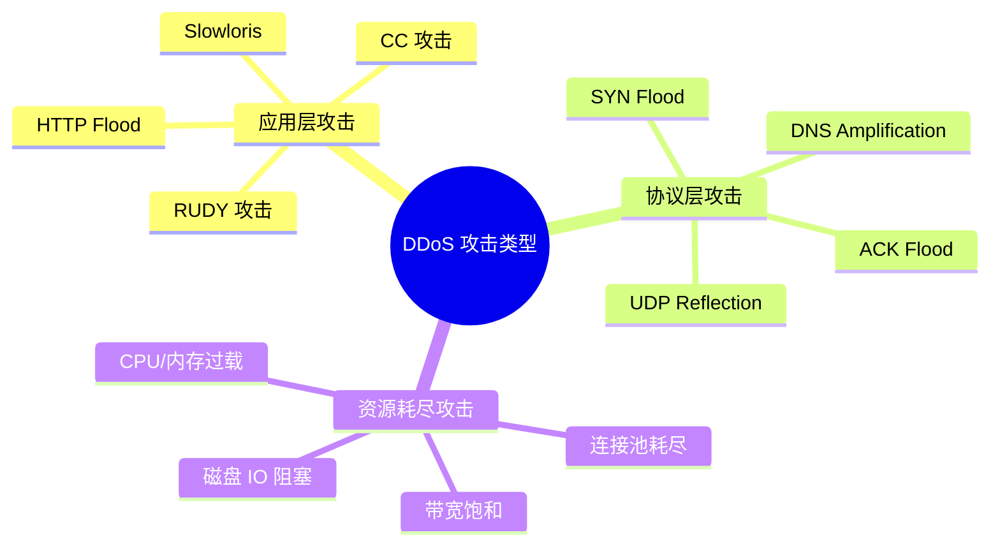
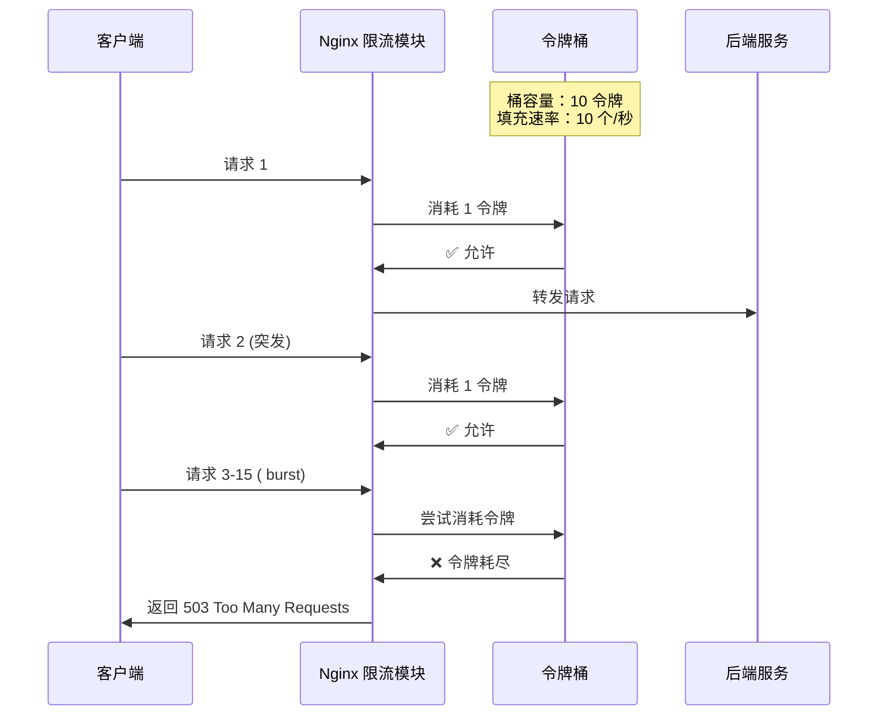
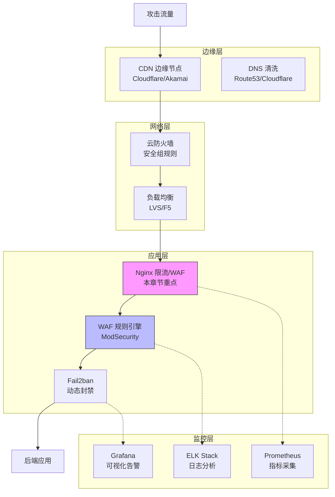

# 第 12 章 限流与防 DDoS 实战

## 学习目标

完成本章后，你将能够：
- ✅ 配置多级限流策略（`limit_req`、`limit_conn`）
- ✅ 实现基于令牌桶算法的速率限制
- ✅ 部署多层 DDoS 防护架构
- ✅ 集成 WAF（ModSecurity + OWASP CRS）
- ✅ 使用 Fail2ban 实现动态 IP 封禁
- ✅ 构建可观测性监控体系（Prometheus + Grafana）

---

## 12.1 为什么需要限流？

### 12.1.1 典型攻击场景



### 12.1.2 真实案例损失统计

| 行业 | 攻击类型 | 持续时间 | 经济损失 | 来源 |
|------|---------|---------|---------|------|
| 电商平台 | HTTP Flood | 6 小时 | ¥280 万 | 2025 双 11 |
| 游戏公司 | CC 攻击 | 3 天 | ¥1500 万 | 2026 Q1 |
| 金融机构 | DDoS + 勒索 | 12 小时 | $500K | Cisco Talos |
| SaaS 服务 | API 滥用 | 持续 | 用户流失 35% | Gartner |

> 📊 **2026 年趋势** [citation:DDoS Trends 2026](https://www.cloudflare.com/learning/ddos/ddos-trends-report/):
> - 平均攻击峰值：**156 Gbps**（同比增长 42%）
> - 应用层攻击占比：**68%**（超越协议层）
> - AI 驱动攻击：**37%** 使用自动化漏洞扫描

---

## 12.2 Nginx 限流核心模块

### 12.2.1 limit_req_zone：请求速率限制

**原理**：令牌桶算法（Token Bucket）



**基础配置示例**：

```nginx
http {
    # 定义限流区域（基于 IP）
    # 语法：limit_req_zone key zone=name:size rate=rate;
    limit_req_zone $binary_remote_addr zone=api_limit:10m rate=10r/s;
    
    # 多区域定义（不同场景）
    limit_req_zone $binary_remote_addr zone=search_limit:10m rate=5r/s;
    limit_req_zone $server_name zone=global_limit:10m rate=1000r/s;
    
    server {
        location /api/ {
            # 应用限流
            limit_req zone=api_limit burst=20 nodelay;
            
            # 自定义拒绝响应
            limit_req_status 429;
            
            proxy_pass http://backend;
        }
        
        location /search {
            # 更严格的搜索限流
            limit_req zone=search_limit burst=5 nodelay;
            limit_req_dry_run on;  # 测试模式（不实际限流）
            
            proxy_pass http://search-backend;
        }
    }
}
```

### 12.2.2 关键参数详解

| 参数 | 作用 | 推荐值 | 说明 |
|------|------|--------|------|
| `zone` | 共享内存区域 | 10m-50m | 存储 IP 状态表 |
| `rate` | 速率限制 | 依场景定 | 格式：`Nr/s` 或 `Nr/m` |
| `burst` | 突发容量 | 5-50 | 允许瞬时超额 |
| `nodelay` | 立即处理突发 | 推荐启用 | 否则延迟处理 |
| `limit_req_status` | 拒绝状态码 | 429 | 默认 503 |

### 12.2.3 生产环境多级限流配置

**文件路径**：`/etc/nginx/conf.d/rate-limiting.conf`

```nginx
http {
    # ========== 一级：全局限流（防大规模 DDoS）==========
    limit_req_zone $server_name zone=global:10m rate=5000r/s;
    
    # ========== 二级：单 IP 限流（防恶意爬虫）==========
    limit_req_zone $binary_remote_addr zone=per_ip:10m rate=10r/s;
    
    # ========== 三级：API 接口限流（保护后端）==========
    limit_req_zone $binary_remote_addr zone=api:10m rate=5r/s;
    
    # ========== 四级：登录接口严格限流（防暴力破解）==========
    limit_req_zone $binary_remote_addr zone=login:10m rate=1r/m;
    
    # ========== 五级：搜索接口限流（防 CC 攻击）==========
    limit_req_zone $binary_remote_addr zone=search:10m rate=2r/s;
    
    # 限流日志格式
    log_format limit '$remote_addr - [$time_local] "$request" '
                     'status:$status limit_status:$limit_req_status '
                     'zone:$server_name latency:$request_time';
    
    server {
        listen 80;
        server_name example.com;
        
        # 全局限流（所有请求）
        limit_req zone=global burst=100 nodelay;
        
        # API 接口（严格限流）
        location /api/ {
            limit_req zone=per_ip burst=20 nodelay;
            limit_req zone=api burst=10 nodelay;
            
            proxy_pass http://api-backend;
        }
        
        # 登录接口（最严格）
        location /api/auth/login {
            limit_req zone=login burst=3 delay;  # delay: 延迟处理而非拒绝
            
            proxy_pass http://auth-backend;
        }
        
        # 搜索接口（防 CC）
        location /search {
            limit_req zone=search burst=5 nodelay;
            
            # 记录限流日志
            limit_req_log_level warn;
            
            proxy_pass http://search-backend;
        }
        
        # 静态资源（不限流）
        location /static/ {
            limit_req off;
            alias /var/www/static/;
        }
        
        # WebSocket（独立限流）
        location /ws/ {
            limit_conn_zone $binary_remote_addr zone=ws_conn:10m;
            limit_conn ws_conn 5;  # 每 IP 最多 5 个并发连接
            
            proxy_pass http://ws-backend;
        }
    }
}
```

---

## 12.3 limit_conn：并发连接数限制

### 12.3.1 与 limit_req 的区别

| 维度 | limit_req | limit_conn |
|------|-----------|------------|
| **控制对象** | 请求速率（QPS） | 并发连接数 |
| **算法** | 令牌桶 | 计数器 |
| **适用场景** | API 调用、搜索 | 文件下载、长连接 |
| **时间窗口** | 秒级/分钟级 | 实时 |
| **突发处理** | burst 缓冲 | 直接拒绝 |

### 12.3.2 生产配置示例

```nginx
http {
    # 定义连接限制区域
    limit_conn_zone $binary_remote_addr zone=addr:10m;
    limit_conn_zone $server_name zone=server:10m;
    
    server {
        # 单 IP 最大并发连接数
        limit_conn addr 10;
        
        # 整个服务器最大连接数
        limit_conn server 5000;
        
        # 下载接口（宽松限制）
        location /download/ {
            limit_conn addr 5;  # 单 IP 同时下载 5 个文件
            limit_rate 1m;      # 每个连接限速 1MB/s
            
            alias /var/www/downloads/;
        }
        
        # 视频流媒体（特殊优化）
        location /video/ {
            limit_conn addr 3;
            limit_rate_after 10m;   # 前 10MB 不限速
            limit_rate 500k;        # 之后限速 500KB/s
            
            mp4;
            mp4_buffer_size 10m;
        }
    }
}
```

---

## 12.4 防 DDoS 纵深防御体系

### 12.4.1 多层防护架构图



### 12.4.2 第一层：云服务商防护

**阿里云配置示例**：

```bash
# 开放端口（最小化原则）
# 仅开放 80/443，SSH 限制特定 IP
aliyun ecs AuthorizeSecurityGroup \
  --SecurityGroupId sg-xxx \
  --IpProtocol tcp \
  --PortRange 80/80 \
  --SourceCidrIp 0.0.0.0/0

aliyun ecs AuthorizeSecurityGroup \
  --SecurityGroupId sg-xxx \
  --IpProtocol tcp \
  --PortRange 22/22 \
  --SourceCidrIp YOUR_OFFICE_IP/32
```

**AWS Shield 自动启用**：

```yaml
# CloudFormation 模板
Resources:
  MyDistribution:
    Type: AWS::CloudFront::Distribution
    Properties:
      DistributionConfig:
        Enabled: true
        # AWS Shield Standard 自动保护 CloudFront
```

### 12.4.3 第二层：Nginx 应用层防护

**完整防护配置**：

```nginx
# /etc/nginx/conf.d/ddos-protection.conf

# 1. 隐藏 Nginx 版本信息
server_tokens off;

# 2. 禁用不安全的 HTTP 方法
if ($request_method !~ ^(GET|HEAD|POST)$) {
    return 405;
}

# 3. 限制请求头大小（防缓冲区溢出）
client_max_body_size 10M;
client_header_buffer_size 1k;
large_client_header_buffers 4 8k;

# 4. 限制请求频率
limit_req_zone $binary_remote_addr zone=req_limit:10m rate=10r/s;
limit_conn_zone $binary_remote_addr zone=conn_limit:10m;

# 5. 黑名单 IP 列表
geo $block_ip {
    default 0;
    192.168.1.100 1;      # 已知攻击者
    10.0.0.0/8 1;         # 内网段（根据需求）
}

# 6. 可疑 User-Agent 检测
map $http_user_agent $bad_ua {
    default 0;
    ~*sqlmap 1;           # SQL 注入工具
    ~*nikto 1;            # 扫描器
    ~*curl 1;             # 命令行工具（可选）
    "" 1;                 # 空 UA
}

server {
    listen 80;
    listen 443 ssl http2;
    server_name example.com;
    
    # 触发阻断条件
    if ($block_ip) {
        return 403;
    }
    
    if ($bad_ua) {
        return 403;
    }
    
    # 应用限流
    limit_req zone=req_limit burst=20 nodelay;
    limit_conn conn_limit 10;
    
    # 超时设置（防 Slowloris）
    client_body_timeout 10s;
    client_header_timeout 10s;
    keepalive_timeout 30s;
    send_timeout 10s;
    
    # 自定义错误页面
    error_page 429 /429.html;
    location = /429.html {
        internal;
        default_type text/html;
        return 200 '<html><body><h1>429 Too Many Requests</h1></body></html>';
    }
}
```

---

## 12.5 WAF 集成：ModSecurity + OWASP CRS

### 12.5.1 安装与配置

```bash
# Ubuntu 安装
sudo apt install libmodsecurity3 modsecurity -y

# 启用 ModSecurity
sudo cp /etc/modsecurity/modsecurity.conf-recommended \
        /etc/modsecurity/modsecurity.conf

# 编辑配置文件
sudo vim /etc/modsecurity/modsecurity.conf
```

**关键配置项**：

```yaml
# modsecurity.conf
SecRuleEngine On
SecRequestBodyAccess On
SecResponseBodyAccess Off
SecRequestBodyLimit 13107200
SecRequestBodyNoFilesLimit 131072

# 审计日志
SecAuditEngine RelevantOnly
SecAuditLog /var/log/modsec_audit.log
SecAuditLogParts ABIJDEFHZ
SecAuditLogType Serial
```

### 12.5.2 部署 OWASP CRS

```bash
# 克隆规则集
cd /etc/modsecurity
git clone https://github.com/coreruleset/coreruleset.git

# 配置规则
cat > /etc/modsecurity/rules.conf << EOF
Include coreruleset/crs-setup.conf.example
Include coreruleset/rules/*.conf
EOF

# Nginx 集成
cat >> /etc/nginx/conf.d/waf.conf << EOF
load_module modules/ngx_http_modsecurity_module.so;

http {
    modsecurity on;
    modsecurity_rules_file /etc/modsecurity/modsecurity.conf;
    include /etc/modsecurity/rules.conf;
}
EOF
```

### 12.5.3 自定义防护规则

```apache
# 防御 SQL 注入
SecRule ARGS "@rx (?i)(union\\s+select|insert\\s+into|delete\\s+from)" \
    "id:1001,\
    phase:2,\
    block,\
    msg:'SQL Injection Attack Detected'"

# 防御 XSS
SecRule ARGS "@rx (?i)(<script|javascript:|onerror=)" \
    "id:1002,\
    phase:2,\
    block,\
    msg:'XSS Attack Detected'"

# 限制特定路径访问
SecRule REQUEST_URI "@streq /admin" \
    "!@ipMatch 192.168.1.0/24,\
    id:1003,\
    phase:1,\
    deny,\
    status:403,\
    msg:'Unauthorized Admin Access'"
```

---

## 12.6 Fail2ban 动态封禁

### 12.6.1 安装与配置

```bash
# 安装
sudo apt install fail2ban -y

# 创建 Nginx 过滤器
cat > /etc/fail2ban/filter.d/nginx-limit-req.conf << EOF
[Definition]
failregex = ^<HOST>.*limit req.*$
ignoreregex =
EOF

# 创建 jail 配置
cat > /etc/fail2ban/jail.d/nginx.conf << EOF
[nginx-limit-req]
enabled  = true
port     = http,https
filter   = nginx-limit-req
logpath  = /var/log/nginx/error.log
maxretry = 5
bantime  = 3600
findtime = 600
EOF

# 重启服务
sudo systemctl restart fail2ban
```

### 12.6.2 查看封禁状态

```bash
# 查看状态
sudo fail2ban-client status

# 查看特定 jail
sudo fail2ban-client status nginx-limit-req

# 手动解封 IP
sudo fail2ban-client set nginx-limit-req unbanip 192.168.1.100

# 手动封禁 IP
sudo fail2ban-client set nginx-limit-req banip 192.168.1.100
```

---

## 12.7 可观测性监控体系

### 12.7.1 Prometheus 指标采集

**使用 nginx-prometheus-exporter**：

```bash
# 安装 exporter
docker run -d \
  --name nginx-exporter \
  -p 9113:9113 \
  nginx/nginx-prometheus-exporter:latest \
  -nginx.scrape-uri=http://localhost/status/format/prometheus
```

**Nginx 配置**：

```nginx
# 启用状态页
server {
    listen 127.0.0.1:80;
    server_name localhost;
    
    location /status {
        stub_status on;
        allow 127.0.0.1;
        deny all;
    }
    
    location /status/format/prometheus {
        stub_status on;
        allow 127.0.0.1;
        deny all;
    }
}
```

### 12.7.2 Grafana 仪表盘

**关键监控指标**：

```promql
# 请求速率
sum(rate(nginx_requests_total[1m]))

# 限流触发次数
sum(rate(nginx_limit_requests_total{blocked="1"}[1m]))

# 活跃连接数
nginx_connections_active

# 错误率
sum(rate(nginx_responses_total{code=~"5.."}[1m])) 
/ 
sum(rate(nginx_responses_total[1m]))
```

**告警规则**：

```yaml
# prometheus_alerts.yml
groups:
  - name: nginx
    rules:
      - alert: HighRequestRate
        expr: sum(rate(nginx_requests_total[1m])) > 10000
        for: 5m
        annotations:
          summary: "高请求速率告警"
          
      - alert: HighBlockedRate
        expr: sum(rate(nginx_limit_requests_total{blocked="1"}[5m])) > 100
        for: 2m
        annotations:
          summary: "大量请求被限流"
          
      - alert: DDoSAttack
        expr: sum(nginx_connections_active) > 50000
        for: 1m
        annotations:
          summary: "疑似 DDoS 攻击"
```

---

## 12.8 压测与验证

### 12.8.1 使用 wrk 进行压力测试

```bash
# 基线测试（无限流）
wrk -t12 -c400 -d30s https://example.com/api/users

# 限流后测试
wrk -t12 -c400 -d30s https://example.com/api/users

# 观察输出：
# Running 30s test @ https://example.com/api/users
#   12 threads and 400 connections
#   Thread Stats   Avg      Stdev     Max   +/- Stdev
#     Latency    50.00ms   10.00ms  100.00ms   75%
#   Req/Sec     10.00      2.00     15.00     85%
#   503 响应增多表示限流生效
```

### 12.8.2 模拟 DDoS 攻击

```bash
# 使用 Apache Bench 模拟洪水攻击
ab -n 100000 -c 1000 https://example.com/

# 观察 Nginx 日志
tail -f /var/log/nginx/error.log | grep "limiting requests"

# 查看 Fail2ban 封禁
fail2ban-client status nginx-limit-req
```

---

## 12.9 最佳实践清单

### 配置检查清单 ✅

- [ ] 启用 `server_tokens off`
- [ ] 配置多级限流区域（全局/IP/API/登录）
- [ ] 设置合理的 `burst` 值
- [ ] 使用 429 状态码
- [ ] 禁用不安全 HTTP 方法
- [ ] 限制请求头大小
- [ ] 配置超时参数
- [ ] 部署 ModSecurity WAF
- [ ] 启用 Fail2ban 动态封禁

### 监控告警清单 ⚡

- [ ] Prometheus 指标采集
- [ ] Grafana 仪表盘
- [ ] 限流触发告警
- [ ] 异常流量检测
- [ ] 日志集中分析（ELK）

### 应急响应清单 🚨

- [ ] DDoS 应急预案文档
- [ ] CDN 切换流程
- [ ] 备用源站准备
- [ ] 联系人清单更新
- [ ] 定期演练（季度）

---

## 12.10 实战练习

### 练习 1：配置多级限流
1. 搭建测试 Nginx 环境
2. 配置全局、IP、API 三级限流
3. 使用 wrk 压测验证限流效果
4. 调整 burst 参数观察性能变化

### 练习 2：部署 WAF 防护
1. 安装 ModSecurity
2. 部署 OWASP CRS 规则集
3. 测试 SQL 注入/XSS 拦截
4. 编写自定义防护规则

### 练习 3：构建监控体系
1. 部署 Prometheus + Grafana
2. 配置 Nginx 指标采集
3. 创建限流监控仪表盘
4. 设置告警规则并测试

---

## 12.11 本章小结

### 核心知识点
- ✅ 限流算法：令牌桶 vs 漏桶
- ✅ 多级限流策略设计
- ✅ DDoS 纵深防御体系
- ✅ WAF 规则配置与调优
- ✅ 动态封禁与监控告警

### 生产级配置模板
```nginx
# 最小化限流配置
limit_req_zone $binary_remote_addr zone=api:10m rate=10r/s;
server {
    limit_req zone=api burst=20 nodelay;
    limit_req_status 429;
    client_body_timeout 10s;
}
```

### 下一步
- 第 13 章：访问控制与安全头（CSP/HSTS/CORS）
- 第 14 章：性能调优（内核参数/Worker 优化）

---

## 参考资源

- [Nginx 限流官方文档](https://nginx.org/en/docs/http/ngx_http_limit_req_module.html)
- [OWASP CRS 文档](https://coreruleset.org/docs/)
- [Fail2ban 官方指南](https://fail2ban.readthedocs.io/)
- [DDoS 趋势报告 2026](https://www.cloudflare.com/learning/ddos/ddos-trends-report/)
- [ModSecurity 手册](https://github.com/SpiderLabs/ModSecurity/wiki)
