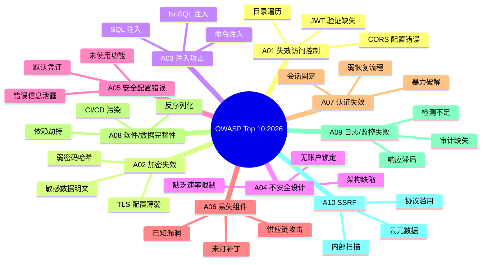
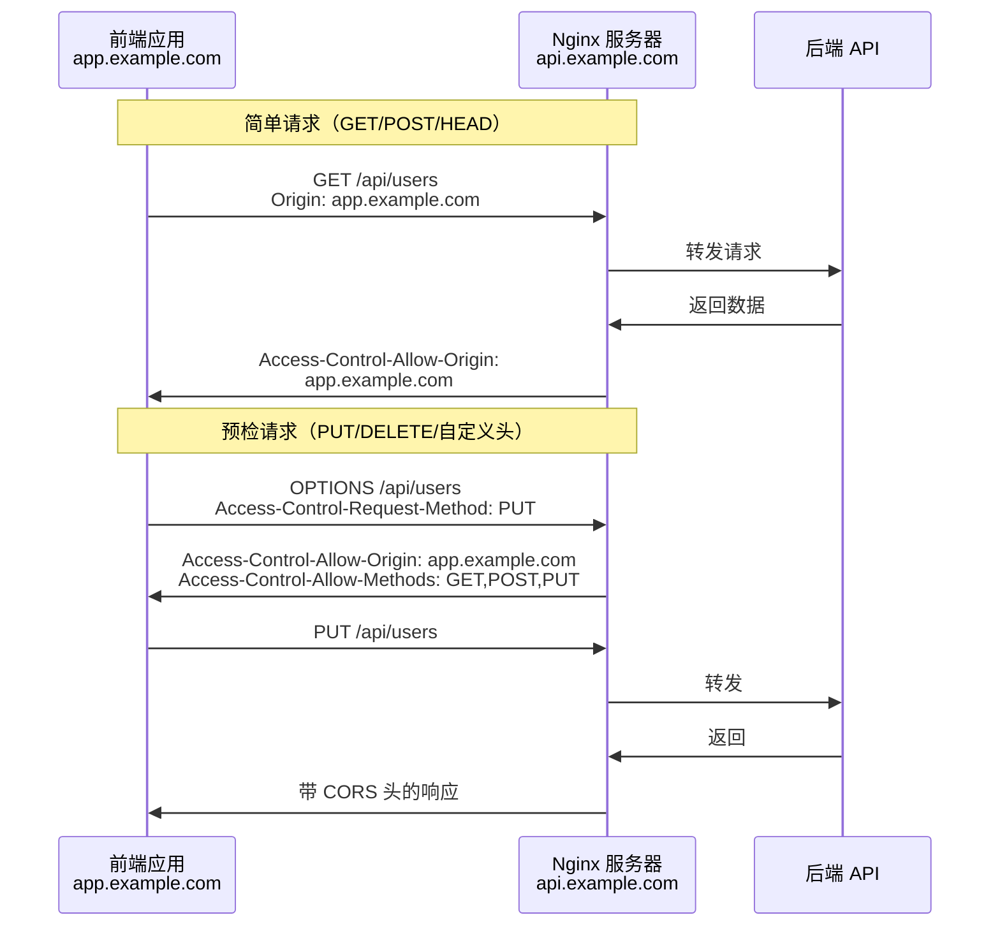
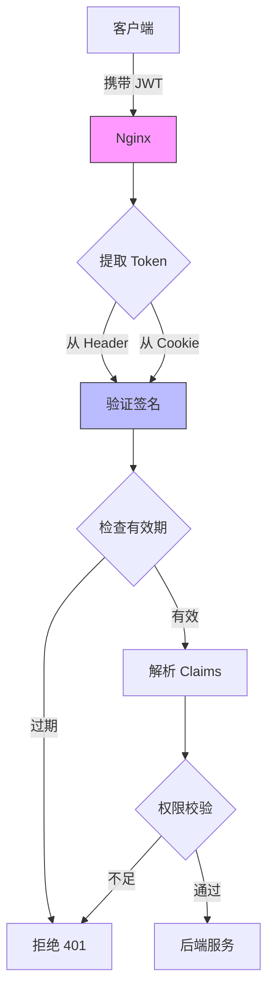

# 第 13 章 访问控制与安全响应头

## 学习目标

完成本章后，你将能够：
- ✅ 配置内容安全策略（CSP）防御 XSS 攻击
- ✅ 启用 HSTS 强制 HTTPS 传输
- ✅ 实现 CORS 跨域资源共享控制
- ✅ 部署 JWT 令牌验证机制
- ✅ 基于 GeoIP 的地理访问控制
- ✅ 构建纵深防御的安全响应头体系

---

## 13.1 Web 安全威胁全景图

### 13.1.1 OWASP Top 10 2026



> 📊 **2026 年统计数据** [citation:OWASP Top 10 2026](https://owasp.org/www-project-top-ten/):
> - **失效访问控制**：连续 3 年排名第 1
> - **平均漏洞修复时间**：127 天
> - **AI 辅助攻击增长率**：**215%**（同比增长）

### 13.1.2 Nginx 在安全体系中的定位

```mermaid
flowchart TB
    subgraph 防护层次
        L1[第一层：网络防火墙<br/>iptables/云安全组]
        L2[第二层：WAF<br/>ModSecurity/Cloudflare]
        L3[第三层：Nginx 访问控制<br/>本章节重点]
        L4[第四层：应用层验证<br/>业务逻辑校验]
    end
    
    subgraph Nginx 能力矩阵
        CSP[CSP 内容安全策略]
        HSTS[HTTPS 强制传输]
        CORS[跨域控制]
        Auth[身份认证]
        GeoIP[地理围栏]
    end
    
    User[用户请求] --> L1
    L1 --> L2
    L2 --> L3
    L3 --> Nginx 能力矩阵
    Nginx 能力矩阵 --> L4
    L4 --> App[后端应用]
    
    style L3 fill:#f9f,stroke:#333
    style Nginx 能力矩阵 fill:#bbf,stroke:#333
```

---

## 13.2 内容安全策略（CSP）深度配置

### 13.2.1 CSP 工作原理

```mermaid
sequenceDiagram
    participant Attacker as 攻击者
    participant Nginx as Nginx 服务器
    participant Browser as 浏览器
    participant CDN as 可信 CDN
    
    Note over Attacker,Browser: 无 CSP 保护
    Attacker->>Browser: 注入恶意脚本<br/>&lt;script src="evil.com/hack.js"&gt;
    Browser->>evil.com: 加载恶意脚本
    evil.com->>Browser: 执行窃取 Cookie
    
    Note over Attacker,Browser: 有 CSP 保护
    Nginx->>Browser: Content-Security-Policy:<br/>script-src 'self' cdn.example.com
    Attacker->>Browser: 注入恶意脚本
    Browser->>Browser: 检测违反 CSP
    Browser->>Nginx: 阻止加载 + 发送报告
    Note right Browser: ❌ 脚本被拦截！
```

### 13.2.2 CSP 指令详解

| 指令 | 作用 | 示例值 | 防护目标 |
|------|------|--------|---------|
| `default-src` | 默认策略 | `'self'` | 兜底规则 |
| `script-src` | JS 脚本源 | `'self' cdn.example.com` | 防 XSS |
| `style-src` | CSS 样式源 | `'self' 'unsafe-inline'` | 样式控制 |
| `img-src` | 图片源 | `'self' data: https:` | 图片加载 |
| `font-src` | 字体源 | `'self' fonts.gstatic.com` | 字体加载 |
| `connect-src` | AJAX/WebSocket | `'self' api.example.com` | API 调用 |
| `frame-ancestors` | 嵌入框架 | `'none'` | 防点击劫持 |
| `report-uri` | 违规报告 | `/csp-report` | 监控告警 |

### 13.2.3 渐进式 CSP 部署策略

**阶段一：仅监控模式（推荐起始）**

```nginx
server {
    # Report-Only 模式：不阻断，仅报告
    add_header Content-Security-Policy-Report-Only \
        "default-src 'self'; \
         script-src 'self' 'unsafe-inline' 'unsafe-eval'; \
         style-src 'self' 'unsafe-inline'; \
         img-src 'self' data: https:; \
         font-src 'self' fonts.gstatic.com; \
         connect-src 'self' api.example.com; \
         frame-ancestors 'none'; \
         report-uri /csp-report;" \
        always;
    
    location /csp-report {
        default_type application/json;
        access_log off;
        
        # 记录违规报告
        lua_need_request_body on;
        content_by_lua_block {
            local cjson = require "cjson"
            local body = ngx.req.get_body_data()
            
            -- 解析并记录报告
            local report = cjson.decode(body)
            ngx.log(ngx.WARN, "CSP Violation: ", body)
            
            -- 发送到监控系统
            -- http.post("http://monitoring/csp-alert", body)
            
            ngx.status = 204
            ngx.exit(204)
        }
    }
}
```

**阶段二：严格模式（生产环境）**

```nginx
server {
    # 强制执行 CSP
    add_header Content-Security-Policy \
        "default-src 'self'; \
         script-src 'self' cdn.example.com; \
         style-src 'self' 'unsafe-inline'; \
         img-src 'self' data: https:; \
         font-src 'self' fonts.gstatic.com; \
         connect-src 'self' api.example.com; \
         frame-ancestors 'none'; \
         base-uri 'self'; \
         form-action 'self'; \
         upgrade-insecure-requests;" \
        always;
    
    # 内联脚本哈希（针对无法外置的脚本）
    # <script nonce="随机值">...</script>
    location / {
        set $csp_nonce "$request_id";
        add_header X-CSP-Nonce $csp_nonce;
        
        # 在 HTML 中替换 nonce
        sub_filter '<script>' '<script nonce="$csp_nonce">';
        sub_filter_once off;
    }
}
```

### 13.2.4 CSP 报告分析仪表板

```promql
# Prometheus 查询：CSP 违规次数
sum(rate(csp_violations_total[5m])) by (blocked_uri)

# 告警规则
- alert: HighCSPViolations
  expr: sum(rate(csp_violations_total[1m])) > 100
  for: 5m
  annotations:
    summary: "CSP 违规异常增多，可能遭受 XSS 攻击"
```

---

## 13.3 HTTP Strict Transport Security (HSTS)

### 13.3.1 SSL 剥离攻击原理

```mermaid
sequenceDiagram
    participant User as 用户
    participant Attacker as 中间人攻击者
    participant Nginx as HTTPS 服务器
    
    Note over User,Nginx: 无 HSTS 保护
    User->>Attacker: 访问 http://example.com
    Attacker->>Nginx: HTTPS 请求
    Nginx->>Attacker: 301 跳转到 HTTPS
    Attacker->>User: 拦截并重写为 HTTP
    User->>Attacker: 继续 HTTP 通信
    Note right Attacker: ✅ 成功窃听！
    
    Note over User,Nginx: 启用 HSTS
    User->>Attacker: 首次访问 http://example.com
    Attacker->>Nginx: HTTPS 请求
    Nginx->>Attacker: 301 + HSTS 头
    Attacker->>User: 转发响应
    User->>User: 浏览器记录 HSTS
    User->>Nginx: 后续请求直接 HTTPS
    Note right Attacker: ❌ 无法降级！
```

### 13.3.2 HSTS 配置最佳实践

```nginx
server {
    listen 443 ssl http2;
    server_name example.com;
    
    # HSTS 配置
    # max-age: 有效期（秒），推荐 1 年 = 63072000
    # includeSubDomains: 包含所有子域名
    # preload: 加入浏览器预加载列表
    add_header Strict-Transport-Security \
        "max-age=63072000; includeSubDomains; preload" \
        always;
    
    # 其他安全头
    add_header X-Frame-Options "SAMEORIGIN" always;
    add_header X-Content-Type-Options "nosniff" always;
    add_header Referrer-Policy "strict-origin-when-cross-origin" always;
}

# HTTP 服务器自动跳转
server {
    listen 80;
    server_name example.com;
    
    # 永久跳转到 HTTPS
    return 301 https://$host$request_uri;
}
```

### 13.3.3 HSTS Preload 提交

**步骤 1：满足预加载要求**

```bash
# 检查是否满足条件
curl -I https://example.com | grep Strict-Transport-Security

# 必须包含：
# max-age≥31536000 (1 年)
# includeSubDomains
# preload
```

**步骤 2：提交到预加载列表**

访问：**https://hstspreload.org/**

输入域名并提交，审核通过后将：
- ✅ 内置于 Chrome/Firefox/Safari
- ✅ 首次访问即强制 HTTPS
- ⚠️ **不可逆操作**（撤回需数月）

---

## 13.4 CORS 跨域资源共享控制

### 13.4.1 CORS 工作流程



### 13.4.2 生产级 CORS 配置

**文件路径**：`/etc/nginx/conf.d/cors.conf`

```nginx
# 定义允许的源（白名单）
map $http_origin $cors_origin {
    default "";
    "https://app.example.com" $http_origin;
    "https://admin.example.com" $http_origin;
    "https://mobile.example.com" $http_origin;
}

# 定义允许的方法
map $request_method $cors_method {
    default "";
    "GET" "GET, POST, HEAD";
    "POST" "GET, POST, HEAD";
    "PUT" "GET, POST, PUT, HEAD";
    "DELETE" "GET, POST, PUT, DELETE, HEAD";
    "OPTIONS" "GET, POST, PUT, DELETE, HEAD, OPTIONS";
}

server {
    listen 443 ssl http2;
    server_name api.example.com;
    
    # 动态 CORS 头
    add_header Access-Control-Allow-Origin $cors_origin always;
    add_header Access-Control-Allow-Methods $cors_method always;
    add_header Access-Control-Allow-Headers \
        "Authorization, Content-Type, Accept, Origin, X-Requested-With" \
        always;
    add_header Access-Control-Allow-Credentials "true" always;
    add_header Access-Control-Max-Age "86400" always;  # 预检缓存 24 小时
    
    # 处理预检请求
    if ($request_method = "OPTIONS") {
        add_header Access-Control-Allow-Origin $cors_origin always;
        add_header Access-Control-Allow-Methods $cors_method always;
        add_header Access-Control-Allow-Headers \
            "Authorization, Content-Type, Accept, Origin, X-Requested-With" \
            always;
        add_header Access-Control-Max-Age "86400" always;
        add_header Content-Length 0;
        add_header Content-Type text/plain;
        return 204;
    }
    
    location /api/ {
        proxy_pass http://backend;
        proxy_set_header Host $host;
        proxy_set_header X-Real-IP $remote_addr;
        proxy_set_header X-Forwarded-For $proxy_add_x_forwarded_for;
    }
}
```

### 13.4.3 CORS 安全配置清单

| 配置项 | ✅ 安全做法 | ❌ 危险做法 |
|--------|-----------|-----------|
| `Allow-Origin` | 明确白名单 | `*`（公开） |
| `Allow-Credentials` | 配合白名单使用 | 与 `*` 同时使用 |
| `Allow-Methods` | 最小化（GET/POST） | 全部开放 |
| `Allow-Headers` | 仅必需头 | 接受任意头 |
| `Max-Age` | 合理缓存（24h） | 过长或过短 |

---

## 13.5 JWT 令牌验证

### 13.5.1 JWT 验证架构



### 13.5.2 Lua 实现 JWT 验证

```nginx
http {
    # 安装 lua-resty-jwt
    # luarocks install lua-resty-jwt
    
    lua_package_path "/usr/local/share/lua/5.1/?.lua;;";
    
    init_by_lua_block {
        jwt = require "resty.jwt"
        cjson = require "cjson"
        
        -- JWT 密钥（生产环境使用环境变量）
        JWT_SECRET = os.getenv("JWT_SECRET") or "your-secret-key"
    }
}

server {
    listen 443 ssl http2;
    server_name api.example.com;
    
    location /api/protected/ {
        access_by_lua_block {
            -- 从 Header 获取 Token
            local auth_header = ngx.var.http_authorization
            local token = nil
            
            if auth_header then
                token = string.match(auth_header, "Bearer%s+(.+)")
            end
            
            -- 尝试从 Cookie 获取
            if not token then
                token = ngx.var.cookie_jwt_token
            end
            
            -- 无 Token 拒绝
            if not token then
                ngx.status = 401
                ngx.header["WWW-Authenticate"] = 'Bearer realm="API"'
                ngx.say(cjson.encode({error = "Missing token"}))
                ngx.exit(401)
            end
            
            -- 验证 JWT
            local jwt_obj = jwt:verify(JWT_SECRET, token)
            
            if not jwt_obj["verified"] then
                ngx.status = 401
                ngx.say(cjson.encode({error = "Invalid token: " .. jwt_obj["reason"]}))
                ngx.exit(401)
            end
            
            -- 检查过期
            if jwt_obj["payload"]["exp"] < os.time() then
                ngx.status = 401
                ngx.say(cjson.encode({error = "Token expired"}))
                ngx.exit(401)
            end
            
            -- 将用户信息传递给后端
            ngx.var.user_id = jwt_obj["payload"]["sub"]
            ngx.var.user_role = jwt_obj["payload"]["role"]
        }
        
        # 传递用户信息到后端
        proxy_set_header X-User-ID $user_id;
        proxy_set_header X-User-Role $user_role;
        
        proxy_pass http://backend;
    }
    
    # 公开接口（无需验证）
    location /api/public/ {
        proxy_pass http://backend;
    }
}
```

### 13.5.3 刷新令牌机制

```nginx
location /api/auth/refresh {
    access_by_lua_block {
        -- 验证旧 Token
        local old_token = ngx.var.http_authorization
        -- ... 验证逻辑同上
        
        -- 生成新 Token
        local payload = {
            sub = user_id,
            role = user_role,
            exp = os.time() + 3600  -- 1 小时
        }
        
        local new_token = jwt:sign(JWT_SECRET, payload)
        
        ngx.header["X-New-Token"] = new_token
        ngx.header["Access-Control-Expose-Headers"] = "X-New-Token"
    }
    
    proxy_pass http://auth-backend;
}
```

---

## 13.6 GeoIP 地理访问控制

### 13.6.1 安装 GeoIP 模块

```bash
# Ubuntu 安装
sudo apt install libgeoip-dev nginx-module-geoip -y

# 下载 GeoLite2 数据库
wget https://download.maxmind.com/app/geoip_download?edition_id=GeoLite2-Country\
  -O /usr/share/geoip/GeoLite2-Country.mmdb
```

### 13.6.2 配置地理围栏

```nginx
http {
    # 加载 GeoIP 数据库
    geoip2 /usr/share/geoip/GeoLite2-Country.mmdb {
        $geoip_country_code country iso_code;
        $geoip_country_name country names en;
    }
    
    # 定义允许的国家
    map $geoip_country_code $allowed_country {
        default no;
        CN yes;      # 中国
        HK yes;      # 香港
        TW yes;      # 台湾
        US yes;      # 美国（业务需求）
        JP yes;      # 日本
    }
    
    server {
        listen 443 ssl http2;
        server_name example.com;
        
        # 地理位置访问控制
        if ($allowed_country = no) {
            return 403 "Access denied from your location";
        }
        
        # 特定国家限流
        if ($geoip_country_code = "CN") {
            set $rate_limit "50r/s";
        } else {
            set $rate_limit "10r/s";
        }
        
        limit_req_zone $binary_remote_addr zone=geo_limit:10m rate=$rate_limit;
        limit_req zone=geo_limit burst=20 nodelay;
    }
}
```

### 13.6.3 应用场景

| 场景 | 配置策略 | 业务价值 |
|------|---------|---------|
| 合规要求 | 仅允许境内访问 | GDPR/数据主权 |
| 业务优化 | 不同国家不同 CDN | 加速访问 |
| 风险防控 | 高风险国家限流 | 降低攻击面 |
| 价格歧视 | 按国家显示价格 | 市场策略 |

---

## 13.7 完整安全响应头体系

### 13.7.1 必配安全头清单

```nginx
server {
    # 1. HSTS - 强制 HTTPS
    add_header Strict-Transport-Security \
        "max-age=63072000; includeSubDomains; preload" always;
    
    # 2. CSP - 内容安全策略
    add_header Content-Security-Policy \
        "default-src 'self'; script-src 'self' cdn.example.com; \
         style-src 'self' 'unsafe-inline'; frame-ancestors 'none'" always;
    
    # 3. X-Frame-Options - 防点击劫持
    add_header X-Frame-Options "SAMEORIGIN" always;
    
    # 4. X-Content-Type-Options - 防 MIME 嗅探
    add_header X-Content-Type-Options "nosniff" always;
    
    # 5. Referrer-Policy - 控制引用来源
    add_header Referrer-Policy "strict-origin-when-cross-origin" always;
    
    # 6. Permissions-Policy - 浏览器功能限制
    add_header Permissions-Policy \
        "geolocation=(), microphone=(), camera=(), payment=()" always;
    
    # 7. X-XSS-Protection - 旧浏览器 XSS 过滤（已废弃但兼容）
    add_header X-XSS-Protection "1; mode=block" always;
    
    # 8. Cache-Control - 敏感数据不缓存
    location /api/private/ {
        add_header Cache-Control "no-store, no-cache, must-revalidate" always;
        add_header Pragma "no-cache" always;
    }
}
```

### 13.7.2 安全头检测工具

**在线检测**：
- **SecurityHeaders.com**：评分系统（A+~F）
- **Mozilla Observatory**：深度分析
- **SSL Labs**：综合 SSL/TLS 评估

**命令行检测**：

```bash
# 查看所有安全头
curl -I https://example.com | grep -E "(Strict|Content-Security|X-Frame|X-Content|Referrer)"

# 使用 securityheaders.com API
curl https://securityheaders.com/api/example.com
```

---

## 13.8 实战练习

### 练习 1：部署 CSP 防护
1. 搭建测试站点（含内联脚本）
2. 配置 Report-Only 模式监控
3. 分析违规报告并调整策略
4. 切换到强制执行模式

### 练习 2：实现 JWT 验证网关
1. 安装 Lua JWT 库
2. 编写 Token 验证逻辑
3. 实现刷新令牌机制
4. 测试过期/无效 Token 处理

### 练习 3：构建地理围栏
1. 安装 GeoIP 模块
2. 配置国家白名单
3. 测试不同 IP 的访问控制
4. 实现差异化限流策略

---

## 13.9 本章小结

### 核心知识点
- ✅ CSP 多层部署策略（监控→执行）
- ✅ HSTS 防 SSL 剥离攻击
- ✅ CORS 白名单配置
- ✅ JWT 令牌验证流程
- ✅ GeoIP 地理访问控制
- ✅ 完整安全响应头体系

### 生产级配置模板
```nginx
# 最小化安全头配置
add_header Strict-Transport-Security "max-age=63072000" always;
add_header X-Frame-Options "SAMEORIGIN" always;
add_header X-Content-Type-Options "nosniff" always;
add_header Content-Security-Policy "default-src 'self'" always;
```

### 下一步
- 第 14 章：性能调优（内核参数/Worker 进程）
- 第 15 章：Docker 容器化部署

---

## 参考资源

- [OWASP Top 10 2026](https://owasp.org/www-project-top-ten/)
- [CSP 官方文档](https://developer.mozilla.org/en-US/docs/Web/HTTP/CSP)
- [HSTS Preload](https://hstspreload.org/)
- [lua-resty-jwt](https://github.com/cdbattags/lua-resty-jwt)
- [SecurityHeaders.com](https://securityheaders.com/)
