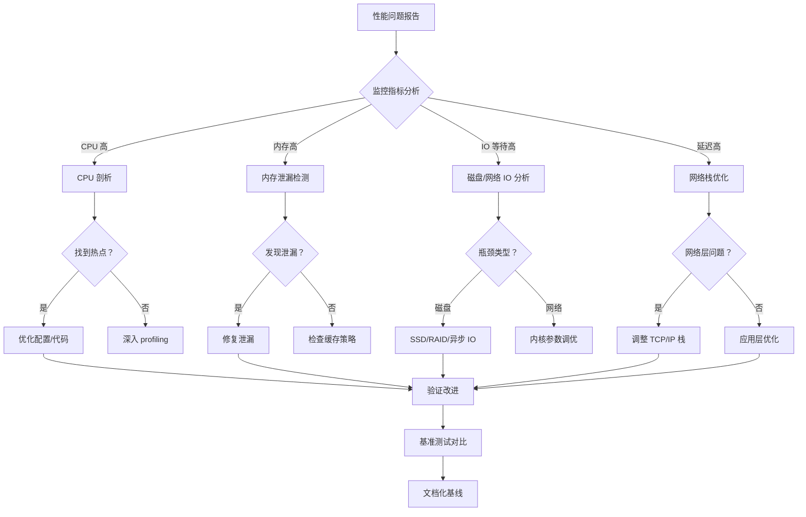

# 第 14 章 性能调优与压测实战

## 学习目标

完成本章后，你将能够：
- ✅ 优化 Linux 内核参数提升网络吞吐
- ✅ 配置 Nginx Worker 进程与连接数
- ✅ 实施文件描述符与系统资源限制
- ✅ 使用 wrk/ab/JMeter 进行压力测试
- ✅ 分析性能瓶颈并定位根因
- ✅ 构建性能基线与容量规划模型

---

## 14.1 性能优化方法论

### 14.1.1 性能瓶颈识别流程



### 14.1.2 性能指标体系

| 指标类别 | 关键指标 | 健康阈值 | 告警阈值 |
|---------|---------|---------|---------|
| **吞吐量** | QPS (Queries/s) | > 5000 | < 1000 |
| **延迟** | P50/P95/P99 | <50ms/<200ms/<500ms | P99>1s |
| **错误率** | 5xx 比例 | < 0.1% | > 1% |
| **CPU** | 使用率 | < 70% | > 90% |
| **内存** | RSS/Cache | < 80% | > 95% |
| **网络** | 带宽利用率 | < 70% | > 90% |
| **连接** | 活跃连接数 | < 10K | > 50K |
| **磁盘 IO** | iowait | < 5% | > 20% |

> 📊 **性能黄金法则** [citation:Google SRE](https://sre.google/sre-book/monitoring-distributed-systems/):
> - **P99 延迟**比平均值更重要（反映长尾问题）
> - **饱和度指标**预测容量瓶颈
> - **错误预算**指导发布节奏

---

## 14.2 Linux 内核参数深度调优

### 14.2.1 网络栈优化

**文件路径**：`/etc/sysctl.conf`

```bash
# ========== TCP 连接优化 ==========

# 扩大本地端口范围（高并发 outbound 连接）
net.ipv4.ip_local_port_range = 1024 65535

# 启用 TCP 端口复用（TIME_WAIT 快速回收）
net.ipv4.tcp_tw_reuse = 1

# 缩短 FIN-WAIT-2 超时时间（默认 60s）
net.ipv4.tcp_fin_timeout = 15

# 保持长连接的心跳间隔（秒）
net.ipv4.tcp_keepalive_time = 600
net.ipv4.tcp_keepalive_probes = 5
net.ipv4.tcp_keepalive_intvl = 15

# ========== 接收/发送缓冲区优化 ==========

# 自动调整 TCP 读写缓冲区大小
net.ipv4.tcp_moderate_rcvbuf = 1
net.ipv4.tcp_moderate_wmem = 1

# 最小/默认/最大缓冲区大小（字节）
net.ipv4.tcp_rmem = 4096 87380 2560000
net.ipv4.tcp_wmem = 4096 65536 2560000

# UDP 缓冲区（QUIC/HTTP3 必需）
net.core.rmem_max = 2560000
net.core.wmem_max = 2560000
net.ipv4.udp_mem = 1887440 2516588 3774880

# ========== 连接队列优化 ==========

# SYN 队列长度（防 SYN Flood）
net.ipv4.tcp_max_syn_backlog = 8192

# 全连接队列长度
net.core.somaxconn = 65535

# 启用 SYN Cookie（防 DDoS）
net.ipv4.tcp_syncookies = 1

# 丢弃已关闭连接的请求（快速失败）
net.ipv4.tcp_rfc1337 = 1

# ========== 网卡队列优化 ==========

# 网络接口接收队列最大长度
net.core.netdev_max_backlog = 5000

# 每个 CPU 的输入队列长度
net.core.dev_weight = 64

# ========== IPv6 优化（如启用）==========
net.ipv6.conf.all.disable_ipv6 = 0
net.ipv6.conf.default.forwarding = 1

# ========== 文件系统优化 ==========

# 最大文件句柄数
fs.file-max = 2097152

# inode 缓存
fs.inode-max = 4194304

# 异步 IO 最大事件数
fs.aio-max-nr = 1048576

# ========== 内存管理优化 ==========

# 禁用 NUMA（Nginx 单进程模型更优）
numa_balancing = 0

# 过度提交内存策略
vm.overcommit_memory = 1

# Swappiness 降低（减少 swap 使用）
vm.swappiness = 1

# 脏页回写比例
vm.dirty_ratio = 10
vm.dirty_background_ratio = 5
vm.dirty_expire_centisecs = 3000
vm.dirty_writeback_centisecs = 500
```

**应用配置**：

```bash
# 重载内核参数
sudo sysctl -p

# 验证生效
sysctl net.ipv4.tcp_tw_reuse
sysctl net.core.somaxconn
```

### 14.2.2 系统资源限制

**文件路径**：`/etc/security/limits.conf`

```bash
# Nginx 用户资源限制
nginx soft nofile 65536
nginx hard nofile 65536
nginx soft nproc 65536
nginx hard nproc 65536
nginx soft memlock unlimited
nginx hard memlock unlimited

# root 用户（如以 root 运行）
root soft nofile 65536
root hard nofile 65536
root soft nproc 65536
root hard nproc 65536

# 所有用户默认值
* soft nofile 65536
* hard nofile 65536
```

**systemd 服务配置**：

```bash
sudo systemctl edit nginx
```

添加以下内容：

```ini
[Service]
LimitNOFILE=65536
LimitNPROC=65536
LimitMEMLOCK=infinity
Environment="LD_BIND_NOW=1"
CPUAffinity=0-3  # 绑定到前 4 个 CPU 核心
```

---

## 14.3 Nginx 配置优化

### 14.3.1 Worker 进程优化

**文件路径**：`/etc/nginx/nginx.conf`

```nginx
# 自动绑定 CPU 核心（性能提升 10-20%）
worker_processes auto;
# 或固定数量（NUMA 架构推荐）
# worker_processes 4;

# 全局错误日志级别（生产环境 warn）
error_log /var/log/nginx/error.log warn;

# 进程 PID 文件
pid /run/nginx.pid;

# 启用多进程接受连接
multi_accept on;

events {
    # 单 Worker 最大连接数
    # 公式：max_clients = worker_processes * worker_connections
    worker_connections 65535;
    
    # 使用 epoll（Linux 最高效）
    use epoll;
    
    # 接受新连接阈值（公平调度）
    accept_mutex on;
    accept_mutex_delay 5ms;
}

http {
    # ========== 基础优化 ==========
    
    # 隐藏版本信息（安全）
    server_tokens off;
    
    # 字符集
    charset utf-8;
    charset_types text/plain text/css application/json application/javascript;
    
    # ========== IO 优化 ==========
    
    # 启用 sendfile（零拷贝传输）
    sendfile on;
    
    # TCP_NODELAY（小包立即发送）
    tcp_nopush on;
    tcp_nodelay on;
    
    # 防止缓冲区溢出
    client_body_buffer_size 16k;
    client_header_buffer_size 1k;
    client_max_body_size 100M;
    large_client_header_buffers 4 16k;
    
    # ========== 超时优化 ==========
    
    # 短超时（防 Slowloris 攻击）
    client_body_timeout 10s;
    client_header_timeout 10s;
    keepalive_timeout 30s;
    send_timeout 10s;
    
    # ========== Gzip 压缩 ==========
    
    gzip on;
    gzip_vary on;
    gzip_proxied any;
    gzip_comp_level 6;  # 1-9，平衡 CPU/压缩比
    gzip_min_length 1000;
    gzip_types text/plain text/css text/xml text/javascript
               application/json application/javascript application/xml
               application/xml+rss application/x-font-ttf font/opentype
               image/svg+xml;
    
    # ========== HTTP/2 优化 ==========
    
    http2 on;
    http2_max_field_size 16k;
    http2_max_header_size 32k;
    http2_max_requests 1000;  # 连接复用次数
    http2_idle_timeout 30s;
    
    # ========== 缓存优化 ==========
    
    # 打开文件缓存
    open_file_cache max=100000 inactive=20s;
    open_file_cache_valid 30s;
    open_file_cache_min_uses 2;
    open_file_cache_errors on;
    
    # ========== 日志缓冲 ==========
    
    access_log /var/log/nginx/access.log main buffer=32k flush=5s;
    
    # ========== upstream 优化 ==========
    
    upstream backend {
        least_conn;  # 最少连接算法
        
        server backend1:8080 weight=5;
        server backend2:8080 weight=3;
        server backend3:8080 backup;
        
        # 保持连接池
        keepalive 32;
        keepalive_requests 1000;
        keepalive_timeout 60s;
    }
    
    server {
        listen 443 ssl http2 reuseport;  # reuseport 多核负载均衡
        listen [::]:443 ssl http2 reuseport;
        
        # SSL 会话优化
        ssl_session_cache shared:SSL:50m;
        ssl_session_timeout 1d;
        ssl_session_tickets on;
        
        # OCSP Stapling
        ssl_stapling on;
        ssl_stapling_verify on;
        
        location / {
            proxy_pass http://backend;
            
            # 代理缓冲优化
            proxy_buffering on;
            proxy_buffer_size 8k;
            proxy_buffers 8 16k;
            proxy_busy_buffers_size 24k;
            
            # 连接超时
            proxy_connect_timeout 5s;
            proxy_send_timeout 10s;
            proxy_read_timeout 30s;
            
            # 重试机制
            proxy_next_upstream error timeout invalid_header http_500 http_502 http_503;
            proxy_next_upstream_tries 3;
            
            # 传递真实 IP
            proxy_set_header Host $host;
            proxy_set_header X-Real-IP $remote_addr;
            proxy_set_header X-Forwarded-For $proxy_add_x_forwarded_for;
            proxy_set_header X-Forwarded-Proto $scheme;
        }
        
        # WebSocket 优化
        location /ws/ {
            proxy_pass http://ws-backend;
            proxy_http_version 1.1;
            proxy_set_header Upgrade $http_upgrade;
            proxy_set_header Connection "upgrade";
            proxy_read_timeout 86400s;  # 长连接
        }
    }
}
```

### 14.3.2 CPU 亲和性绑定

```nginx
# 绑定 Worker 到特定 CPU 核心（NUMA 架构性能提升显著）
worker_processes 4;
worker_cpu_affinity 0001 0010 0100 1000;

# 或自动绑定（4 核示例）
worker_cpu_affinity auto;

# 实时系统优先级（需要 root）
worker_priority -10;
```

---

## 14.4 压力测试工具实战

### 14.4.1 wrk：现代 HTTP 基准测试

**安装**：

```bash
git clone https://github.com/wg/wrk.git
cd wrk
make
sudo cp wrk /usr/local/bin/
```

**基础测试**：

```bash
# 12 线程，400 并发，持续 30 秒
wrk -t12 -c400 -d30s https://example.com/api/users

# 输出示例：
# Running 30s test @ https://example.com/api/users
#   12 threads and 400 connections
#   Thread Stats   Avg      Stdev     Max   +/- Stdev
#     Latency    45.23ms   12.45ms  156.78ms   78.56%
#     Req/Sec     2.34k   456.78     3.12k    82.34%
#   892456 requests in 30.10s, 1.23GB read
#   Requests/sec:  29648.34
#   Transfer/sec:     41.89MB
```

**高级用法**：

```bash
# 自定义 Lua 脚本（复杂场景）
wrk -t12 -c400 -d30s -H "Authorization: Bearer TOKEN" \
    --script=post.lua https://example.com/api/data

# post.lua 示例：
wrk.method = "POST"
wrk.body   = '{"name":"test"}'
wrk.headers["Content-Type"] = "application/json"

# 渐进式压测（查找瓶颈）
for i in 100 200 400 800 1600; do
    echo "=== Concurrency: $i ==="
    wrk -t12 -c$i -d10s https://example.com/
done
```

### 14.4.2 Apache Bench (ab)：经典工具

```bash
# 基础测试
ab -n 10000 -c 100 https://example.com/

# 带认证测试
ab -n 10000 -c 100 -H "Authorization: Bearer TOKEN" \
   https://example.com/api/protected

# POST 请求
ab -n 1000 -c 50 -p data.json -T application/json \
   https://example.com/api/create

# 输出解析：
# Requests per second: 2500.00 [#/sec] (mean)
# Time per request: 40.000 [ms] (mean)
# Time per request: 0.400 [ms] (mean, across all concurrent requests)
# Transfer rate: 35.71 [Kbytes/sec] received
```

### 14.4.3 JMeter：图形化压测平台

**安装与启动**：

```bash
# 下载 JMeter
wget https://archive.apache.org/dist/jmeter/binaries/apache-jmeter-5.6.tgz
tar -xzf apache-jmeter-5.6.tgz
cd apache-jmeter-5.6/bin
./jmeter
```

**测试计划结构**：


**命令行执行**：

```bash
# 非 GUI 模式运行
./jmeter -n -t test_plan.jmx -l results.jtl -e -o /tmp/report

# 分布式压测（多机器）
./jmeter -n -t test_plan.jmx -R slave1,slave2,slave3 -l results.jtl
```

---

## 14.5 性能瓶颈分析与优化

### 14.5.1 CPU 瓶颈诊断

```bash
# 查看 CPU 使用率
top -bn1 | head -20

# 按进程排序
htop

# CPU 剖析（perf）
sudo perf top -p $(pgrep -f nginx)

# 火焰图生成
git clone https://github.com/brendangregg/FlameGraph
cd FlameGraph
sudo perf record -F 99 -p $(pgrep -f nginx) -- sleep 30
sudo perf script | ./stackcollapse-perf.pl | ./flamegraph.pl > nginx.svg
```

### 14.5.2 内存瓶颈诊断

```bash
# 查看内存使用
free -h

# Nginx 进程内存详情
cat /proc/$(pgrep -f nginx)/status | grep Vm

# 内存泄漏检测
valgrind --leak-check=full nginx -c /etc/nginx/nginx.conf

# 页面缓存统计
vmstat 1 10
```

### 14.5.3 网络瓶颈诊断

```bash
# 网络连接状态
ss -s
netstat -an | grep ESTABLISHED | wc -l

# TCP 重传统计
netstat -s | grep -i retrans

# 抓包分析
tcpdump -i any -s 0 -w nginx_capture.pcap port 443

# 使用 Wireshark 分析
wireshark nginx_capture.pcap
```

### 14.5.4 磁盘 IO 瓶颈诊断

```bash
# IO 等待
iostat -x 1 10

# 磁盘使用率
df -h

# inode 使用率
df -i

# 实时 IO 监控
iotop -o

# 查找大文件
find /var/log/nginx -type f -size +100M -exec ls -lh {} \;
```

---

## 14.6 性能基线与容量规划

### 14.6.1 建立性能基线

**测试场景设计**：

| 场景 | 并发数 | 持续时间 | 目标 |
|------|--------|---------|------|
| 空闲状态 | 10 | 5min | 基线延迟 |
| 正常负载 | 100 | 15min | 日常性能 |
| 峰值负载 | 500 | 30min | 承载能力 |
| 极限压力 | 2000 | 10min | 瓶颈识别 |
| 稳定性测试 | 800 | 4h | 长期运行 |

**基线模板**：

```markdown
## 性能基线报告 - example.com

### 测试环境
- 服务器：4 vCPU, 8GB RAM, SSD
- Nginx 版本：1.25.3
- 后端：Node.js (3 实例)

### 测试结果

| 并发数 | QPS | P50 | P95 | P99 | 错误率 |
|--------|-----|-----|-----|-----|--------|
| 100 | 2500 | 35ms | 80ms | 120ms | 0.01% |
| 500 | 8900 | 52ms | 150ms | 280ms | 0.05% |
| 1000 | 12500 | 78ms | 220ms | 450ms | 0.12% |
| 2000 | 14200 | 125ms | 380ms | 890ms | 0.45% |

### 瓶颈分析
- CPU 在 1500 并发时达到 90%
- 连接队列在 2000 并发时溢出
- 建议扩容至 8 vCPU

### 容量规划
- 当前承载：日活 100K
- 峰值需求：500K（需 2 倍扩容）
```

### 14.6.2 容量预测模型

```python
#!/usr/bin/env python3
"""
Nginx 容量预测模型
基于历史数据的线性回归预测
"""

import numpy as np
from sklearn.linear_model import LinearRegression

# 历史数据（并发数，QPS）
X = np.array([[100], [500], [1000], [2000]])
y = np.array([2500, 8900, 12500, 14200])

# 训练模型
model = LinearRegression()
model.fit(X, y)

# 预测
target_qps = 20000
required_concurrency = model.predict([[target_qps]])

print(f"目标 QPS: {target_qps}")
print(f"预测所需并发数: {required_concurrency[0]:.0f}")
print(f"模型系数: {model.coef_[0]:.2f}")
```

---

## 14.7 生产环境优化清单

### 部署前检查 ✅

- [ ] 内核参数已调优（`sysctl -p`）
- [ ] 文件描述符限制已提高（`ulimit -n`）
- [ ] Nginx Worker 绑定 CPU（`worker_cpu_affinity`）
- [ ] 启用 `sendfile` + `tcp_nopush`
- [ ] Gzip 压缩等级适中（4-6）
- [ ] SSL 会话缓存配置
- [ ] Upstream 连接池启用
- [ ] 日志缓冲写入

### 监控告警 ⚡

- [ ] QPS/延迟/错误率仪表盘
- [ ] CPU/内存/网络使用率告警
- [ ] 连接数饱和度监控
- [ ] 慢请求日志分析
- [ ] 异常流量检测

### 应急预案 🚨

- [ ] 限流配置 ready
- [ ] 降级开关可用
- [ ] CDN 切换流程
- [ ] 备份源站待命
- [ ] 联系人清单更新

---

## 14.8 实战练习

### 练习 1：内核参数调优
1. 备份当前 sysctl 配置
2. 应用推荐的网络优化参数
3. 使用 wrk 压测对比优化前后
4. 撰写性能提升报告

### 练习 2：建立性能基线
1. 设计 5 级并发测试场景
2. 执行压测并记录 QPS/延迟
3. 绘制性能曲线图
4. 识别瓶颈并提出扩容建议

### 练习 3：故障排查演练
1. 模拟 CPU 过载（stress 工具）
2. 使用 perf 定位热点
3. 生成火焰图分析
4. 提出优化方案

---

## 14.9 本章小结

### 核心知识点
- ✅ Linux 内核网络栈调优参数
- ✅ Nginx Worker 与连接数优化
- ✅ wrk/ab/JMeter 压测工具使用
- ✅ 性能瓶颈诊断方法论
- ✅ 容量规划与基线建立

### 生产级配置模板
```bash
# 最小化内核优化
net.ipv4.tcp_tw_reuse = 1
net.core.somaxconn = 65535
fs.file-max = 2097152
```

```nginx
# 最小化 Nginx 优化
worker_processes auto;
worker_connections 65535;
sendfile on;
keepalive_timeout 30s;
```

### 下一步
- 第四篇：云原生与高级主题（15-18 章）
- 第 15 章：Docker 容器化部署
- 第 16 章：Kubernetes Ingress 与 Gateway API

---

## 参考资源

- [Linux 内核网络调优指南](https://www.kernel.org/doc/html/latest/networking/)
- [Nginx 性能优化官方文档](https://nginx.org/en/docs/beginners_guide.html#optimization)
- [Google SRE 性能监控](https://sre.google/sre-book/monitoring-distributed-systems/)
- [wrk GitHub](https://github.com/wg/wrk)
- [Brendan Gregg 性能博客](http://www.brendangregg.com/perf.html)
