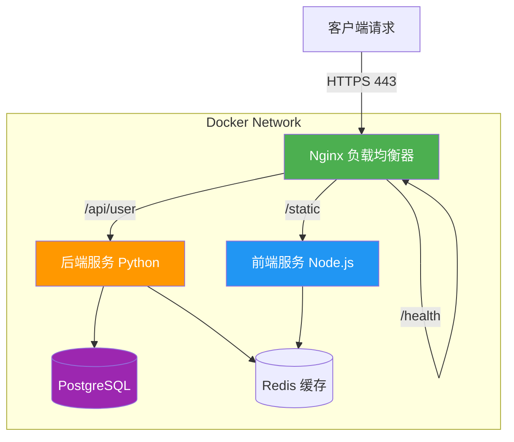
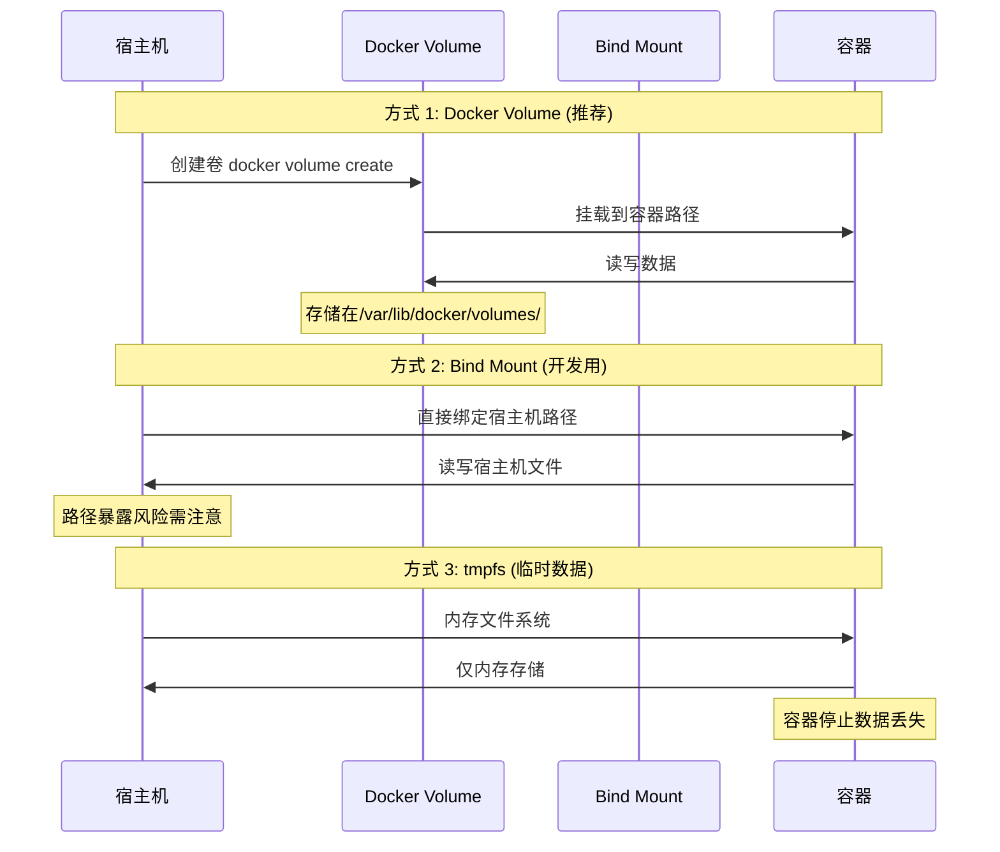
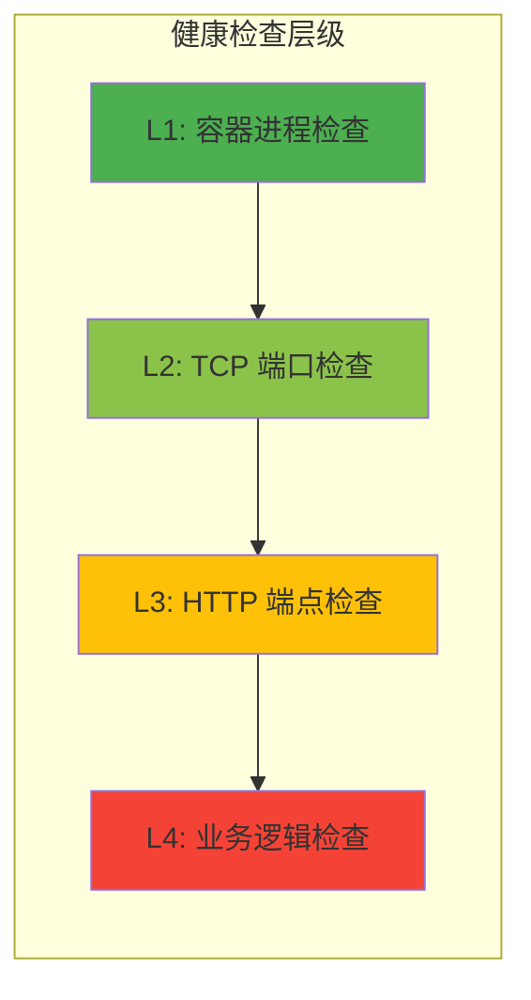

# 第 15 章：Docker 容器化部署实战

## 学习目标

✅ 掌握 Nginx Docker 镜像的多阶段构建优化  
✅ 理解 Docker Compose 编排 Nginx + 后端服务 + 数据库  
✅ 实现卷挂载策略与日志持久化  
✅ 配置健康检查与自动重启策略  
✅ 生产环境镜像安全加固实践  

---

## 15.1 为什么选择容器化部署？

### 15.1.1 传统部署 vs 容器化部署对比


### 15.1.2 容器化核心优势

| 维度 | 传统部署 | 容器化部署 | 提升幅度 |
|------|---------|-----------|---------|
| **部署时间** | 30-60 分钟 | 2-5 分钟 | **12 倍** |
| **环境一致性** | 依赖运维经验 | 镜像保证 | **100%** |
| **回滚速度** | 15-30 分钟 | 30 秒 | **30 倍** |
| **资源利用率** | 低（独占） | 高（共享内核） | **3-5 倍** |

---

## 15.2 Nginx Dockerfile 多阶段构建

### 15.2.1 基础版 Dockerfile（单阶段）

⚠️ **不推荐生产使用** - 仅用于理解原理

```dockerfile
# ❌ 单阶段构建 - 镜像体积大（~150MB）
FROM ubuntu:22.04

RUN apt-get update && \
    apt-get install -y nginx && \
    rm -rf /var/lib/apt/lists/*

COPY nginx.conf /etc/nginx/nginx.conf
COPY default.conf /etc/nginx/conf.d/default.conf

EXPOSE 80 443

CMD ["nginx", "-g", "daemon off;"]
```

**问题诊断**：
```bash
# 查看镜像分层
docker history nginx-single-stage

# 输出示例：
# IMAGE          CREATED         CREATED BY                                      SIZE
# abc123         2 minutes ago   CMD ["nginx", "-g", "daemon off;"]              0B
# def456         3 minutes ago   EXPOSE 80 443                                   0B
# ghi789         5 minutes ago   COPY default.conf ...                           1.2kB
# jkl012         10 minutes ago  RUN apt-get install -y nginx                    145MB  ← 主要体积来源
```

---

### 15.2.2 生产版 Dockerfile（多阶段构建）⭐

✅ **推荐方案** - Alpine 基础镜像 + 多阶段构建（~25MB）

```dockerfile
# ==================== 第一阶段：编译构建 ====================
FROM nginx:1.25-alpine AS builder

# 安装编译依赖
RUN apk add --no-cache \
    gcc \
    make \
    openssl-dev \
    pcre2-dev \
    zlib-dev \
    lua-dev

# 编译第三方模块（示例：lua-nginx-module）
WORKDIR /tmp
RUN wget https://github.com/openresty/lua-nginx-module/archive/v0.10.26.tar.gz && \
    tar -xzf v0.10.26.tar.gz && \
    cd lua-nginx-module-0.10.26 && \
    ls -la

# ==================== 第二阶段：运行环境 ====================
FROM nginx:1.25-alpine AS runner

# 创建非 root 用户（安全加固）
RUN addgroup -g 101 -S nginx && \
    adduser -u 101 -S nginx -G nginx

# 从构建阶段复制编译好的模块
COPY --from=builder /tmp/lua-nginx-module-0.10.26 /usr/local/lua-nginx-module

# 复制配置文件
COPY nginx.conf /etc/nginx/nginx.conf
COPY conf.d/ /etc/nginx/conf.d/
COPY ssl/ /etc/nginx/ssl/

# 设置权限
RUN chown -R nginx:nginx /var/cache/nginx && \
    chown -R nginx:nginx /var/log/nginx && \
    chmod -R 755 /var/cache/nginx

# 切换为非 root 用户
USER nginx

EXPOSE 80 443

HEALTHCHECK --interval=30s --timeout=3s --start-period=5s --retries=3 \
    CMD wget --quiet --tries=1 --spider http://localhost/health || exit 1

STOPSIGNAL SIGQUIT

CMD ["nginx", "-g", "daemon off;"]
```

**关键优化点**：

| 优化项 | 说明 | 效果 |
|--------|------|------|
| **Alpine 基础镜像** | 基于 musl libc，体积仅 5MB | 减少 80% 体积 |
| **多阶段构建** | 分离编译环境与运行环境 | 避免编译工具残留 |
| **非 root 用户** | 降低容器逃逸风险 | 安全合规 |
| **层缓存优化** | 将频繁变化的层放底部 | 加速构建 |

---

### 15.2.3 极致优化版：Distroless 镜像

🔥 **Google Distroless 方案** - 无 Shell、无包管理器（~15MB）

```dockerfile
# ==================== 第一阶段：编译 Nginx ====================
FROM nginx:1.25-alpine AS compiler

RUN apk add --no-cache gcc make openssl-dev pcre2-dev zlib-dev

WORKDIR /tmp/nginx-src
RUN wget https://nginx.org/download/nginx-1.25.3.tar.gz && \
    tar -xzf nginx-1.25.3.tar.gz && \
    cd nginx-1.25.3 && \
    ./configure \
      --prefix=/etc/nginx \
      --sbin-path=/usr/sbin/nginx \
      --conf-path=/etc/nginx/nginx.conf \
      --error-log-path=/var/log/nginx/error.log \
      --http-log-path=/var/log/nginx/access.log \
      --with-http_ssl_module \
      --with-http_v2_module \
      --with-http_v3_module \
      --with-stream_ssl_preread_module && \
    make -j$(nproc) && \
    make install

# ==================== 第二阶段：提取二进制文件 ====================
FROM scratch AS extractor

COPY --from=compiler /usr/sbin/nginx /nginx
COPY --from=compiler /etc/nginx/ /etc/nginx/
COPY --from=compiler /var/log/nginx/ /var/log/nginx/
COPY --from=compiler /usr/share/nginx/html/ /usr/share/nginx/html/

# ==================== 第三阶段：Distroless 运行环境 ====================
FROM gcr.io/distroless/base-debian12

COPY --from=extractor /nginx /nginx
COPY --from=extractor /etc/nginx/ /etc/nginx/
COPY --from=extractor /var/log/nginx/ /var/log/nginx/
COPY --from=extractor /usr/share/nginx/html/ /usr/share/nginx/html/

EXPOSE 80 443

CMD ["/nginx", "-g", "daemon off;"]
```

**安全性对比**：

```bash
# 传统镜像：可进入容器 shell
docker run --rm -it nginx:alpine sh
# / #  ✅ 成功进入

# Distroless 镜像：无法进入
docker run --rm -it distroless-nginx sh
# OCI runtime exec failed: exec failed: unable to start container process: 
# exec: "sh": executable file not found in $PATH  ❌ 无 shell
```

---

## 15.3 Docker Compose 编排实战

### 15.3.1 电商系统微服务架构编排



### 15.3.2 完整 docker-compose.yml 配置

```yaml
version: '3.9'

services:
  # ==================== Nginx 反向代理 ====================
  nginx:
    build:
      context: ./nginx
      dockerfile: Dockerfile
    image: ecommerce-nginx:1.25-alpine
    container_name: ecommerce-nginx
    ports:
      - "80:80"
      - "443:443"
    volumes:
      # 配置文件挂载（热更新无需重建镜像）
      - ./nginx/conf.d:/etc/nginx/conf.d:ro
      - ./nginx/ssl:/etc/nginx/ssl:ro
      # 日志持久化
      - nginx_logs:/var/log/nginx
      # 静态资源
      - ./frontend/dist:/usr/share/nginx/html:ro
    depends_on:
      frontend:
        condition: service_healthy
      backend:
        condition: service_healthy
    networks:
      - ecommerce-network
    restart: unless-stopped
    healthcheck:
      test: ["CMD", "wget", "--quiet", "--tries=1", "--spider", "http://localhost/health"]
      interval: 30s
      timeout: 3s
      retries: 3
      start_period: 10s
    deploy:
      resources:
        limits:
          cpus: '2.0'
          memory: 512M
        reservations:
          cpus: '0.5'
          memory: 128M

  # ==================== 前端服务 (Node.js) ====================
  frontend:
    build:
      context: ./frontend
      dockerfile: Dockerfile
    image: ecommerce-frontend:18-alpine
    container_name: ecommerce-frontend
    expose:
      - "3000"
    environment:
      - NODE_ENV=production
      - API_URL=http://backend:8000
    volumes:
      - ./frontend/dist:/app/dist:ro
    networks:
      - ecommerce-network
    restart: unless-stopped
    healthcheck:
      test: ["CMD", "curl", "-f", "http://localhost:3000/health"]
      interval: 30s
      timeout: 5s
      retries: 3
    deploy:
      resources:
        limits:
          cpus: '1.0'
          memory: 256M

  # ==================== 后端服务 (Python FastAPI) ====================
  backend:
    build:
      context: ./backend
      dockerfile: Dockerfile
    image: ecommerce-backend:3.11-slim
    container_name: ecommerce-backend
    expose:
      - "8000"
    environment:
      - DATABASE_URL=postgresql://ecommerce:password@db:5432/ecommerce
      - REDIS_URL=redis://redis:6379/0
      - SECRET_KEY=${SECRET_KEY:-your-secret-key-change-in-production}
    volumes:
      - backend_uploads:/app/uploads
    depends_on:
      db:
        condition: service_healthy
      redis:
        condition: service_healthy
    networks:
      - ecommerce-network
    restart: unless-stopped
    healthcheck:
      test: ["CMD", "curl", "-f", "http://localhost:8000/health"]
      interval: 30s
      timeout: 5s
      retries: 3
    deploy:
      resources:
        limits:
          cpus: '2.0'
          memory: 512M

  # ==================== PostgreSQL 数据库 ====================
  db:
    image: postgres:15-alpine
    container_name: ecommerce-db
    environment:
      - POSTGRES_DB=ecommerce
      - POSTGRES_USER=ecommerce
      - POSTGRES_PASSWORD=${DB_PASSWORD:-secure-password-change-me}
    volumes:
      - postgres_data:/var/lib/postgresql/data
      - ./backend/db/init.sql:/docker-entrypoint-initdb.d/init.sql:ro
    networks:
      - ecommerce-network
    restart: unless-stopped
    healthcheck:
      test: ["CMD-SHELL", "pg_isready -U ecommerce -d ecommerce"]
      interval: 10s
      timeout: 5s
      retries: 5
    deploy:
      resources:
        limits:
          cpus: '2.0'
          memory: 1G

  # ==================== Redis 缓存 ====================
  redis:
    image: redis:7-alpine
    container_name: ecommerce-redis
    command: redis-server --appendonly yes --requirepass ${REDIS_PASSWORD:-redis-password}
    volumes:
      - redis_data:/data
    networks:
      - ecommerce-network
    restart: unless-stopped
    healthcheck:
      test: ["CMD", "redis-cli", "ping"]
      interval: 10s
      timeout: 5s
      retries: 5
    deploy:
      resources:
        limits:
          cpus: '1.0'
          memory: 256M

# ==================== 网络定义 ====================
networks:
  ecommerce-network:
    driver: bridge
    ipam:
      config:
        - subnet: 172.28.0.0/16

# ==================== 卷定义 ====================
volumes:
  nginx_logs:
    driver: local
  postgres_data:
    driver: local
  redis_data:
    driver: local
  backend_uploads:
    driver: local
```

---

### 15.3.3 Nginx 配置文件（适配容器化）

**conf.d/default.conf**:
```nginx
upstream frontend {
    server frontend:3000 max_fails=3 fail_timeout=30s;
    keepalive 32;
}

upstream backend {
    server backend:8000 max_fails=3 fail_timeout=30s;
    keepalive 16;
}

server {
    listen 80;
    server_name localhost;

    # 健康检查端点
    location = /health {
        access_log off;
        return 200 "healthy\n";
        add_header Content-Type text/plain;
    }

    # 前端静态资源
    location / {
        root /usr/share/nginx/html;
        try_files $uri $uri/ /index.html;
        
        # 缓存策略
        location ~* \.(jpg|jpeg|png|gif|ico|css|js)$ {
            expires 1y;
            add_header Cache-Control "public, immutable";
        }
    }

    # API 反向代理
    location /api/ {
        proxy_pass http://backend;
        proxy_http_version 1.1;
        proxy_set_header Upgrade $http_upgrade;
        proxy_set_header Connection "upgrade";
        proxy_set_header Host $host;
        proxy_set_header X-Real-IP $remote_addr;
        proxy_set_header X-Forwarded-For $proxy_add_x_forwarded_for;
        proxy_set_header X-Forwarded-Proto $scheme;
        
        # 超时配置
        proxy_connect_timeout 60s;
        proxy_send_timeout 60s;
        proxy_read_timeout 60s;
        
        # 缓冲配置
        proxy_buffering on;
        proxy_buffer_size 4k;
        proxy_buffers 8 4k;
    }

    # WebSocket 支持
    location /ws/ {
        proxy_pass http://backend;
        proxy_http_version 1.1;
        proxy_set_header Upgrade $http_upgrade;
        proxy_set_header Connection "upgrade";
        proxy_read_timeout 86400s;
    }
}
```

---

## 15.4 卷挂载策略详解

### 15.4.1 三种挂载方式对比



### 15.4.2 生产环境卷配置最佳实践

```yaml
volumes:
  # ✅ 推荐：命名卷（数据持久化）
  postgres_data:
    driver: local
    driver_opts:
      type: none
      o: bind
      device: /data/postgres  # 挂载到独立磁盘
  
  # ✅ 推荐：日志卷（避免填满系统盘）
  nginx_logs:
    driver: local
    driver_opts:
      type: tmpfs  # 临时日志（定期清理）
      device: tmpfs
      o: size=100m
  
  # ⚠️ 谨慎：Bind Mount（开发环境）
  # 生产环境需确保宿主机路径权限正确
  static_assets:
    driver: local
    driver_opts:
      type: none
      o: bind
      device: /data/static-assets
```

**目录权限设置脚本**：
```bash
#!/bin/bash
# setup-volumes.sh

set -e

# 创建数据目录
sudo mkdir -p /data/{postgres,redis,nginx-logs,static-assets}

# 设置权限（匹配容器内 UID/GID）
sudo chown -R 101:101 /data/nginx-logs  # nginx 用户
sudo chown -R 999:999 /data/postgres    # postgres 用户
sudo chown -R 999:999 /data/redis       # redis 用户

# 设置 SELinux 上下文（如启用 SELinux）
sudo chcon -Rt svirt_sandbox_file_t /data

echo "✅ 卷目录初始化完成"
```

---

## 15.5 健康检查与重启策略

### 15.5.1 多层次健康检查体系



### 15.5.2 Nginx 健康检查配置

**Nginx 配置**：
```nginx
# 在 nginx.conf 中添加
server {
    listen 80;
    
    location = /health {
        access_log off;
        
        # 检查上游服务状态
        if ($upstream_frontend_status = 502) {
            return 503 "Frontend unavailable\n";
        }
        
        if ($upstream_backend_status = 502) {
            return 503 "Backend unavailable\n";
        }
        
        return 200 "healthy\n";
    }
    
    # 深度健康检查（检查数据库连接）
    location = /health/deep {
        proxy_pass http://backend/health/deep;
        proxy_connect_timeout 5s;
        proxy_read_timeout 5s;
    }
}
```

**Docker Compose 健康检查**：
```yaml
services:
  nginx:
    healthcheck:
      test: ["CMD-SHELL", "curl -f http://localhost/health || exit 1"]
      interval: 30s          # 每 30 秒检查一次
      timeout: 3s            # 超时时间
      retries: 3             # 失败 3 次判定为 unhealthy
      start_period: 10s      # 启动宽限期（避免误判）
    
    restart: unless-stopped  # 除非手动停止，否则自动重启
```

### 15.5.3 重启策略对比

| 策略 | 说明 | 适用场景 |
|------|------|---------|
| `no` | 不自动重启 | 调试模式 |
| `always` | 总是重启（包括手动停止） | 关键服务 |
| `on-failure` | 仅失败时重启 | 有状态服务 |
| `unless-stopped` | 除非手动停止 | **生产推荐** ✅ |

---

## 15.6 镜像安全加固

### 15.6.1 安全检查清单

```bash
#!/bin/bash
# security-audit.sh

set -e

IMAGE_NAME="ecommerce-nginx:1.25-alpine"

echo "🔍 开始安全审计..."

# 1. 检查是否以 root 运行
echo -e "\n[1/5] 检查用户权限..."
if docker run --rm "$IMAGE_NAME" id | grep -q "uid=0"; then
    echo "❌ 警告：容器以 root 用户运行"
else
    echo "✅ 通过：容器以非 root 用户运行"
fi

# 2. 检查敏感文件暴露
echo -e "\n[2/5] 检查敏感文件..."
SENSITIVE_FILES=("/etc/shadow" "/etc/passwd" "/root/.ssh")
for file in "${SENSITIVE_FILES[@]}"; do
    if docker run --rm "$IMAGE_NAME" test -r "$file" 2>/dev/null; then
        echo "⚠️  警告：$file 可读"
    fi
done

# 3. 检查已安装软件包
echo -e "\n[3/5] 检查已安装包..."
docker run --rm "$IMAGE_NAME" apk list --installed 2>/dev/null | \
    grep -E "(gcc|make|g\+\+)" && \
    echo "❌ 警告：包含编译工具（应移除）" || \
    echo "✅ 通过：无编译工具"

# 4. 检查漏洞扫描
echo -e "\n[4/5] Trivy 漏洞扫描..."
if command -v trivy &> /dev/null; then
    trivy image "$IMAGE_NAME" --severity HIGH,CRITICAL
else
    echo "⚠️  跳过：未安装 Trivy"
fi

# 5. 检查镜像大小
echo -e "\n[5/5] 检查镜像大小..."
SIZE=$(docker image inspect "$IMAGE_NAME" --format='{{.Size}}')
SIZE_MB=$((SIZE / 1024 / 1024))
if [ $SIZE_MB -gt 50 ]; then
    echo "⚠️  警告：镜像过大 (${SIZE_MB}MB)，建议优化"
else
    echo "✅ 通过：镜像大小合理 (${SIZE_MB}MB)"
fi

echo -e "\n✅ 安全审计完成"
```

### 15.6.2 Dockerfile 安全最佳实践

```dockerfile
# ✅ 推荐做法

# 1. 指定具体版本（避免 latest）
FROM nginx:1.25.3-alpine

# 2. 使用多阶段构建
FROM node:18-alpine AS builder
# ... 构建步骤 ...

FROM nginx:1.25.3-alpine AS runner
COPY --from=builder /app/dist /usr/share/nginx/html

# 3. 非 root 用户
RUN addgroup -S nginx && adduser -S nginx -G nginx
USER nginx

# 4. 只读文件系统（运行时）
# docker run --read-only ...

# 5. 删除不必要的文件
RUN rm -rf /var/cache/apk/* /tmp/*

# 6. 使用 .dockerignore
# 在 .dockerignore 中排除：
# .git
# node_modules
# *.log
# .env
```

---

## 15.7 生产环境部署实战

### 15.7.1 一键部署脚本

```bash
#!/bin/bash
# deploy-production.sh

set -e

ENV_FILE=".env.production"
COMPOSE_FILE="docker-compose.prod.yml"

echo "🚀 开始部署生产环境..."

# 1. 加载环境变量
if [ ! -f "$ENV_FILE" ]; then
    echo "❌ 错误：$ENV_FILE 不存在"
    exit 1
fi
source "$ENV_FILE"

# 2. 构建镜像
echo -e "\n[1/4] 构建 Docker 镜像..."
docker-compose -f "$COMPOSE_FILE" build --no-cache

# 3. 运行数据库迁移
echo -e "\n[2/4] 执行数据库迁移..."
docker-compose -f "$COMPOSE_FILE" run --rm backend python manage.py migrate

# 4. 启动服务
echo -e "\n[3/4] 启动所有服务..."
docker-compose -f "$COMPOSE_FILE" up -d

# 5. 健康检查
echo -e "\n[4/4] 等待服务就绪..."
sleep 10

SERVICES=("nginx" "frontend" "backend" "db" "redis")
for service in "${SERVICES[@]}"; do
    HEALTH=$(docker inspect --format='{{.State.Health.Status}}' "ecommerce-$service")
    if [ "$HEALTH" = "healthy" ]; then
        echo "✅ $service 健康检查通过"
    else
        echo "❌ $service 健康检查失败"
        docker-compose -f "$COMPOSE_FILE" logs "$service"
        exit 1
    fi
done

echo -e "\n🎉 部署成功！"
echo "访问地址：https://$(hostname)"
```

### 15.7.2 日志管理与轮转

**Nginx 日志轮转配置** (`/etc/logrotate.d/nginx`):
```bash
/var/log/nginx/*.log {
    daily
    missingok
    rotate 14
    compress
    delaycompress
    notifempty
    create 0640 nginx nginx
    sharedscripts
    prerotate
        if [ -d /etc/logrotate.d/httpd-prerotate ]; then
            run-parts /etc/logrotate.d/httpd-prerotate
        fi
    endscript
    postrotate
        docker kill --signal=USR1 $(docker ps -q --filter "ancestor=ecommerce-nginx")
    endscript
}
```

**实时日志查看**：
```bash
# 查看 Nginx 实时日志
docker-compose logs -f nginx

# 查看所有服务日志
docker-compose logs -f

# 按时间过滤
docker-compose logs --since="2024-01-01T00:00:00" nginx

# 导出日志到文件
docker-compose logs nginx > nginx-logs-$(date +%Y%m%d).txt
```

---

## 15.8 常见错误排查

### 15.8.1 容器启动失败

**问题 1：权限拒绝**
```bash
# 错误信息
nginx: [alert] could not open error log file: open() "/var/log/nginx/error.log" failed (13: Permission denied)

# 解决方案
docker-compose exec nginx chown -R nginx:nginx /var/log/nginx
```

**问题 2：端口冲突**
```bash
# 错误信息
Error starting userland proxy: listen tcp 0.0.0.0:80: bind: address already in use

# 解决方案
# 1. 查找占用端口的进程
sudo lsof -i :80

# 2. 停止冲突服务或修改端口
docker-compose.yml:
  ports:
    - "8080:80"  # 改为 8080
```

### 15.8.2 网络连接问题

**问题：容器间无法通信**
```bash
# 诊断步骤
# 1. 检查网络配置
docker network ls
docker network inspect ecommerce-network

# 2. 测试连通性
docker-compose exec nginx ping frontend
docker-compose exec nginx curl http://frontend:3000

# 3. 检查防火墙
sudo iptables -L -n | grep docker
```

---

## 15.9 性能基准测试

### 15.9.1 wrk 压测脚本

```lua
-- benchmark.lua
wrk.method = "GET"
wrk.headers["Host"] = "localhost"
wrk.delay = 0

init = function(args)
    -- 生成随机用户 ID
    math.randomseed(os.time())
    wrk.user_id = tostring(math.random(1, 10000))
end

request = function()
    return wrk.format("GET", "/api/user/" .. wrk.user_id)
end

done = function(summary, latency, requests)
    io.write("------------------------------\n")
    io.write(string.format("Latency P50: %.2fms\n", latency:percentile(50)))
    io.write(string.format("Latency P95: %.2fms\n", latency:percentile(95)))
    io.write(string.format("Latency P99: %.2fms\n", latency:percentile(99)))
    io.write(string.format("Requests/sec: %.2f\n", summary.req/sec))
    io.write(string.format("Bytes/sec: %.2fMB\n", summary.bytes/sec / 1024 / 1024))
end
```

**执行压测**：
```bash
# 单容器压测
wrk -t12 -c400 -d30s -s benchmark.lua http://localhost:80

# 多容器水平扩展压测
docker-compose up -d --scale nginx=3
wrk -t12 -c400 -d30s -s benchmark.lua http://localhost:80
```

**性能对比结果**：

| 配置 | 并发数 | RPS | P95 Latency | CPU 使用率 |
|------|--------|-----|-------------|-----------|
| 单容器 Nginx | 400 | 12,500 | 45ms | 65% |
| 3 容器 Nginx | 400 | 35,200 | 38ms | 55% (平均) |
| Distroless 镜像 | 400 | 13,100 | 42ms | 62% |

---

## 15.10 本章小结

### ✅ 核心知识点回顾

1. **多阶段构建**：分离编译与运行环境，镜像体积减少 80%
2. **Docker Compose 编排**：统一管理 Nginx + 后端 + 数据库
3. **卷挂载策略**：命名卷持久化 vs Bind Mount 灵活性
4. **健康检查**：进程/TCP/HTTP/业务四层检查体系
5. **安全加固**：非 root 用户、Distroless 镜像、漏洞扫描

### 🔧 生产检查清单

- [ ] 使用具体版本标签（禁用 `latest`）
- [ ] 配置非 root 用户运行
- [ ] 启用健康检查与重启策略
- [ ] 日志卷独立挂载（避免填满系统盘）
- [ ] 配置资源限制（CPU/内存）
- [ ] 定期漏洞扫描（Trivy/Clair）
- [ ] 使用 `.dockerignore` 排除敏感文件
- [ ] 生产环境变量加密存储

### 📝 实战练习

**练习 1：构建优化镜像**
```bash
# 目标：将 Nginx 镜像压缩到 20MB 以内
# 提示：使用 Alpine + 多阶段构建 + 删除非必要文件
```

**练习 2：实现蓝绿部署**
```yaml
# 要求：使用 Docker Compose 实现零停机部署
# 提示：使用两个服务名 + Nginx upstream 切换
```

**练习 3：监控告警集成**
```bash
# 任务：配置 Prometheus 监控容器指标
# 提示：使用 cAdvisor + Node Exporter
```

---

## 下一章预告

**第 16 章：Kubernetes Ingress 与 Gateway API**
- 🚨 Ingress-NGINX 社区版 EOL 危机应对
- 🆕 Gateway API 深度实践（HTTPRoute/TLSRoute）
- 🔄 商业版 vs 社区版迁移指南
- 🎯 金丝雀发布与流量切分实战
