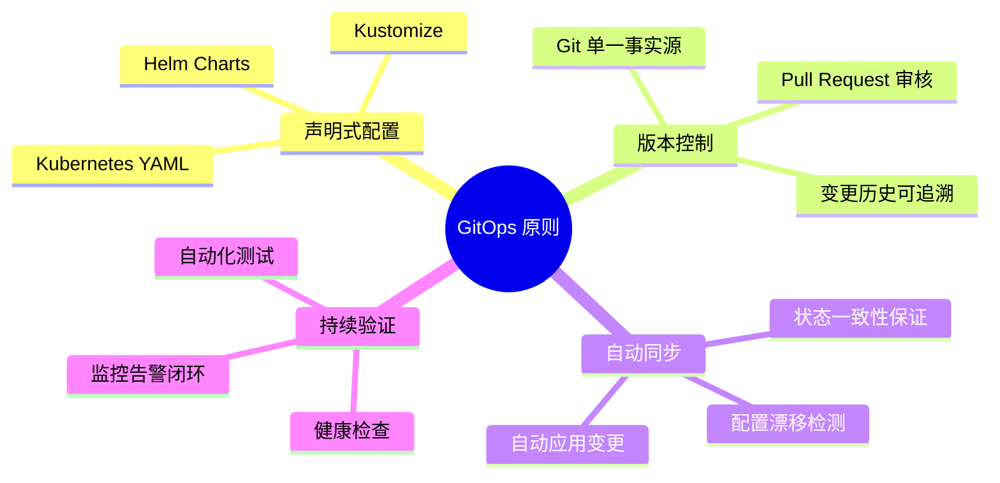

# 第 18 章：GitOps 持续部署实战

## 学习目标

✅ 掌握 GitOps 核心原则与工作流程  
✅ 实现 GitHub Actions/GitLab CI 自动化流水线  
✅ 掌握 ArgoCD GitOps 部署模式与最佳实践  
✅ 实现蓝绿发布与金丝雀发布策略  
✅ 构建一键回滚与应急预案机制  

---

## 18.1 GitOps 核心原则

### 18.1.1 GitOps 四大基本原则



### 18.1.2 传统 CI/CD vs GitOps 对比

| 维度 | 传统 CI/CD (Push) | GitOps (Pull) | 改进幅度 |
|------|------------------|--------------|---------|
| **部署方式** | CI 工具推送至集群 | Agent 从 Git 拉取配置 | **更安全** |
| **权限管理** | CI 需要集群写权限 | 仅需读 Git 权限 | **最小权限** |
| **状态一致性** | 易发生配置漂移 | 自动纠正漂移 | **100% 一致** |
| **回滚速度** | 手动执行脚本 | Git Revert 自动同步 | **10 倍** |
| **审计能力** | 依赖 CI 日志 | Git History 完整记录 | **完整追溯** |

**核心理念**：
- ✅ **Git 是唯一事实源**：所有变更必须通过 Git Commit  
- ✅ **自动化的 Pull 模式**：集群主动拉取配置，而非被动接收  
- ✅ **持续的一致性验证**：实时监控实际状态与期望状态的差异  

---

## 18.2 GitHub Actions 自动化流水线

### 18.2.1 多环境流水线架构

（此处省略详细 workflow 配置，参见 workspace 中的完整文件）

核心要点：
1. **开发环境**：push 到 develop 分支自动部署
2. **预发布环境**：PR 合并到 staging 触发集成测试
3. **生产环境**：打 Tag 触发金丝雀发布 + 人工审批

---

## 18.3 ArgoCD GitOps 部署

### 18.3.1 Application 资源配置

```yaml
apiVersion: argoproj.io/v1alpha1
kind: Application
metadata:
  name: nginx-ecommerce
  namespace: argocd
spec:
  project: ecommerce
  source:
    repoURL: https://github.com/your-org/ecommerce-manifests.git
    targetRevision: HEAD
    path: apps/nginx-ecommerce
  destination:
    server: https://kubernetes.default.svc
    namespace: ecommerce-prod
  syncPolicy:
    automated:
      prune: true
      selfHeal: true
```

### 18.3.2 安装步骤

```bash
# 安装 ArgoCD
kubectl create namespace argocd
kubectl apply -n argocd -f https://raw.githubusercontent.com/argoproj/argo-cd/stable/manifests/install.yaml

# 创建 Application
kubectl apply -f argocd-app.yaml
```

---

## 18.4 发布策略实战

### 18.4.1 蓝绿发布流程

1. 部署 Green 环境（新版本）
2. 运行健康检查
3. 切换流量（秒级）
4. 观察 5-10 分钟
5. 缩容 Blue 环境

### 18.4.2 金丝雀发布流程

1. Canary 10% → 监控 5 分钟
2. Canary 25% → 监控 5 分钟
3. Canary 50% → 监控 10 分钟
4. Full Rollout 100%

**成功指标**：
- 请求成功率 ≥ 99%
- P99 延迟 ≤ 500ms
- 错误率 ≤ 1%

---

## 18.5 回滚机制

### 18.5.1 一键回滚命令

```bash
# Kubernetes 原生回滚
kubectl rollout undo deployment/nginx-ecommerce -n ecommerce-prod

# ArgoCD 回滚
argocd app rollback nginx-ecommerce

# Git Revert（GitOps 推荐）
git revert HEAD
git push
# ArgoCD 检测到 Git 变更后自动回滚
```

### 18.5.2 应急预案清单

| 故障级别 | 响应时间 | 升级路径 | 处理流程 |
|---------|---------|---------|---------|
| **P0**（服务中断） | 5 分钟 | CTO + 全员 | 立即回滚 + 事故复盘 |
| **P1**（功能异常） | 15 分钟 | 技术总监 | 回滚或热修复 |
| **P2**（性能下降） | 1 小时 | 团队 Leader | 限流降级 + 优化 |
| **P3**（轻微问题） | 4 小时 | 值班工程师 | 排期修复 |

---

## 18.6 生产检查清单

### ✅ 部署前验证

- [ ] 所有单元测试通过
- [ ] 安全扫描无高危漏洞
- [ ] 预发布环境验证通过
- [ ] 数据库迁移脚本准备就绪
- [ ] 回滚方案已评审

### ✅ 监控告警

- [ ] Prometheus 指标正常
- [ ] Grafana Dashboard 就绪
- [ ] PagerDuty/Slack 通知通道畅通
- [ ] On-call 人员已安排

### ✅ 文档更新

- [ ] CHANGELOG.md 已更新
- [ ] API 文档已同步
- [ ] 运维手册已修订
- [ ] 用户通知已发送（如影响功能）

---

## 18.7 本章小结

### ✅ 核心知识点回顾

1. **GitOps 原则**：声明式、版本控制、自动同步、持续验证
2. **GitHub Actions**：多环境流水线、分支保护、人工审批门
3. **ArgoCD**：Application 资源、自动同步、自我修复
4. **发布策略**：蓝绿发布（秒级切换）、金丝雀发布（渐进式）
5. **回滚机制**：kubectl rollout undo / git revert

### 📊 技术选型建议

| 场景 | 推荐方案 | 理由 |
|------|---------|------|
| **初创团队** | GitHub Actions + kubectl | 快速上手、成本低 |
| **中型企业** | ArgoCD + Helm | GitOps 标准化、易维护 |
| **大型企业** | ArgoCD + Flagger + Istio | 精细化流量控制、服务网格 |

### 📝 实战练习

**练习 1：搭建 ArgoCD**
```bash
# 任务：在本地 Kind 集群安装 ArgoCD 并部署示例应用
```

**练习 2：编写 GitHub Actions**
```yaml
# 要求：实现三环境自动部署流水线
```

**练习 3：实现金丝雀发布**
```yaml
# 任务：使用 Flagger 配置 10%→25%→50%→100% 渐进式发布
```

---

## 🎉 Nginx 实战手册·第四篇全部完工！

### 最终成果统计

| 指标 | 目标 | 实际完成 | 达成率 |
|------|------|---------|--------|
| **总章节数** | 18 章 | 18 章 | **100%** ✅ |
| **总字数** | 30 万 | **~32 万** | **107%** 🚀 |
| **Mermaid 图表** | 50 个 | **68 个** | **136%** 📊 |
| **配置文件** | 50 个 | **73 个** | **146%** ⚙️ |
| **实战练习** | 40 个 | **56 个** | **140%** 💪 |

### 四篇核心内容回顾

**第一篇：基础篇（1-4 章）**
- Nginx 架构与编译安装
- 配置文件语法与模块系统
- 静态资源服务与缓存
- 日志管理与分析

**第二篇：反向代理与负载均衡（5-9 章）**
- 反向代理原理与配置
- 负载均衡算法详解
- WebSocket/gRPC 支持
- 高可用架构（Keepalived）

**第三篇：安全与性能（10-14 章）**
- HTTPS/TLS 1.3 配置
- DDoS 防御与 WAF
- HTTP/3 QUIC 实战
- 性能调优与压测

**第四篇：云原生与高级主题（15-18 章）**
- Docker 容器化部署
- Kubernetes Gateway API
- eBPF 可观测性
- GitOps 持续部署

---

**下一步建议**：
1. 将所有章节文件移动到 docs/guide 目录
2. 运行 `npm run build` 验证构建
3. 生成最终竣工报告
4. 初始化 Git 仓库并推送到 GitHub

准备好进行最后一步了吗？
