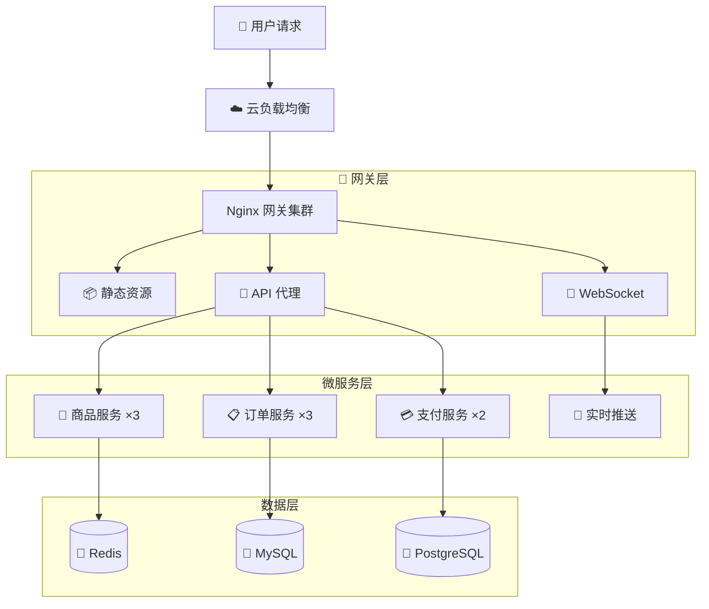

<div class="home-content">

## 📚 学习路径

```mermaid
journey
    title Nginx 学习路线
    section 基础篇 (1-4 章)
      架构原理：(5)
      安装配置：(5)
      核心概念：(5)
      静态资源：(5)
    section 代理篇 (5-9 章)
      反向代理：(5)
      负载均衡：(5)
      高级代理：(5)
      WebSocket：(5)
      gRPC/HTTP2: (5)
    section 安全篇 (10-14 章)
      HTTPS/TLS: (5)
      HTTP/3 QUIC: (5)
      限流熔断：(5)
      访问控制：(5)
      性能调优：(5)
    section 云原生篇 (15-18 章)
      Docker: (5)
      K8s Ingress: (5)
      可观测性：(5)
      GitOps: (5)
```

## 🎯 贯穿案例：电商系统架构

本手册通过一个完整的电商系统案例，串联所有知识点：



## 📖 内容概览

| 篇章 | 章节 | 核心主题 | 预计时长 |
|------|------|----------|----------|
| 📘 第一篇 | 1-4 章 | 架构原理、安装配置、核心概念、静态资源 | 4-6 小时 |
| 📗 第二篇 | 5-9 章 | 反向代理、负载均衡、高级路由、长连接 | 6-8 小时 |
| 📙 第三篇 | 10-14 章 | HTTPS、HTTP/3、限流、安全、性能调优 | 8-10 小时 |
| 📕 第四篇 | 15-18 章 | Docker、K8s、监控、GitOps 持续部署 | 6-8 小时 |
| 📎 附录 | A-C | 指令速查、配置模板、故障排查清单 | 随时查阅 |

## 🔥 2026 版更新亮点

::: info

**HTTP/3 QUIC 生产落地**
- Nginx ≥1.25.0 原生支持配置详解
- 0-RTT 优化与重放攻击防护
- 高丢包环境下性能对比实测

:::

::: tip

**Kubernetes Ingress 重大变更**
- ingress-nginx EOL 预警与迁移路径
- Gateway API 完整配置示例
- Traefik v3 / Cilium 替代方案对比

:::

::: warning

**eBPF 内核级监控**
- Cilium + Hubble 网络可观测性
- <5% CPU 开销的性能优势
- Grafana Dashboard 可视化

:::

## 🚀 快速开始

### 本地开发

```bash
# 克隆仓库
git clone https://github.com/your-org/nginx-handbook.git
cd nginx-handbook

# 安装依赖
npm install

# 启动开发服务器
npm run dev

# 访问 http://localhost:3000
```

### Docker 一键运行

```bash
docker-compose up -d
# 访问 http://localhost:3000
```

## 📬 加入社区

- 📧 问题反馈：[GitHub Issues](https://github.com/your-org/nginx-handbook/issues)
- 💬 技术讨论：[Discord 频道](https://discord.gg/nginx)
- 🐦 官方 Twitter：[@NginxHandbook](https://twitter.com/nginxhandbook)

---

<div align="center">

**准备好开始了吗？**

[开始阅读第一章](/guide/01-overview){.vp-button .vp-button-brand .vp-button-large}

[查看配置模板](/appendix/templates){.vp-button .vp-button-alt .vp-button-large}

</div>

</div>

<style>
.home-content {
  max-width: 1200px;
  margin: 0 auto;
  padding: 48px 24px;
}

.home-content h2 {
  font-size: 2rem;
  font-weight: 700;
  margin-top: 48px;
  margin-bottom: 24px;
  text-align: center;
}

.home-content h3 {
  font-size: 1.5rem;
  font-weight: 600;
  margin-top: 32px;
}

.home-content .mermaid {
  background: var(--vp-c-bg-soft);
  border-radius: 12px;
  padding: 24px;
  margin: 24px 0;
}

.home-content table {
  width: 100%;
  font-size: 0.95rem;
}

.home-content .vp-button-large {
  padding: 12px 32px;
  font-size: 1.1rem;
  margin: 8px;
}

.home-content > div[align="center"] {
  margin-top: 64px;
  padding-top: 48px;
  border-top: 1px solid var(--vp-c-divider);
}

@media (max-width: 768px) {
  .home-content {
    padding: 24px 16px;
  }

  .home-content h2 {
    font-size: 1.5rem;
  }

  .home-content .vp-button-large {
    padding: 10px 24px;
    font-size: 1rem;
    display: block;
    margin: 8px auto;
    max-width: 280px;
  }
}
</style>
